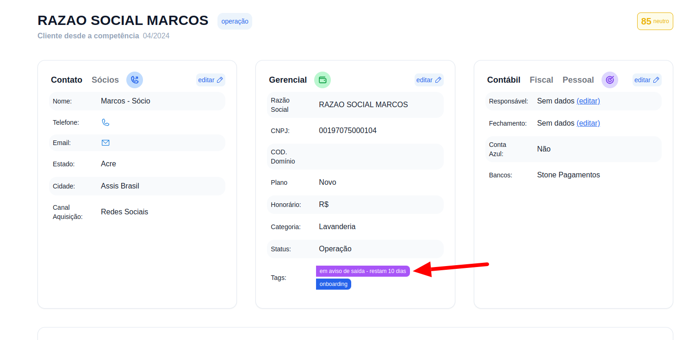

## Passo a Passo para definir os dias do aviso prévio

### 1. Acesse

Primeiramente, faça login na sua conta do G Client.

### 2. Navegue até a Seção de Configurações

Clique na aba [Configurações](https://client.primorgroup.com.br/configuracao) localizada no menu lateral. Isso o levará para a página onde você pode visualizar opções de configuração do sistema.

### 3. Clique em Aviso prévio

### 4. Insira a quantidade de dias para aviso prévio

Basta clicar no botão `+` present na tela e inserir a quantidade de dias para o aviso prévio, por fim clicar em salvar.

### 5. Visualizar contagem dos dias

Na lista de clientes assim como na tela de informações de um cliente, você poderá visualizar quantos dias restam para que o aviso prévio do mesmo termine.

Lista de clientes:

Tela de informações do cliente:

✅ Esse tutorial deve ajudar os usuários a configurar o aviso prévio para seus clientes de forma simples e eficiente. Se precisar de mais alguma coisa, é só [avisar](https://api.whatsapp.com/send?phone=5544997046569&text=Ol%C3%A1,%20estava%20lendo%20um%20tutorial%20do%20Client%20e%20quero%20saber%20mais%20sobre%20seus%20servi%C3%A7os.)!
