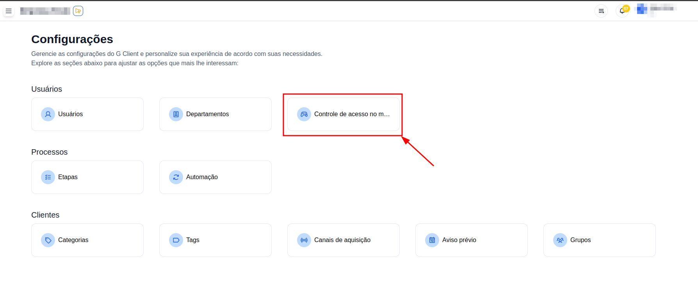

## Introdução

Bem-vindo ao tutorial do G Client! Neste guia, vamos explicar como você pode controlar quais páginas e itens no menu do G Client os usuários da sua empresa podem acessar.

## Quem pode editar o acesso aos itens do menu?

Usuários com a permissão **Controle das configurações de Acesso no Menu** poderão acessar a página de configuração do acesso ao menu, e editar quem pode acessar cada item.

## Passo a Passo para editar o Acesso aos Itens do Menu

### 1. Acesso o G Client

Primeiro, faça login na sua conta do G Client.

### 2. Acesse a página de configurações

Navegue até o final da barra lateral e acesse a página de configurações, simbolizada pelo ícone de uma engrenagem.

### 3. Acesse a página de Controle de Acesso ao Menu

Na página de configurações, selecione a opção **Controle de acesso no menu** para acessar a página de configuração do controle de acesso no menu.

### 4. Identifique os itens que você deseja configurar e selecione uma das opções

Você pode optar entre deixar o item disponível para todos os usuários e departamentos, ou selecionar departamentos e/ou usuários específicos.

### 5. Selecione os usuários e/ou departamentos que deseja permitir

Caso você queira que apenas alguns departamentos e/ou usuários possam acessar o item do menu basta você abrir o modal e seleciona-los.

No modal de departamentos você pode adicionar usuários para garantir acesso ao clicar no botão `Adicionar usuário`

### 6. Pressionar confirmar após selecionar os usuários e/ou departamentos

Após selecionar alguma das opções e definir os departamentos e/ou usuários basta clicar em `CONFIRMA` para confirmar as configurações.

> ℹ️ Ao alterar as configurações, será necessário que os usuários recarreguem a página do G Client (se conectados) para que as alterações sejam visíveis.

## Conclusão

A funcionalidade de **Controle de Acesso ao Menu** é uma funcionalidade útil para que você possa limitar os usuários que possam acessar informações específicas no G Client. Utilize essa funcionalidade para poder ter mais controle sobre quem pode acessar as informações em sua empresa no G Client.
