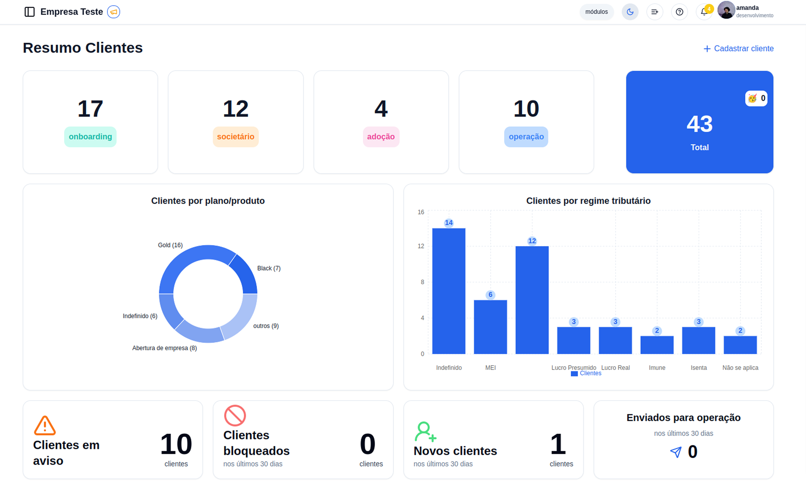

# Comece aqui

Bem-vindo à Central de Ajuda do G Client! Aqui você encontra tutoriais, guias práticos e orientações para aproveitar ao máximo todas as funcionalidades da nossa plataforma.

## O que é o G Client

O G Client é uma plataforma desenvolvida para transformar a gestão de clientes em escritórios contábeis. Com uma estrutura modular e intuitiva, ele organiza processos, centraliza informações e gera visibilidade sobre a jornada do cliente, desde o **onboarding até a retenção**.

Nosso objetivo é ajudar escritórios a ganhar eficiência, oferecer um atendimento mais encantador e tomar decisões com base em dados. Tudo isso com uma ferramenta simples, personalizável e pensada para o dia a dia da gestão contábil.

Se você busca organização, clareza e escalabilidade, o G Client foi feito para o seu escritório.

## Para quem é

Esta base foi criada para escritórios contábeis que estão iniciando no G Client e também para quem deseja se aprofundar nos recursos e estratégias de gestão de clientes.

## Suporte

Se não encontrar sua resposta aqui, fale com nosso time pelo **chat**. Estamos prontos para ajudar. 💙
