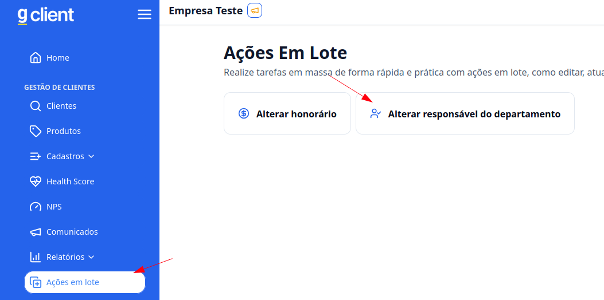
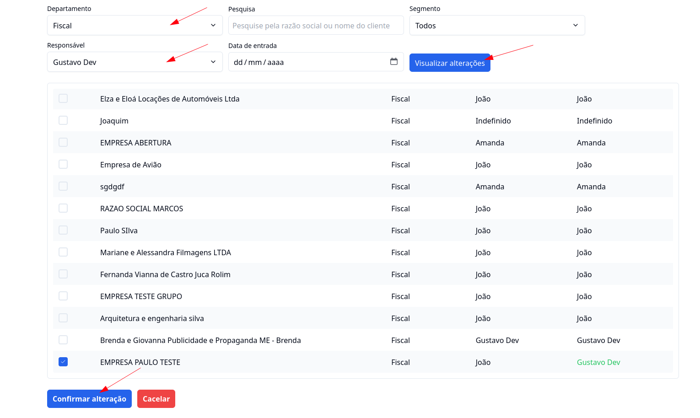

## Introdução

Com o **G Client**, você pode realizar tarefas em massa de forma rápida e prática utilizando ações em lote, como editar e atualizar múltiplos registros de uma só vez.

---

## Como acessar?

### 1. Acesse o G Client

Primeiramente, faça login na sua conta do **G Client**.

---

### 2. Navegue até a seção **Gestão de Clientes**

No menu lateral, clique na opção **Ações em Lote** e selecione **Alterar responsável do departamento**.

---

### 3. Entendendo a página

Nesta página, você encontrará dois campos obrigatórios:

- **Departamento**: Selecione o departamento no qual deseja alterar o responsável.
- **Responsável**: Escolha o novo responsável a ser atribuído.

Além desses, há campos opcionais para refinar a busca:

- **Pesquisa**: Encontre clientes de forma mais rápida.
- **Segmento**: Filtre clientes por um segmento específico.
- **Data de entrada**: Selecione clientes com base na data de entrada.

Após selecionar os clientes desejados, clique em **Visualizar Alterações** para conferir as mudanças antes de aplicá-las. Se tudo estiver correto, finalize clicando em **Confirmar Alterações**.

---

✅ **Pronto!** Agora você sabe como alterar o responsável do departamento de forma simples e produtiva no **G Client**. Se precisar de ajuda, entre em contato clicando [aqui](https://api.whatsapp.com/send?phone=5544997046569&text=Preciso%20de%20ajuda%20sobre%20um%20tutorial)!

🎉 **Obrigado por usar o G Client!**
