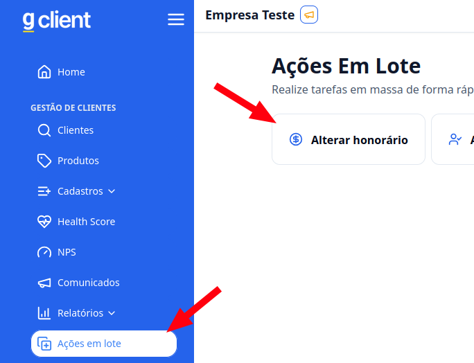
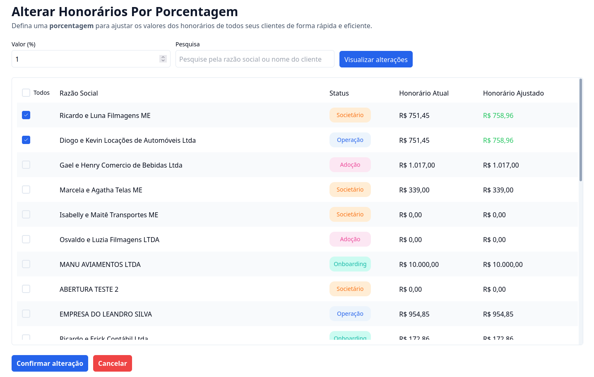

## Introdução

Com o **G Client**, você pode realizar tarefas em massa de forma rápida e prática utilizando ações em lote, como editar, atualizar ou excluir múltiplos registros de uma só vez.

---

## Como acessar?

### 1. Acesse o G Client

Primeiramente, faça login na sua conta do **G Client**.

---

### 2. Navegue até a seção **Gestão de Clientes**

No menu lateral, clique na opção **Ações em Lote** e selecione **Alterar Honorário**.

---

### 3. Entendendo a página

Nesta página, você encontrará dois campos principais:

- **Valor (%)**: Defina o percentual de aumento desejado para os honorários.
- **Pesquisa**: Utilize este campo para buscar e selecionar os clientes cujos honorários serão ajustados.

Após selecionar os clientes e definir o valor percentual, clique em **Visualizar Alterações**. Se estiver tudo certo, finalize o processo clicando em **Confirmar Alterações**.

---

✅ **Pronto!** Agora você sabe como alterar os honorários de forma simples e produtiva no **G Client**. Se precisar de ajuda, entre em contato clicando [aqui](https://api.whatsapp.com/send?phone=5544997046569&text=Preciso%20de%20ajuda%20sobre%20um%20tutorial)!

🎉 **Obrigado por usar o G Client!**
