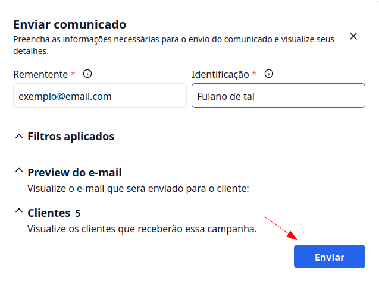

## Introdução

Agora você pode enviar comunicado em massa para seus clientes.

## Passo a passo de como enviar Comunicados

### 1. Acesse o G Client

Primeiramente, faça login na sua conta do G Client.

### 2. Navegue até a Seção GESTÃO DE CLIENTES

No menu lateral, clique no opção **Comunicados**.

Na página você poderá visualizar os comunicados já enviados, e também clicando no botão **+ Criar comunicado**, você pode realizar um comunicado.

### 3. Criando Comunicado

Na criação do comunicado você deve preencer os campos de acordo com sua necessidade. Assim que tudo estiver preenchido clique no botão para **Cadastrar**

### 4. Enviando Comunicado

Para enviar o comunicado basta clicar no botão de ação e selecionar o opção **Enviar**.

Com isso abrirá um modal para você prencer com as seguintes informações:

- Rementente: Qual endereço de e-mail está enviando o comunicado.
- Identificação: Nome do remetente que será exibido no e-mail enviado.

Por fim para enviar os email, basta clicar em **Enviar**.

---

✅ Com esse tutorial, esperamos que ajude no envio de comunicados. Se precisar de mais ajuda, é só [avisar](https://api.whatsapp.com/send?phone=5544997046569&text=Preciso%20de%20ajuda%20sobre%20um%20tutorial)!
