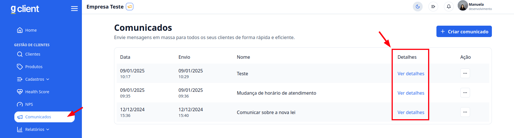
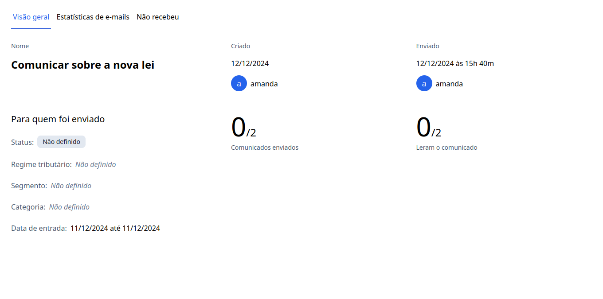
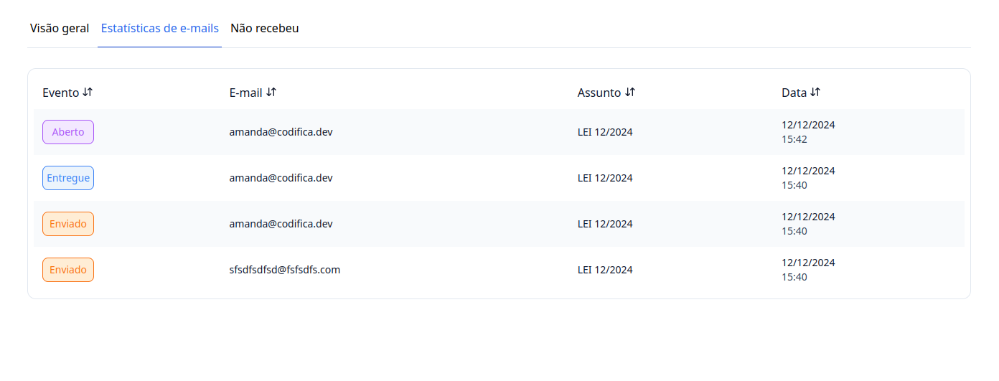
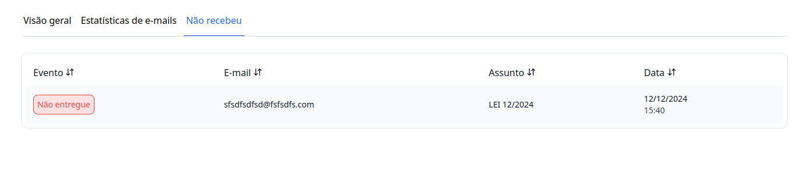

## Introdução

Agora que você já aprendeu a [enviar os comunicados](/docs/customer-management/communication/send-communication) em massa para seus clientes. Agora vamos ver quem recebeou ou não o email.

---

## Passo a passo e como funciona os emails

### 1. Acesse o G Client

Faça login na sua conta do **G Client**.

---

### 2. Navegue até a seção **Comunicados**

No menu lateral, clique na opção **Comunicados**.

Nesta página, você poderá:

- Visualizar os comunicados já enviados.

Encolha o comunicado a qual você deseja saber as informações dos email e clique em **Ver detalhes**

Terão três abas: Visão geral, Estátisticas de Email, Não recebeu.

---

### 3. Visão geral

Aqui vamo mostrar todas as informações do Comunicado

### 4. Estátisticas de e-mail

Aqui você poderá vizualizar os e-mail que foram enviador, entreges e quais foram abertos.

Teram as os seguintes status:
- Enviado: indica que o e-mail foi enviado
- Entrege: indica que o e-mail foi entrege ao destinatário
- Aberto: indica que o e-mail foi aberto

### 5. Não recebidos

Aqui você pode vizualizar os clientes que não receberam o e-mail

---

✅ **Pronto!** Com este tutorial, esteja fácil a compreenção dos e-mail dos comunicados. Se precisar de mais ajuda, entre em contato clicando [aqui](https://api.whatsapp.com/send?phone=5544997046569&text=Preciso%20de%20ajuda%20sobre%20um%20tutorial)!

🎉 **Obrigado por usar o G Client!**
