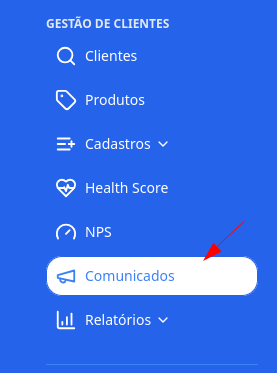
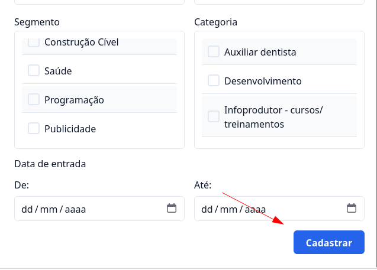
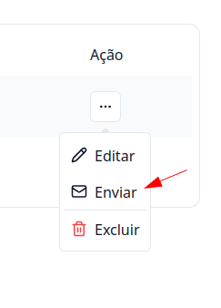

## Introdução

Com o **G Client**, você pode enviar comunicados em massa para seus clientes de forma prática e eficiente. Este guia irá ajudá-lo a criar e enviar comunicados com facilidade.

---

## Passo a passo de como enviar Comunicados

### 1. Acesse o G Client

Faça login na sua conta do **G Client**.

---

### 2. Navegue até a seção **Comunicados**

No menu lateral, clique na opção **Comunicados**.

Nesta página, você poderá:

- Visualizar os comunicados já enviados.
- Criar um novo comunicado clicando no botão **+ Criar comunicado**.

---

### 3. Criando um Comunicado

Na criação do comunicado, preencha os campos necessários conforme sua necessidade. Após preencher todos os campos, clique em **Cadastrar** para salvar o comunicado.

---

### 4. Enviando o Comunicado

Para enviar um comunicado:

1. Clique no botão de ação correspondente ao comunicado criado.
2. Selecione a opção **Enviar**.

Um modal será exibido para preenchimento das seguintes informações:

- **Remetente**: O endereço de e-mail usado para enviar o comunicado.
- **Identificação**: Nome do remetente que será exibido no e-mail enviado.

Após preencher as informações, clique em **Enviar** para finalizar o envio.

---

✅ **Pronto!** O comunicado será enviado para os destinatários. Com este tutorial, esperamos facilitar o envio de comunicados.  
Se precisar de mais ajuda, entre em contato clicando [aqui](https://api.whatsapp.com/send?phone=5544997046569&text=Preciso%20de%20ajuda%20sobre%20um%20tutorial)!

🎉 **Obrigado por usar o G Client!**
