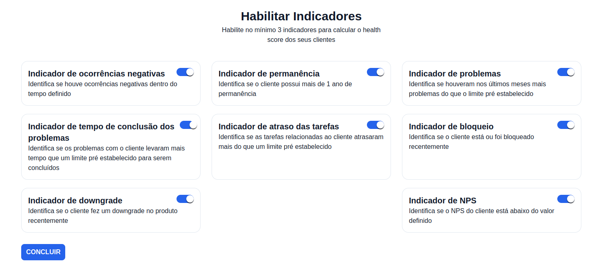
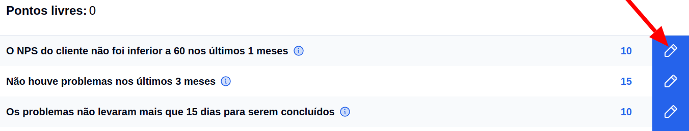
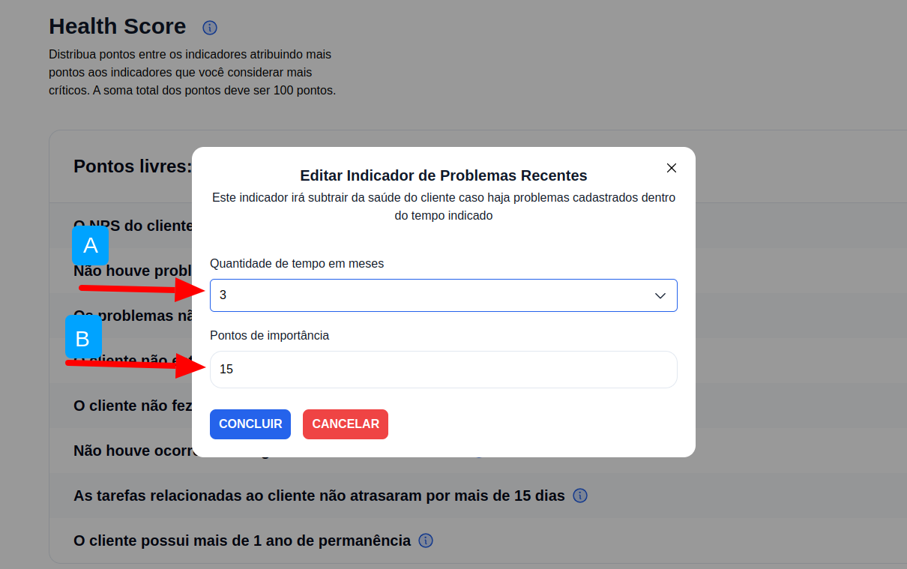
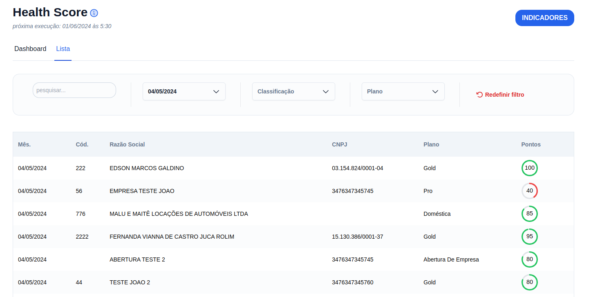
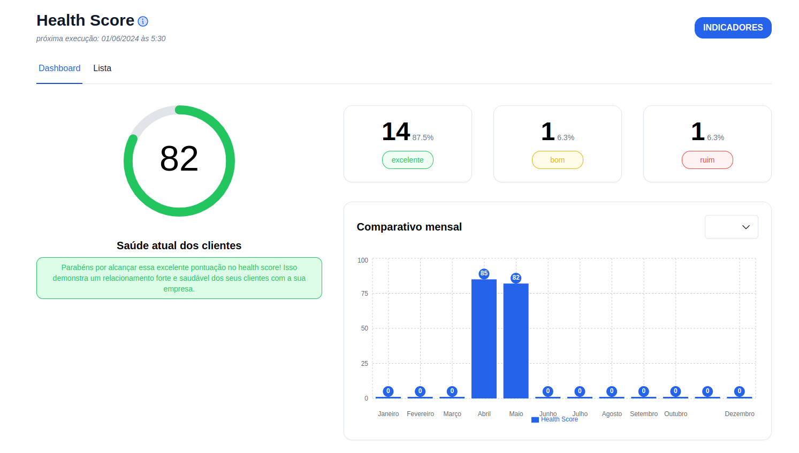

import VideoEmbed from "../../src/components/VideoEmbed";

## Introdução

Bem-vindo ao tutorial do G Client! Neste guia, vamos explicar o que é o Health Score e como você pode calculá-lo utilizando o nosso sistema. O Health Score é uma métrica essencial para avaliar a saúde e satisfação dos seus clientes. Vamos começar!

## O que é Health Score?

> O Health Score é uma métrica que ajuda a avaliar a saúde do relacionamento entre sua empresa e seus clientes. Ele pode incluir vários fatores, como a frequência de uso do seu produto, o nível de satisfação, o engajamento, e outros indicadores importantes. Um Health Score alto indica que seus clientes estão satisfeitos e engajados, enquanto um score baixo pode ser um sinal de que há problemas que precisam ser resolvidos.

  Diferença do Health Score para o Net Promoter Score (NPS)

O NPS mede a lealdade e a satisfação com base na probabilidade de recomendação. O Health Score avalia a saúde geral do cliente com base em múltiplos indicadores.
**Método de Cálculo:** O NPS é calculado a partir de uma única pergunta, enquanto o Health Score combina vários indicadores.

## Passo a Passo para Calcular o Health Score no G Client

### 1. Acesse o G Client

Primeiramente, faça login na sua conta do G Client.

### 2. Navege até a Seção de Health Score

Na página principal, clique na aba [`Health Score`](https://client.primorgroup.com.br/health-score) localizada no menu lateral. Isso o levará para a página onde você pode visualizar e calcular os Health Scores dos seus clientes.

### 3. Configuração dos Indicadores

Para calcular o Health Score, precisamos configurar os indicadores que serão utilizados.

Clique no botão `Indicadores` e na página seguinte clique no botão `Habilitar indicadores` e selecione osfatores que deseja incluir no cálculo, após selecionar clique em `Concluir`:

### 4. Defina Pontos para Cada Indicador

Cada indicador pode ter um peso diferente dependendo da sua importância, e isso é definido pelos pontos. Por exemplo, você pode definir que Não terem acontecido problemas tenha um peso de 40 pontos, o NPS 30, Não bloqueio do cliente 20 pontos, e o Tempo de permanência 10 pontos.

Ajuste os pontos conforme necessário e clique em `Concluir`.

**Para habilitar um indicador, basta clicar no ícone de lápis presente na lista:**

**Após, um modal será aberto para configurar o indicador:**

**A.** Define o tempo a ser considerado para o indicador

**B.** Define a quantidade de pontos para o indicador

### 5. Cálculo do Health Score

O cálculo é feito automaticamente todo dia 01 do mês. O G Client irá calcular o score para cada cliente com base nos dados disponíveis.

**Importante:** você deve habilitar no mínimo 3 indicadores, e a soma dos indicadores habilitados não pode passar de 100 pontos.

### 6. Visualize e Analise os Resultados

Após calcular, você verá uma lista dos seus clientes com seus respectivos Health Scores, assim como um dashboard exibindo o resultado obtido. Clientes com scores **altos** estão em boa saúde, enquanto scores **baixos** indicam que a atenção é necessária, já os com score **neutro** são clientes que ainda tem pontos a melhorar na relação com a empresa.

**Lista** 📃

**Dashboard** 📊

### 7. Ações de Follow-Up

Com os Health Scores calculados, você pode tomar ações específicas para melhorar a relação com clientes que possuem scores baixos. Isso pode incluir:

- Entrar em contato com o cliente para entender melhor suas necessidades.
- Oferecer treinamentos adicionais ou suporte técnico.
- Implementar melhorias no atendimento com base no feedback dos clientes.

> 💡 Dica: Utilize os insights obtidos dos Health Scores para melhorar continuamente seu produto e serviço.

## Conclusão

O Health Score é uma ferramenta poderosa para garantir que seus clientes estejam satisfeitos e engajados. Utilizando o G Client, você pode facilmente calcular e monitorar esses scores, tomando ações proativas para manter um relacionamento saudável com seus clientes.

---

O conteúdo pode não estar muito claro. Para mais informações, temos um vídeo tutorial sobre pesquisas NPS. Você pode acessá-lo pelo link abaixo:

<VideoEmbed videoUrl="mUknCwHuizM?si=s_HwdGyEHR0pI97F" />
