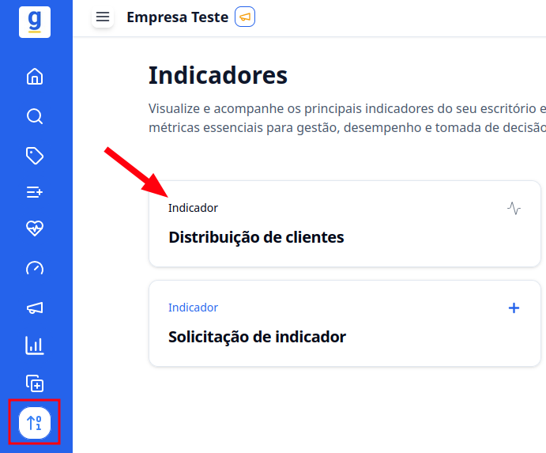
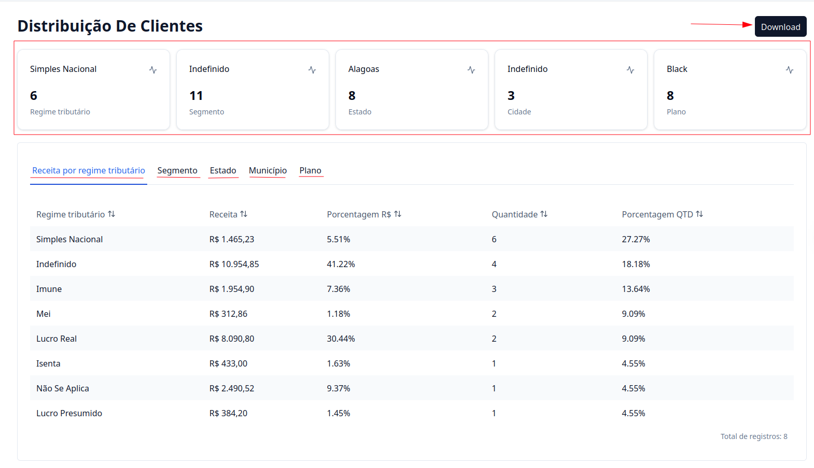

## Introdução

O **Indicador de Distribuição de Clientes** permite que você visualize a distribuição da sua receita de acordo com os seguintes critérios:

- **Regime tributário**
- **Segmento**
- **Estado**
- **Município**
- **Plano**

---

## Como acessar?

### 1. Acesse o G Client

Primeiramente, faça login na sua conta do **G Client**.

---

### 2. Navegue até a seção **Gestão de Clientes**

No menu lateral, clique na opção **Indicadores** e selecione **Distribuição de Clientes**.

---

### 3. Entendendo a página

- Os dados apresentados no card indicam o tipo mais recorrente.
- Logo abaixo, você pode ver a receita de cada tipo em **valor (R$)**, **porcentagem (%)** e **quantidade**.
- Caso queira, é possível **baixar essas informações** clicando no botão **Download**, localizado no canto superior direito.

---

✅ **Pronto!** Agora você sabe onde encontrar o indicador de distribuição de clientes dentro do **G Client**. Se precisar de ajuda, entre em contato clicando [aqui](https://api.whatsapp.com/send?phone=5544997046569&text=Preciso%20de%20ajuda%20sobre%20um%20tutorial)!

🎉 **Obrigado por usar o G Client!**
