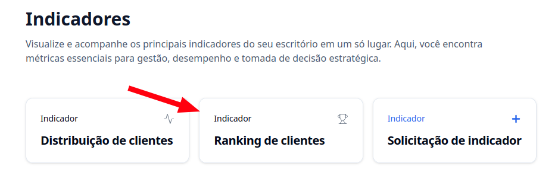
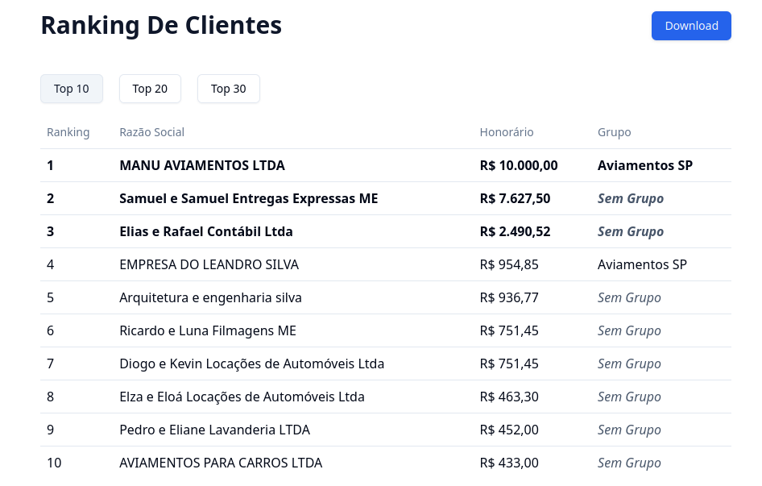

## Introdução

O **Indicador de Ranking de Clientes** mostra para você os clientes com os maiores honorários, classificados em ordem decrescente.

---

## Como acessar?

### 1. Acesse o G Client

Primeiramente, faça login na sua conta do **G Client**.

---

### 2. Navegue até a seção **Gestão de Clientes**

No menu lateral, clique na opção **Indicadores** e selecione **Ranking de Clientes**.

---

### 3. Entendendo a página

Você poderá visualizar o ranking dos seus clientes de acordo com o honorário e escolher entre as seguintes opções:

- **Top 10**
- **Top 20**
- **Top 30**

Além disso, é possível **exportar esses dados em PDF**.

---

✅ **Pronto!** Agora você sabe onde encontrar o indicador de ranking de clientes dentro do **G Client**. Se precisar de ajuda, entre em contato clicando [aqui](https://api.whatsapp.com/send?phone=5544997046569&text=Preciso%20de%20ajuda%20sobre%20um%20tutorial)!

🎉 **Obrigado por usar o G Client!**
