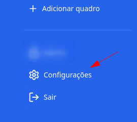
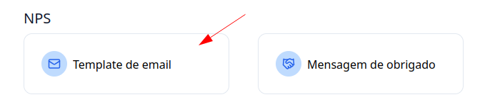
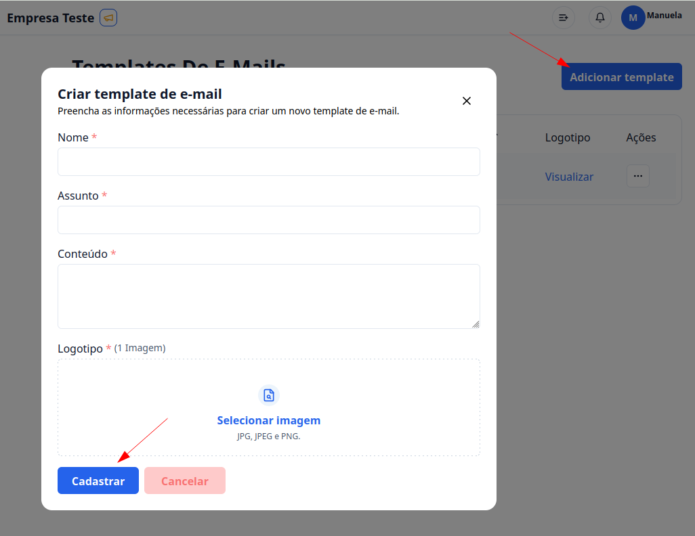

## 1. Acesse o G Client

Primeiramente, faça login na sua conta do G Client.

## 2. Navege até a Seção de configurações

Seleciona a opção de configurações que tem o icone de engrenagem.

## 3. Vá até a Seção NPS

Clique na opção **Template de Email**.

## 4. Dentro de Template de Email

Clique no botão **Nova mensagem**. Com isso abrirá um modal em que você pode colocar:

- Nome: aqui você coloca o nome do seu template, para identificação.
- Assunto: O assunto e o que vai aparecer no topo da mensagem.
- Conteúdo: aqui é a descrição da da sua mensagem, é o conteúdo do texto.
- Logotipo: Aqui você coloca a logo da sua empresa, que vai aparecer no cabeçalho.

Depois de preenchido todos os campos, é só clicar em **Cadastrar**, para finalizar o cadastro. Com isso você pode usar a mensagem de obrigado nas suas campanhas NPS.

Não sabe como criar e enviar uma campanha NPS, clique <a href="/docs/customer-management/nps/" className="text-blue-600 font-bold">aqui</a> para saber como realizar o proceso.

---

✅ Com esse tutorial, esperamos que consiga criar um template de email para as campanhas NPS. Se precisar de mais ajuda, é só [avisar](https://api.whatsapp.com/send?phone=5544997046569&text=Preciso%20de%20ajuda%20sobre%20um%20tutorial)!
