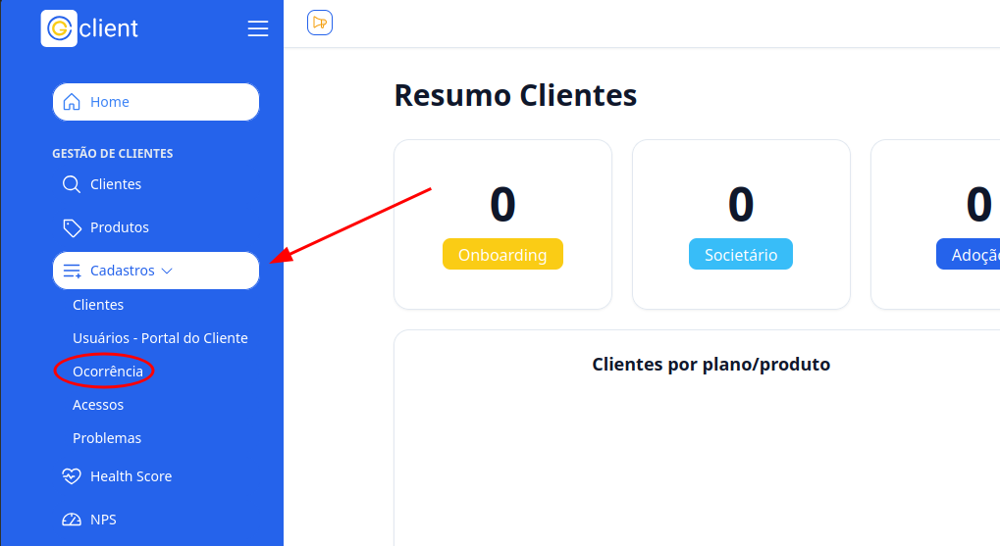
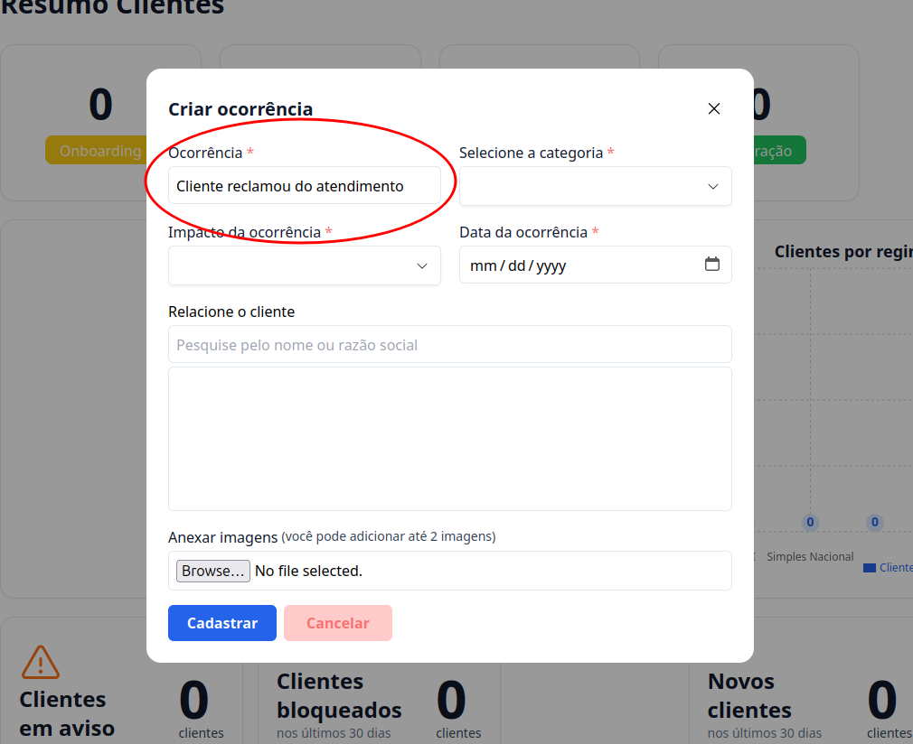
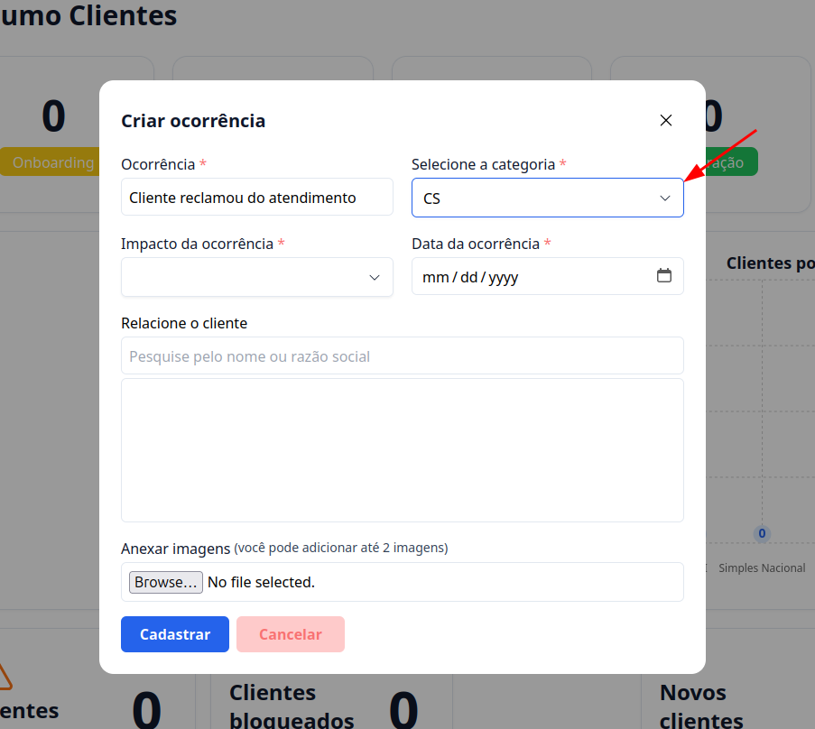
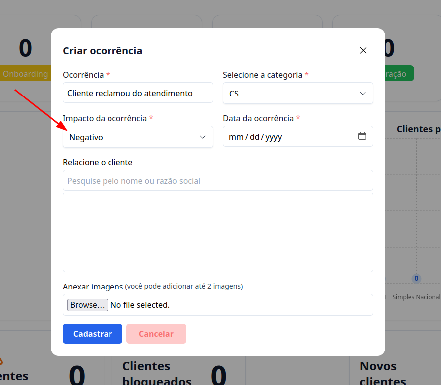
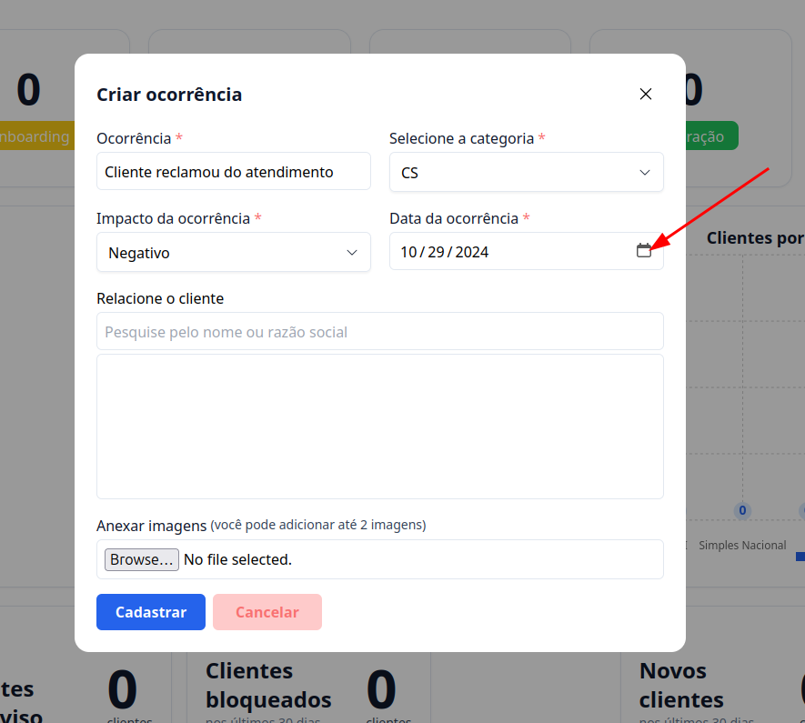
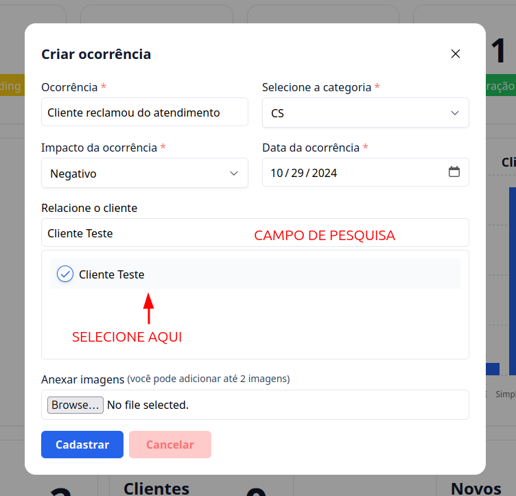
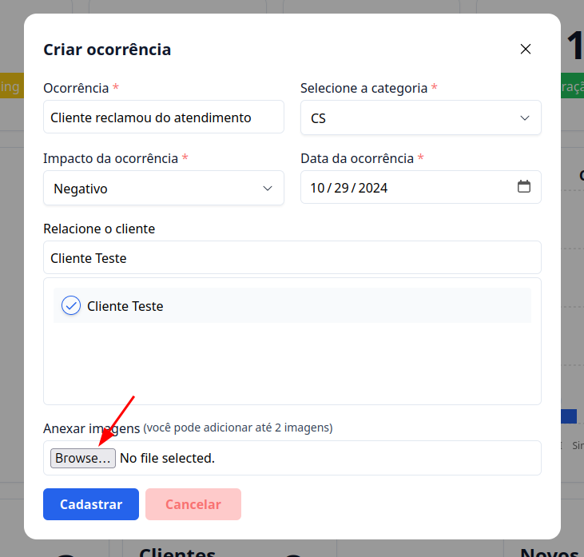
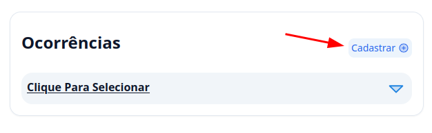
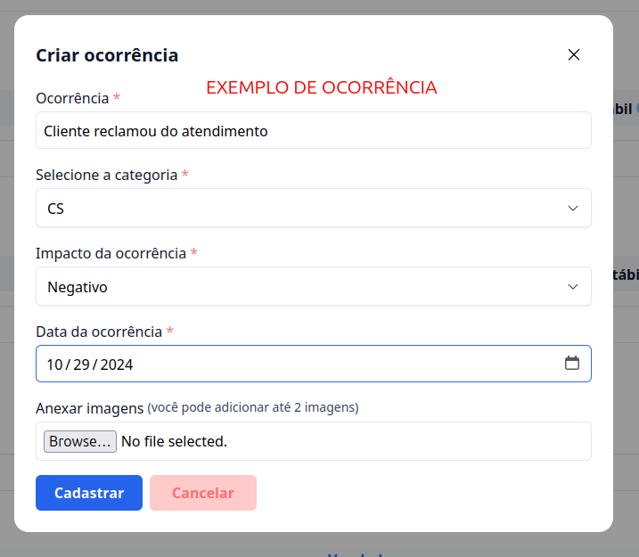

## Introdução

Bem-vindo ao tutorial do **G Client**! Neste guia, você aprenderá como cadastrar ocorrências, tanto na seção de cadastros quanto diretamente no cliente.

---

## Passo a passo para cadastrar uma ocorrência

### 1. Acesse o G Client

Faça login na sua conta do **G Client**.

---

### 2. Navegue até a seção **Cadastros**

No menu lateral, clique na aba **Cadastros**.  
Em seguida, selecione a opção **Ocorrência**.

---

### 3. Preencha os campos necessários

Na seção de cadastro de ocorrências, preencha os seguintes campos:

1. **Ocorrência**: descreva o problema enfrentado pelo cliente.  
   

2. **Selecione a Categoria**: escolha a categoria que melhor descreve a ocorrência.  
   

3. **Impacto da Ocorrência**: selecione o impacto gerado para o cliente:

   - POSITIVO
   - NEUTRO
   - NEGATIVO  
     

4. **Data da Ocorrência**: registre a data no formato `MM/DD/AAAA`.  
   

5. **Relacione o Cliente**: localize rapidamente o cliente relacionado usando o campo de busca.  
   

6. **Anexar Imagens (opcional)**: adicione até 2 imagens para documentar a ocorrência clicando em **Browse...** e selecionando os arquivos.  
   

   > ⚠️ **Nota:** Este campo é opcional. Você pode cadastrar a ocorrência sem adicionar imagens.

---

### 4. Finalize o cadastro

Após preencher todos os campos, clique no botão **Cadastrar** para salvar a ocorrência.

---

## Cadastrando uma ocorrência diretamente no cliente

### 1. Acesse o G Client

Faça login na sua conta do **G Client**.

---

### 2. Navegue até a seção **Clientes**

No menu lateral, clique na aba **Clientes**.

---

### 3. Localize o cliente

Navegue pela lista de clientes até encontrar o cliente desejado. Clique no nome dele para acessar as informações detalhadas.

---

### 4. Cadastre a ocorrência

Na página do cliente, localize a seção de **Ocorrências**. Clique no botão **Cadastrar +**, que abrirá o formulário para preenchimento dos campos necessários.

---

### 5. Finalize o cadastro

Após preencher os campos, clique em **Cadastrar** para concluir o processo.

---

✅ **Pronto!** Agora você sabe como cadastrar ocorrências no **G Client**. Se precisar de mais ajuda, entre em contato clicando [aqui](https://api.whatsapp.com/send?phone=5544997046569&text=Preciso%20de%20ajuda%20sobre%20um%20tutorial)!

🎉 **Obrigado por usar o G Client!**
