## Introdução

Bem vindo ao tutorial do G Client! Neste guia, vamos explicar como é feito o cadastro de problemas.

## Passo a Passo para Cadastrar Ocorrência

### 1. Acesse o G Client

Primeiramente, faça o login na sua conta do G Client

### 2. Navege até a Seção Cadastros

Na página principal, cliqe na aba `Cadastros` localizado no menu lateral. Com isso aparecerá algumas opções clique na opção `Problemas`.

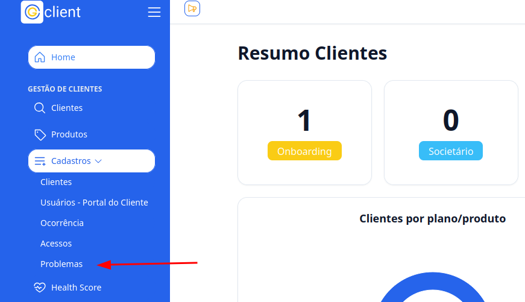

### 3. Preencha os campos

Na seção de cadastro de problemas, você deverá preencher os seguintes campos:

- **Status do problema**: selecione o andamento do problema RESOLVIDO, RESOLVENDO ou NÃO RESOLVIDO.

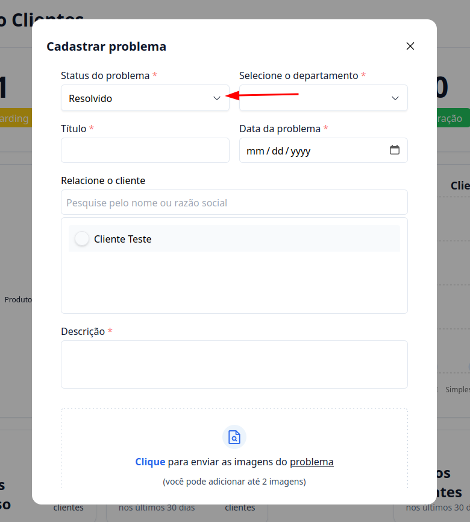

- **Selecione a Departamento**: escolha o depantamento que acontece o problema.

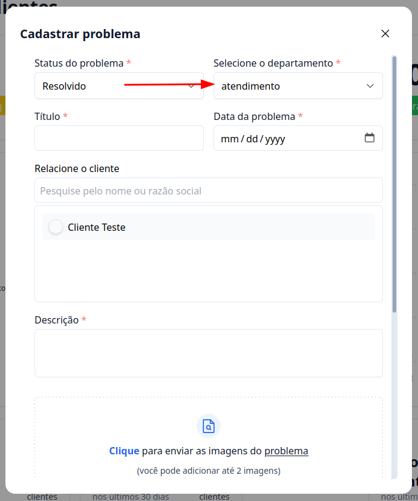

- **Título**: O nome do problema.

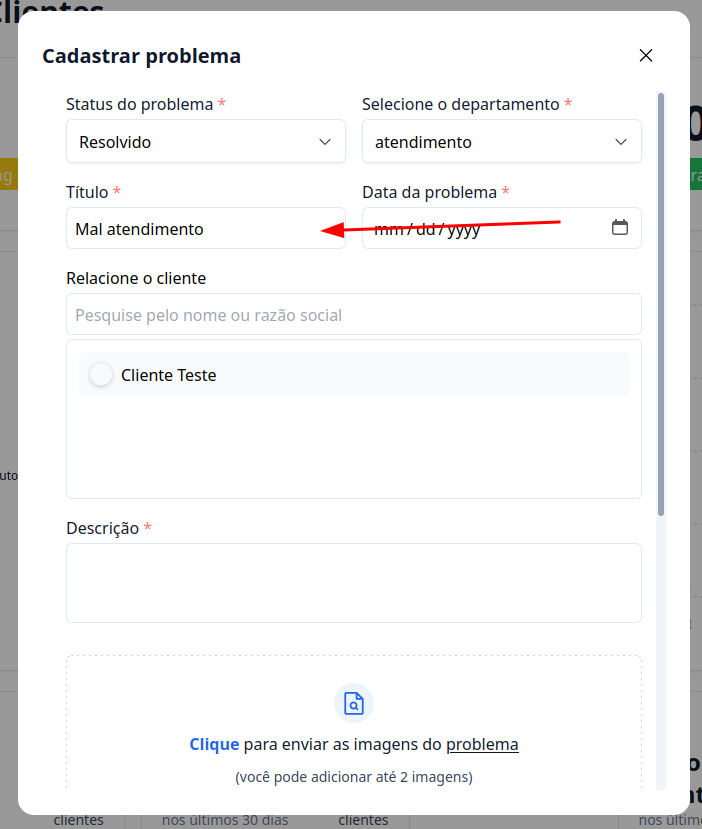

- **Data do problema**: registre a data da situação.

> **Nota**: A data está no seguinte formato `MM/DD/AAAA`

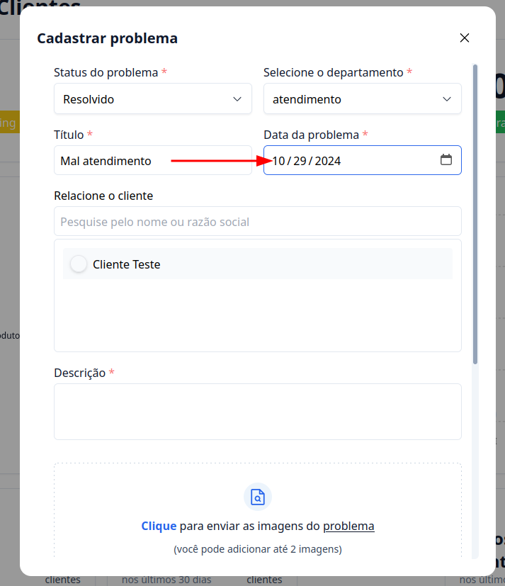

- **Relacione o Cliente**: use o campo de busca para localizar rapidamente o cliente relacionado ao problema.

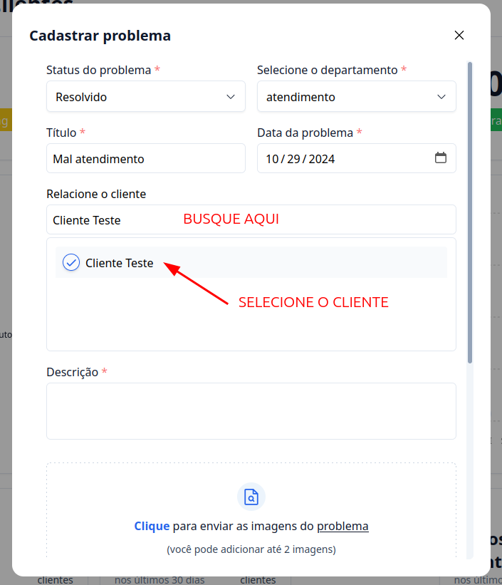

- **Descrição**: aqui você vai colocar a descrição detalhada do problema enfrentado.

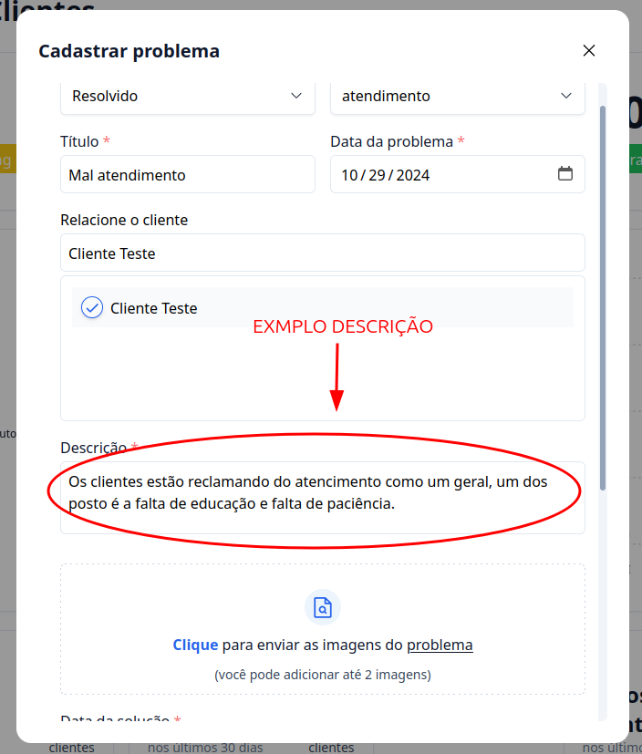

- **Anexar Imagens (opcional)**: você pode adicionar até 2 imagens para documentar o problema. Para anexá-las, clique no campo de adicionar imagens e selecione os arquivos desejados.

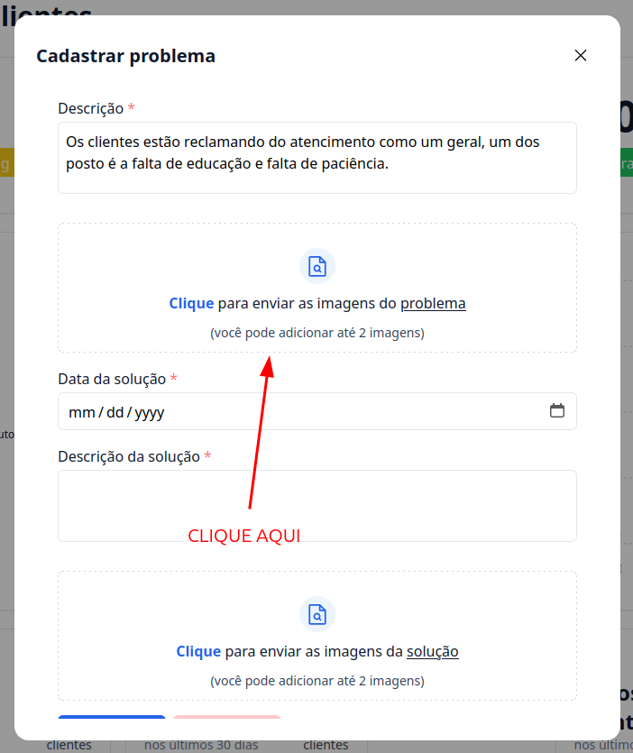

> ⚠️ **Este campo é opcional e não é obrigatório adicionar imagens para concluir o cadastro.**

#### Em caso do problema já ter sido resolvido, aparecerá mais os seguintes campos

**Data da solução**: data que foi solucionado o problema.

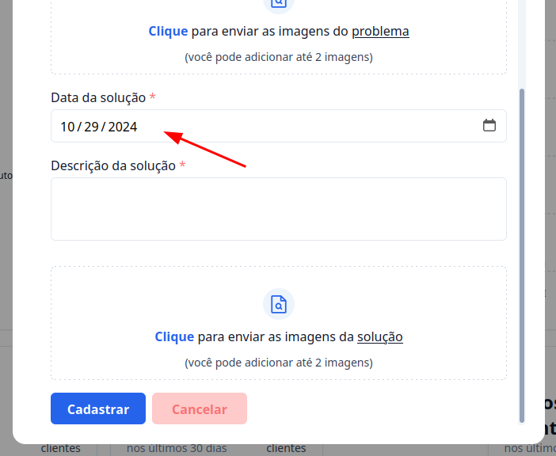

**Descrição da solução**: aqui você vai colocar a descrição da solução do problema.

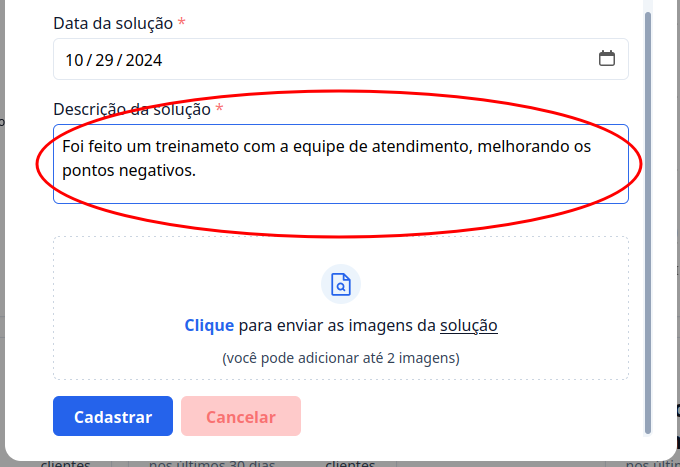

**Anexar Imagens (opcional)**: você pode adicionar até 2 imagens para documentar a solução do problema. Para anexá-las, clique no campo de adicionar imagens e selecione os arquivos desejados.

### 4. Finalize o Cadastro

Após preencher todos os campos, finalize o cadastro clicando no botão `Cadastrar`.

---

Além disso é possivel cadastrar um problema direto no cliente.

## Passo a Passo para Cadastrar Ocorrência direto no Cliente

### 1. Acesse o G Client

Primeiramente, faça o login na sua conta do G Client

### 2. Navege até a seção de Clientes

Na página principal, cliqe na aba `Clientes` localizado no menu lateral.

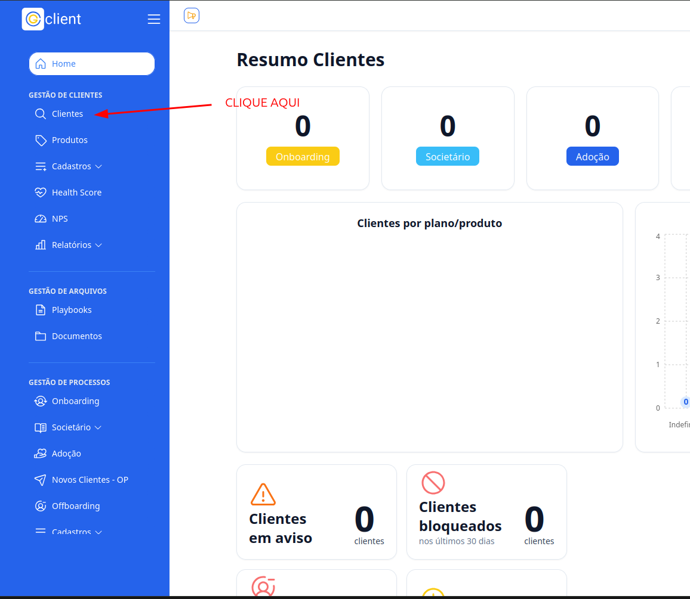

### 3. Procure o cliente você deseja cadastrar uma ocorrência.

Navege dentro da aba de clientes até achar o cliente que deseja cadastrar a ocorrência e clique nele.

### 4. Cadastre a ocorrência

Descendo um pouco a página é possivel encontrar as Problemas, clique no botão `Cadastrar +`, com isso aparecerá os campos para serem preenchidos.

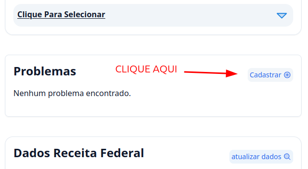

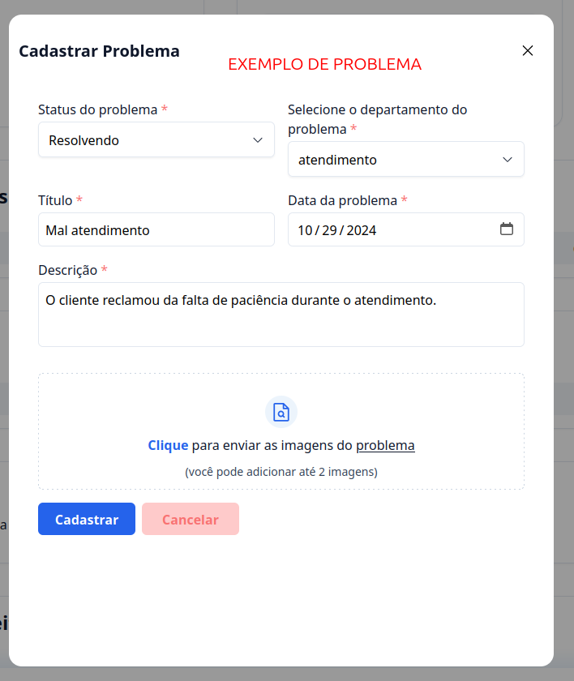

### 5. Finalize o cadastro

Após preencher todos os campos, finalize o cadastro clicando no botão `Cadastrar`.

---

✅ Com esse tutorial, esperamos que o processo de cadastro de ocorrências seja fácil e eficiente. Se precisar de mais ajuda, é só [avisar](https://api.whatsapp.com/send?phone=5544997046569&text=Preciso%20de%20ajuda%20sobre%20um%20tutorial)!
