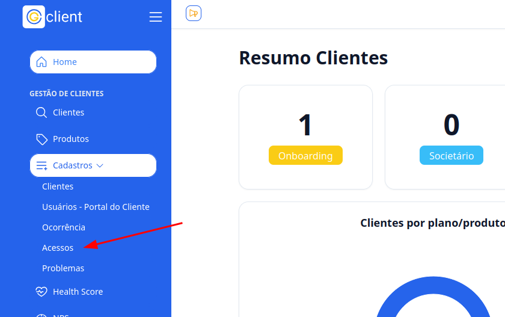
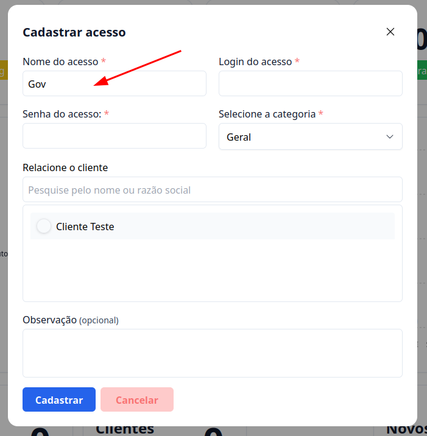
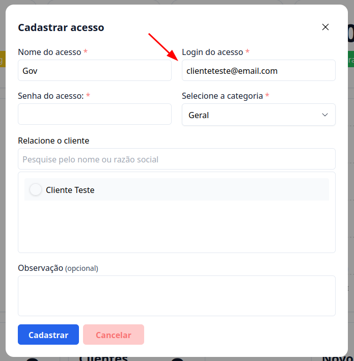
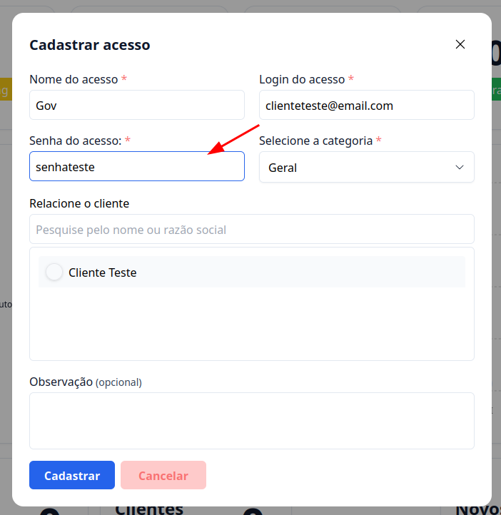
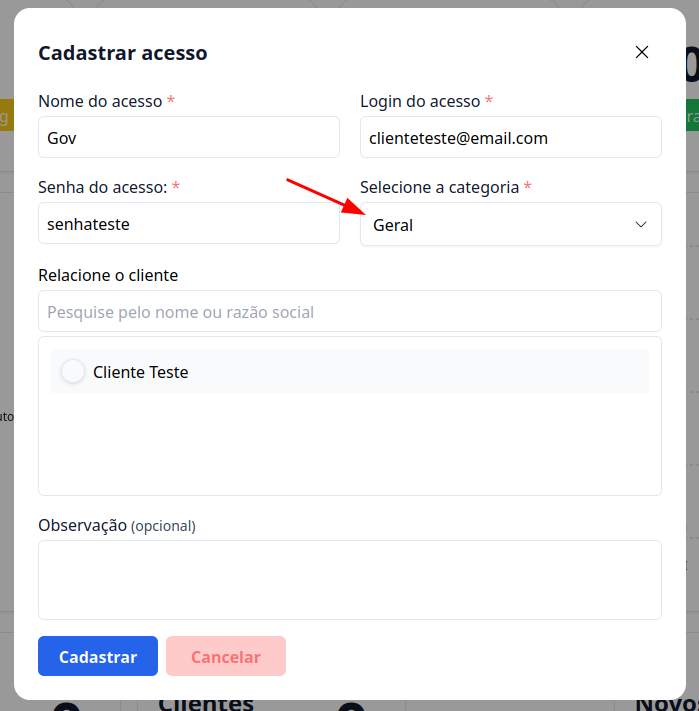
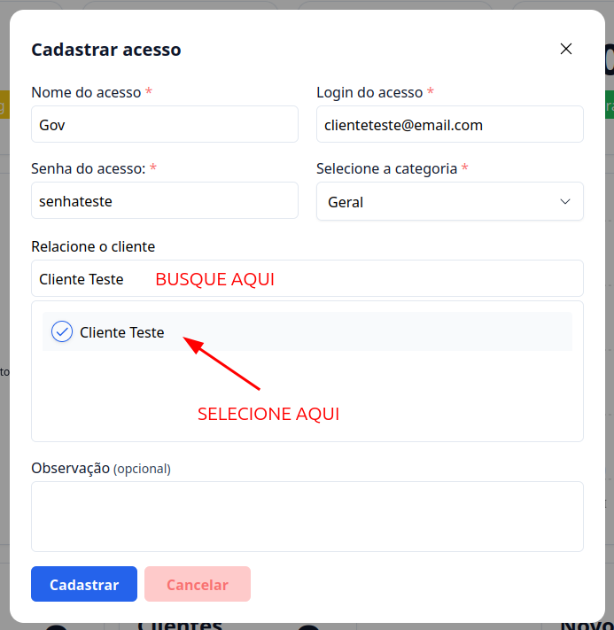
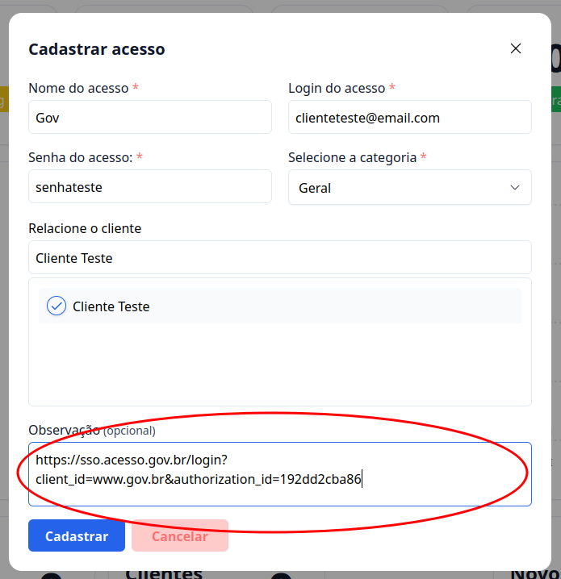
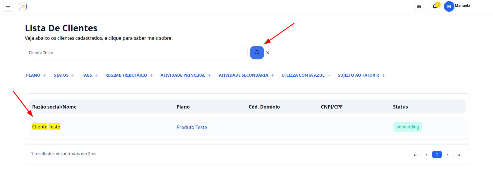
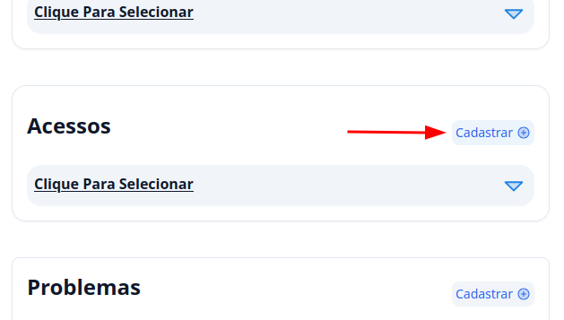
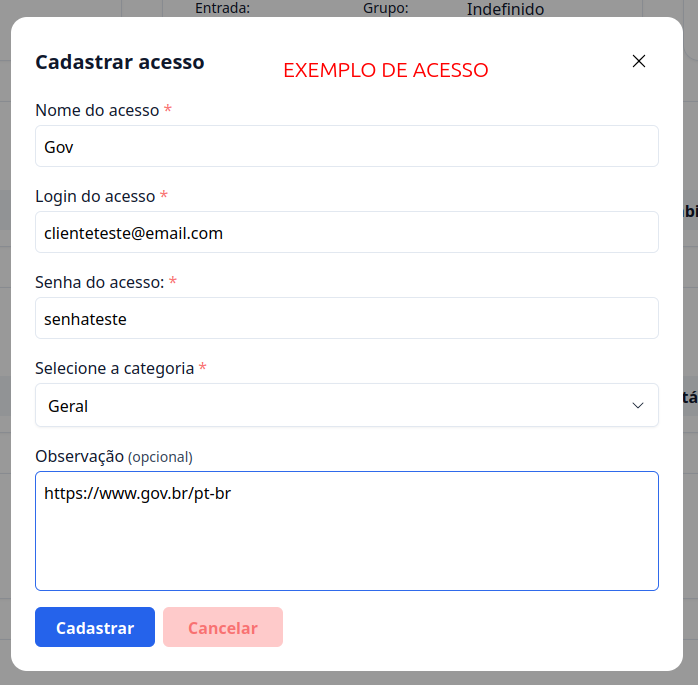

## Introdução

Bem-vindo ao tutorial do **G Client**!  
Neste guia, explicaremos como cadastrar os acessos de seus clientes para que você não precise solicitá-los repetidamente.

---

## Passo a passo para cadastrar acessos

### 1. Acesse o G Client

Faça login na sua conta do **G Client**.

---

### 2. Navegue até a seção **Cadastros**

No menu lateral, clique na aba **Cadastros**.  
Em seguida, selecione a opção **Acessos**.

---

### 3. Preencha os campos necessários

Na seção de cadastro de acessos, preencha os seguintes campos:

1. **Nome do acesso**: insira o nome do acesso que está sendo cadastrado.  
   

2. **Login do acesso**: insira o login para acessar o site ou sistema.  
   

3. **Senha do acesso**: insira a senha associada ao login.  
   

4. **Categoria**: selecione a categoria correspondente ao acesso.  
   

5. **Relacione o Cliente**: use o campo de busca para localizar rapidamente o cliente ao qual o acesso está vinculado.  
   

6. **Observação (opcional)**: insira observações adicionais. Recomendamos informar o site associado ao acesso para facilitar futuras consultas.  
   

---

### 4. Finalize o cadastro

Após preencher todos os campos, clique no botão **Cadastrar** para salvar o acesso.

---

## Cadastrando acessos diretamente no cliente

### 1. Acesse o G Client

Faça login na sua conta do **G Client**.

---

### 2. Navegue até a seção **Clientes**

No menu lateral, clique na aba **Clientes**.

---

### 3. Localize o cliente

Navegue pela lista de clientes até encontrar o cliente desejado. Clique no nome dele para acessar os detalhes.

---

### 4. Cadastre o acesso

Na página do cliente, localize a seção de **Acessos**. Clique no botão **Cadastrar +**, que abrirá o formulário para preenchimento.

---

### 5. Finalize o cadastro

Após preencher os campos, clique em **Cadastrar** para concluir o processo.

---

✅ **Pronto!** Agora você sabe como cadastrar acessos no **G Client**. Se precisar de mais ajuda, entre em contato clicando [aqui](https://api.whatsapp.com/send?phone=5544997046569&text=Preciso%20de%20ajuda%20sobre%20um%20tutorial)!

🎉 **Obrigado por usar o G Client!**
