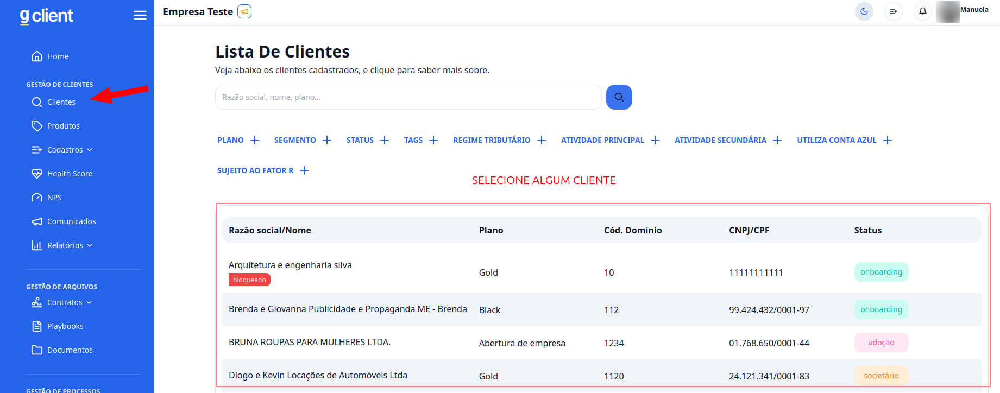
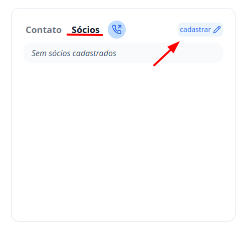
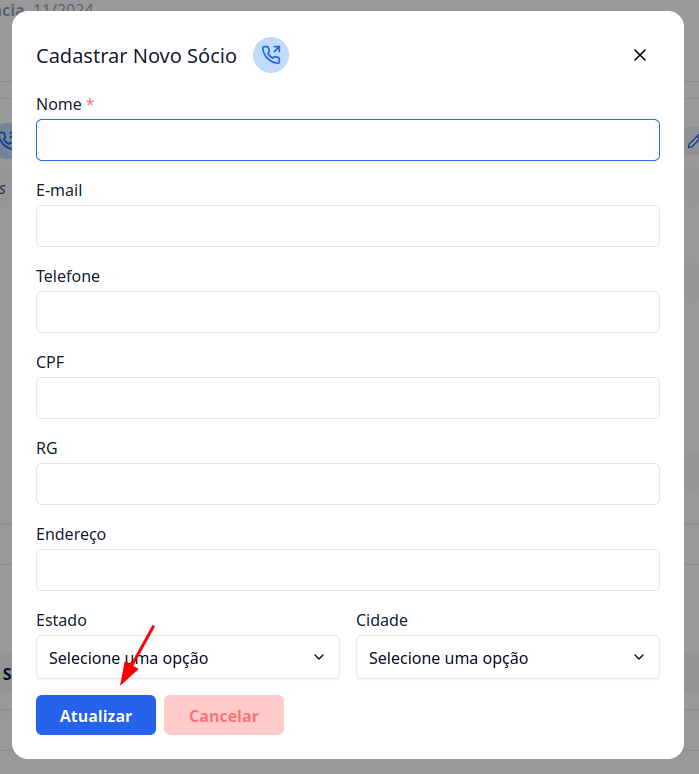

## Introdução

Bem-vindo ao tutorial do **G Client**! Neste guia, você encontrará um passo a passo detalhado para realizar o cadastro de sócios dos seus clientes de maneira simples e eficiente.

---

## Passo a Passo para Cadastrar Sócios

### 1. Acesse o G Client

Inicie fazendo login na sua conta do **G Client** com suas credenciais.

---

### 2. Navegue até a seção **Gestão de Clientes**

Na página principal, localize o menu lateral e clique na aba **Clientes**. Em seguida, selecione o cliente para o qual você deseja adicionar um sócio.

---

### 3. Acesse a aba **Sócios**

Dentro da página do cliente, vá até os cartões de informações de contato e clique na aba **Sócios**. Depois, selecione o botão **Cadastrar** para começar o processo.

---

### 4. Preencha as informações necessárias

Preencha todos os campos solicitados com os dados do sócio. Após finalizar, clique em **Atualizar**. Pronto! O sócio será exibido na aba **Sócios**. Lembre-se de que você pode cadastrar mais de um sócio por cliente, caso necessário.

---

✅ **Pronto!** Agora você pode cadastrar e gerenciar os sócios dos seus clientes no **G Client** de forma simples e eficiente. Se precisar de ajuda, entre em contato clicando [aqui](https://api.whatsapp.com/send?phone=5544997046569&text=Preciso%20de%20ajuda%20sobre%20um%20tutorial)!

🎉 **Obrigado por usar o G Client!**
