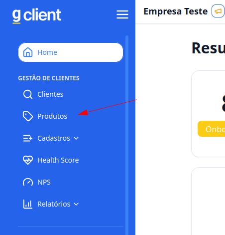
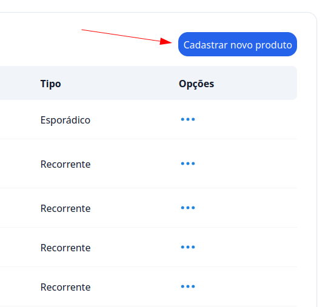
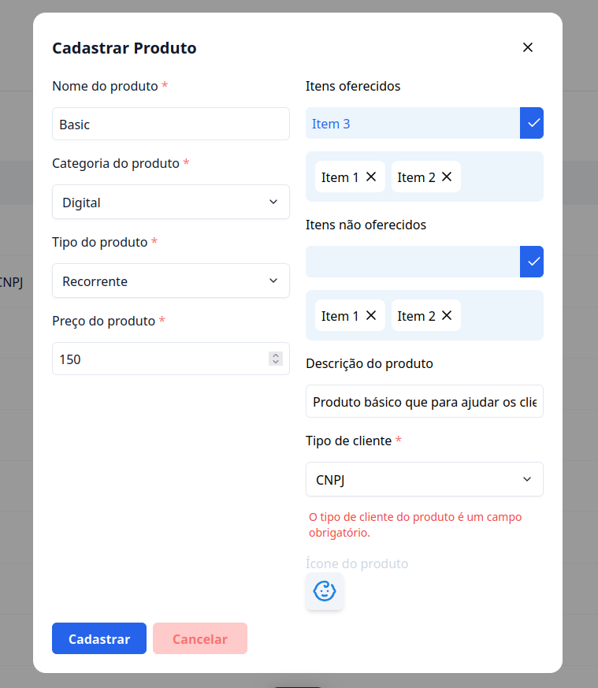

# Como cadastrar um produto

## Introdução

Bem vindo ao tutorial do G Client! Neste guia, vamos explicar como é feito o cadastro de produto dos seus clientes.

## Passo a Passo para Cadastrar Produto

### 1. Acesse o G Client

Primeiramente, faça o login na sua conta do G Client

### 2. Navege até a Seção Produtos

Na página principal, cliqe na aba `Produtos` localizado no menu lateral.

### 3. Dentro de Produtos

Clique no botão **Cadastrar novo produto**, para pooder preencher os campos.

### 4. Preencha os campos

Você deverá preencher os seguintes campos:

- **Nome do produto**;
- **Categoria do Produto**;
- **Tipo do produto**;
- **Preço do produto**;
- **Itens oferecidos**: aqui você pode colcoar os que esse produto fornece.
- **Iens não oferecidos**: aqui você coloca os itens que o produto não oferece.
- **Descrição do produto**;
- **Tipo de cliente**.
- **Icone do produto**: você pode selecionar um icone específico para seu produto, para melhor identificação.

### 5. Finaliza os cadastro

Após preencher todos os campos, finalize o cadastro clicando no botão `Cadastrar`.

---

✅ Com esse tutorial, esperamos que o processo de cadastro de produtos seja fácil e eficiente. Se precisar de mais ajuda, é só [avisar](https://api.whatsapp.com/send?phone=5544997046569&text=Preciso%20de%20ajuda%20sobre%20um%20tutorial)!
