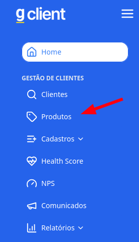
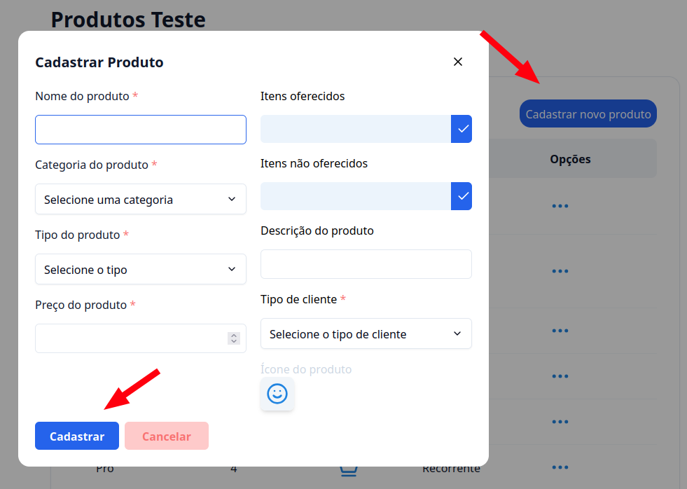

## Introdução

Está com dificuldade para cadastrar produtos? Venha comigo que vou te auxiliar nessa jornada.

---

## Passo a passo de como cadastrar produtos

### 1. Acesse o G Client

Faça login no **G Client** e certifique-se de que você possui as permissões necessárias para criar um novo produto.

---

### 2. Navegue até a sessão **Gestão de Clientes**

No menu lateral, clique na aba **Produtos**.

---

### 3. Cadastrar produto

1. Localize o botão **Cadastrar novo produto** e clique nele.  
2. Um modal será exibido. Preencha os campos necessários com as informações do produto.  

3. Para concluir o cadastro, clique em **Cadastrar**.

---

✅ **Pronto!** Agora você sabe como cadastrar produtos no **G Client**. Se precisar de ajuda, entre em contato clicando [aqui](https://api.whatsapp.com/send?phone=5544997046569&text=Preciso%20de%20ajuda%20sobre%20um%20tutorial)!

🎉 **Obrigado por usar o G Client!**
