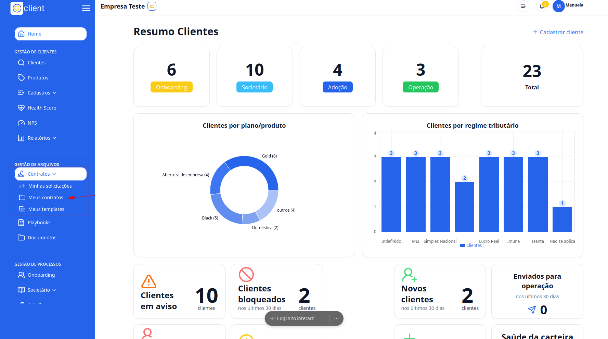
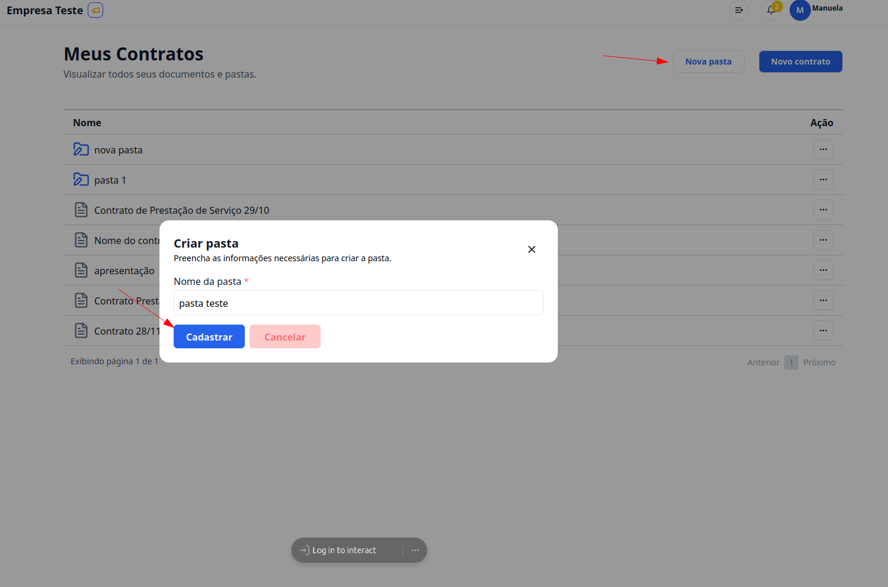
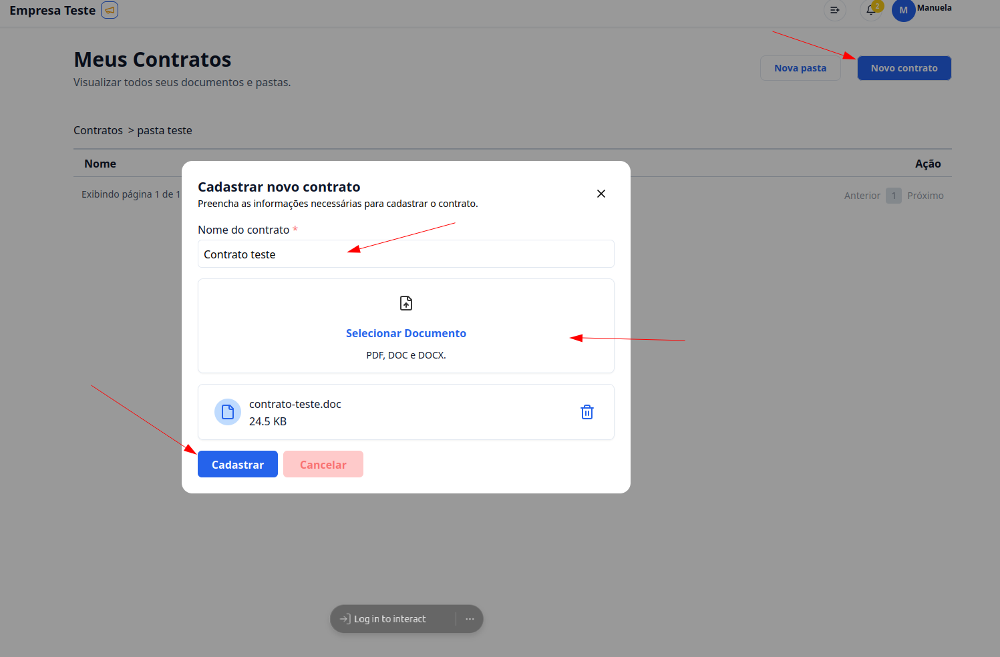
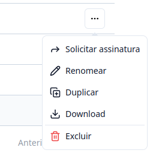

## Passo a Passo para criar Pastas e adicionar Documentos.

### 1. Acesse

Primeiramente, faça login na sua conta do G Client.

Verifique se você possui as permissões necessárias para lidar com os documentos.

### 2. Navegue até a Seção de GESTÃO DE ARQUIVOS

Clique na aba `Contratos` locallizada no menu lateral. Clique me **Meus contratos**.

### 3. Meus Contratos

Clique no botão `Nova pasta`, coloque o nome que deseja nomear a pasta.

Para finalizar a criação clique em **Cadastrar**.

### 4. Criar Contrato

Clique no botão `Novo Contrato`, coloque o nome do documento e exporte o documento.

Para finalizar a criação do contrato clique em **Cadastrar**.

> ⚠️ Só poder ser exportados os seguintes formatos: PDF, DOC, DOCX.

### 5. Botões de ação no documento

Ao clicar no botão `...` nas pastas você terá as seguintes opcões:

- `Renomear`: você poderá editar o nome do documento.
- `Excluir`: você poderá excluir um documento.

Ao clicar no botão `...`: nas pastar você terá as seguintes opções:

- `Solicitar assinatura`:
- `Renomar`: você poderá editar o nome do documento.
- `Duplicar`: você fará um cópia do arquivo.
- `Download`: ao clicar neste botão o documento será salvo em seu dispositivo.
- `Excluir`: você poderá excluir um documento.

✅ Esse tutorial deve ajudar os usuários a cadastrar pastas e documentos dos seus clientes de forma simples e eficiente. Se precisar de mais alguma coisa, é só [avisar](https://api.whatsapp.com/send?phone=5544997046569&text=Preciso%20de%20ajuda%20sobre%20um%20tutorial)!
