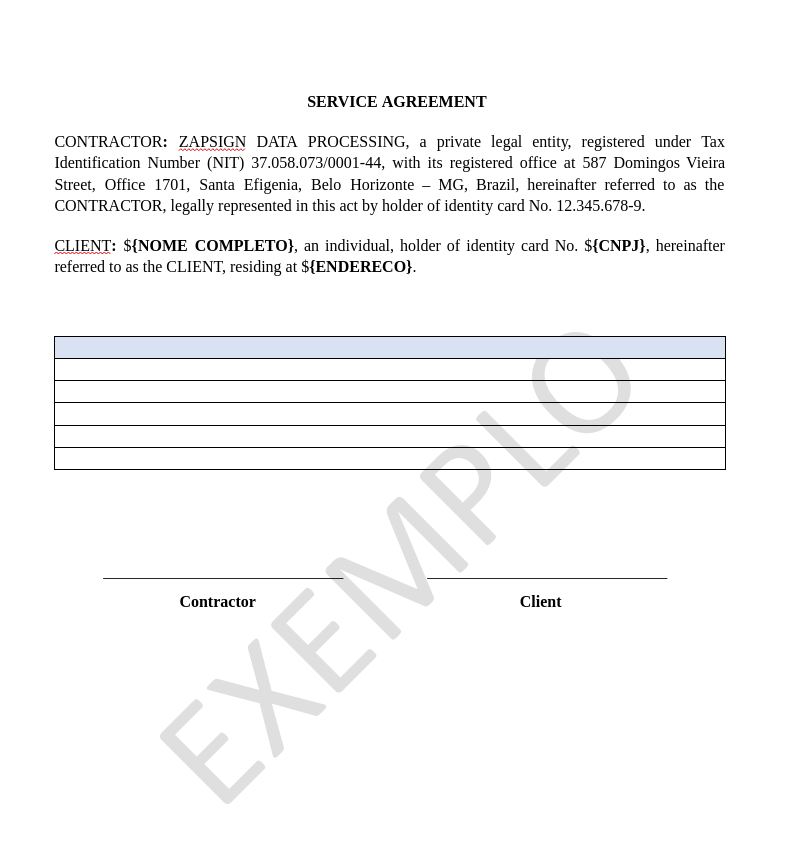
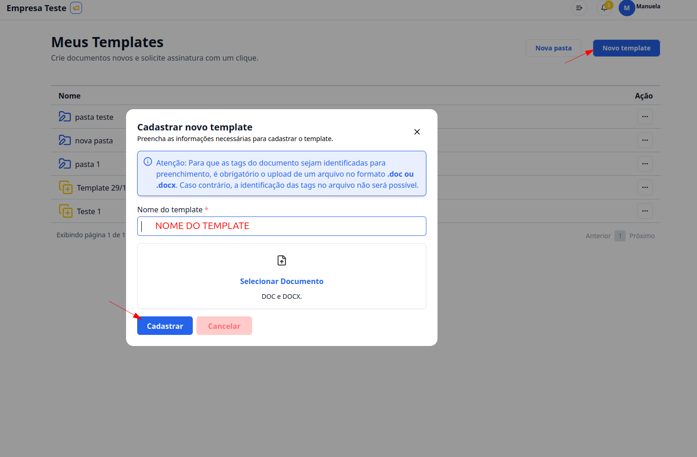

## Passo a Passo para criar um documentos Template

### 1. Acesse

Primeiramente, faça o login na sua conta do G Client.

Verifique se você possui as permissões necessárias para lidar com os documentos.

### 2. navegue até a Seção de GESTÃO DE ARQUIVOS

Clique na aba `Contratos` localizada no meu lateral. Clique em **Meus templates**.

### 3. Meus Templates

Clique no botão `Novo template`, coloque o nome do template e selecione o documento.

- Como deve ser o documento:

  Os locais que você deseja mudar você deve colocar da seguinte forma `${nome}`. Segue a baixo um exemplo de modelo de como realizar um template:

> ⚠️ Só é suportado os arquivos do tipo DOC E DOCX

Para finalizar clique em **Cadastrar**.

✅ Esse tutorial deve ajudar os usuários a criar templates para seus clientes de forma simples e eficiente. Se precisar de mais alguma coisa, é só [avisar](https://api.whatsapp.com/send?phone=5544997046569&text=Preciso%20de%20ajuda%20sobre%20um%20tutorial)!
