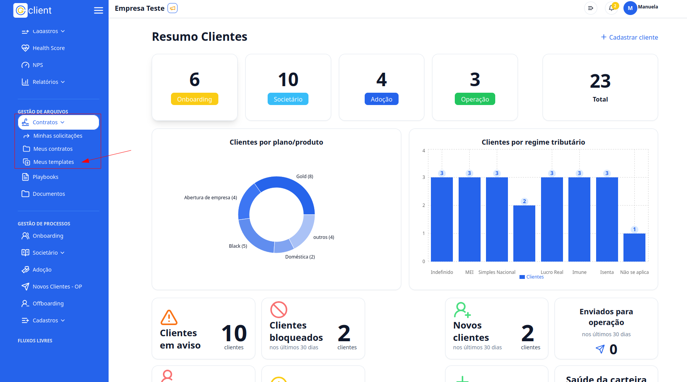

## Passo a Passo de como solicitar uma assinatura a partir de um template

### 1. Acesse

Primeiramente, faça o login na sua conta do G Client.

Verifique se você possui as permissões para lidar com os **Contratos**.

### 2. Navegue até a Seção de GESTÃO DE ARQUIVOS

Clique na aba `Contratos` localizado no menu lateral. Clique em **Meus Templates**.

### 3. Meus Templates

Clique no botão `...` no arquivo que você deseja fazer a solicitação da assinatura.

Navegue até a opção **Solicitar assinatura**. Com isso será aberto um modal com as seguintes informações:

- **Nome do documento**: aqui você vai colocar o nome do documento.
- **Mensagem ao(s) destinatário(s)**: aqui você pode colocar uma descrição que o destinatário irá receber.
- **Signatário**: aqui você deve colocar 1 ou mais signatários, lembrando que devem ser **emails**.
- **Data de expiração** (opcional): aqui você pode colocar uma data limite para assinatura do contrato.
- **Campos do template**: aqui aparecerá os campos que você cadastrou no seu template para serem preenchidos dinamicamente.

Por fim, após preencher os campos, basta clicar no botão **Enviar solicitação**.

Após esse processo, é enviado um email para os envolvidos realizarem a assinatura do contrato.

### 4. Visualizando as Solicitações

Cliquei na aba `Contratos` localizado no manu lateral. Clique em **Minhas solicitações**.

### 5. Dentro das Solicitações

Você pode visualizar um tabela com as seguintes informações:

- `Contrato`: É o nome do Contrato.
- `Pasta`: Onde está localizado o arquivo.
- `Expiração`: A data limite para assinatura.
- `Vencimento`: A data de vencimento do contrato.
- `Interessados`: O nome de quem enviou a solicitação e também a lista de emails que recebeu a solicitação de assinatura.
- `Status`: Se foi Concluído, ou se ainda não foi assinado Pendente, e se foi Cancelado.
- `Ação`: Clicando no botão `...` abrirá o seguinte modal:
  - `Lembrar`: Para reenviar um email para aos signatários. Nele você deve adicionar um assunto e uma mensagem ao destinatário.
  - `Cancelar`: Para cancelar a solicitação de assinatura do contrato.
  - `Alterar o signatário`: Para poder fazer a alteração do signatário, é necessário enviar um email e uma mensagem para o novo signatário.

---

✅ Esse tutorial deve ajudar os usuários a solicitar assinatura de templates aos seus clientes de forma simples e eficiente. Se precisar de mais alguma coisa, é só [avisar](https://api.whatsapp.com/send?phone=5544997046569&text=Preciso%20de%20ajuda%20sobre%20um%20tutorial)!
