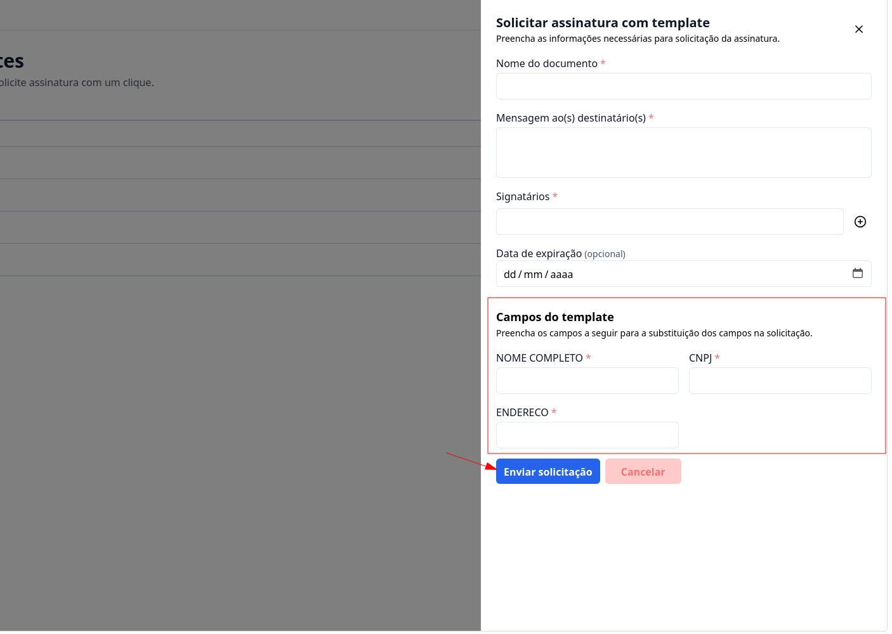
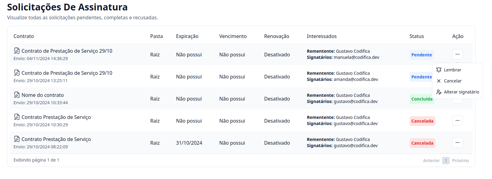

## Passo a Passo de como solicitar uma assinatura de um template

### 1. Acesse

Primeiramente, faça o login na sua conta do G Client.

Verifique se você possui as permissões para lidar com os documentos.

### 2. Navegue até a Seção de GESTÃO DE ARQUIVOS

Cliquei na aba `Contratos` localizado no manu lateral. Clique em **Meus Templates**.

### 3. Meus Contratos

Clique no botão `...` no arquivo que você deseja fazer a solicitação da assinatura.

Navegue até a opção **Soliciatar assinatura**. Com isso será aberto um modal com as seguintes informações:

- **Nome do documento**: aqui você vai colocar o nome do documento.
- **Mensaguem ao(s) destinatário**: aqui você pode colocar uma descrição que o destinatário irá receber.
- **Signatário**: aqui você deve colocar 1 ou mais signatários, lembrando que devem ser emails.
- **Data de expiração** (opcional): aqui você pode colcocar uma data limite para assinatura do contratro.
- **Campos do template**: aqui aparecerá as tags que você cadastrou no seu template.

Por fim só clicar no botão **Enviar solicitação**.

### 4. Vizualizando as Solicitações

Cliquei na aba `Contratos` localizado no manu lateral. Clique em **Minhas solicitações**.

### 5. Detro das Solicitações

Você pode vizualizar um tabela com as seguintes informações:

- `Contrato`: É o nome do Contrato.
- `Pasta`: Onde está localizado o arquivo.
- `Expiração`: A data de envio do contrato para assinatura.
- `Vencimento`: A data limite para a assinatura do contrato.
- `Interessados`: O nome para quem foi enviado e email.
- `Status`: Se foi Concluído, ou se ainda não fou assinado Pendente, e se foi Cancelado.
- `Ação`: Clicando no botão `...` abrirá o seguinte modal:
  - `Lembrar`: Para reenviar aos destinatários. Nele você deve adicionar um assunto e uma mensagem ao destinatário.
  - `Cancelar`: Para cencelar a solicitação de assinatura do contrato.
  - `Alterar o signatário`: Para poder fazer a alteração do destinatário, é necessário enviar um email e uma mensaguem para o destinatário.

---

✅ Esse tutorial deve ajudar os usuários a solicitar assinatura de templates aos seus clientes de forma simples e eficiente. Se precisar de mais alguma coisa, é só [avisar](https://api.whatsapp.com/send?phone=5544997046569&text=Preciso%20de%20ajuda%20sobre%20um%20tutorial)!
