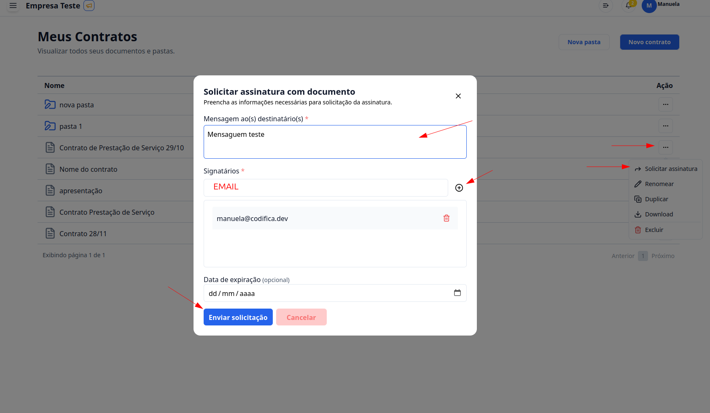
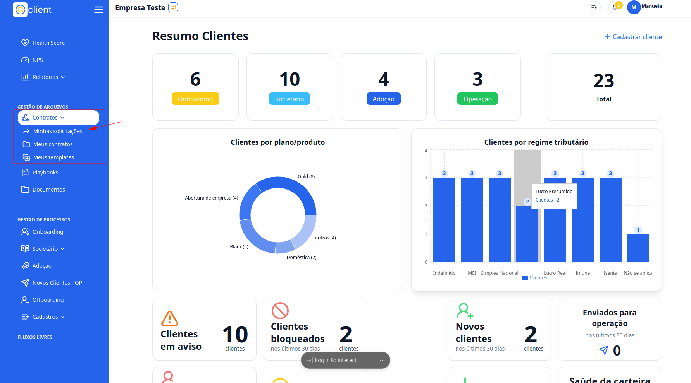
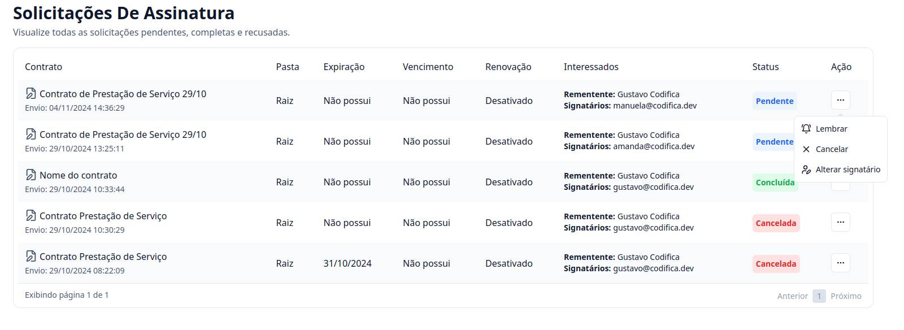

## Passo a passo para solicitar uma assinatura de um documento

### 1. Acesse o G Client

Primeiramente, faça login na sua conta do **G Client**.  
Certifique-se de que você possui as permissões necessárias para gerenciar os **Contratos**.

---

### 2. Navegue até a seção de **Gestão de Arquivos**

No menu lateral, clique na aba **Contratos** e, em seguida, selecione **Meus Contratos**.

---

### 3. Solicitar assinatura

1. Localize o documento desejado.
2. Clique no botão **`...`** ao lado do arquivo.
3. Selecione a opção **Solicitar assinatura**.

Será exibido um modal com os seguintes campos a serem preenchidos:

- **Mensagem ao(s) destinatário(s)**: Adicione uma descrição que será enviada aos signatários.
- **Signatário(s)**: Insira um ou mais emails das pessoas que deverão assinar o documento.
- **Data de expiração** (opcional): Defina um prazo limite para a assinatura do contrato.

Após preencher todos os campos, clique em **Enviar solicitação**.  
O sistema enviará um email para os signatários com a solicitação de assinatura.

---

### 4. Visualizando solicitações de assinatura

1. No menu lateral, clique novamente na aba **Contratos**.
2. Selecione a opção **Minhas solicitações**.

---

### 5. Gerenciando solicitações

Na página **Minhas solicitações**, você verá uma tabela com as seguintes informações:

- **Contrato**: Nome do contrato.
- **Pasta**: Localização do arquivo.
- **Expiração**: Data limite para assinatura.
- **Vencimento**: Data de vencimento do contrato.
- **Interessados**: Nome do solicitante e lista de emails dos signatários.
- **Status**:
  - Concluído: Documento assinado.
  - Pendente: Aguardando assinatura.
  - Cancelado: Solicitação cancelada.

#### Ações disponíveis:

Clique no botão **`...`** ao lado de uma solicitação para abrir o modal de ações. As opções incluem:

- **Lembrar**: Reenvie um email para os signatários com um assunto e mensagem personalizada.
- **Cancelar**: Cancele a solicitação de assinatura.
- **Alterar o signatário**: Substitua um signatário existente. Será necessário enviar um email e uma mensagem para o novo signatário.

---

✅ **Pronto!** Agora você sabe como solicitar assinaturas de documentos no **G Client**. Se precisar de ajuda, entre em contato clicando [aqui](https://api.whatsapp.com/send?phone=5544997046569&text=Preciso%20de%20ajuda%20sobre%20um%20tutorial)!

🎉 **Obrigado por usar o G Client!**
