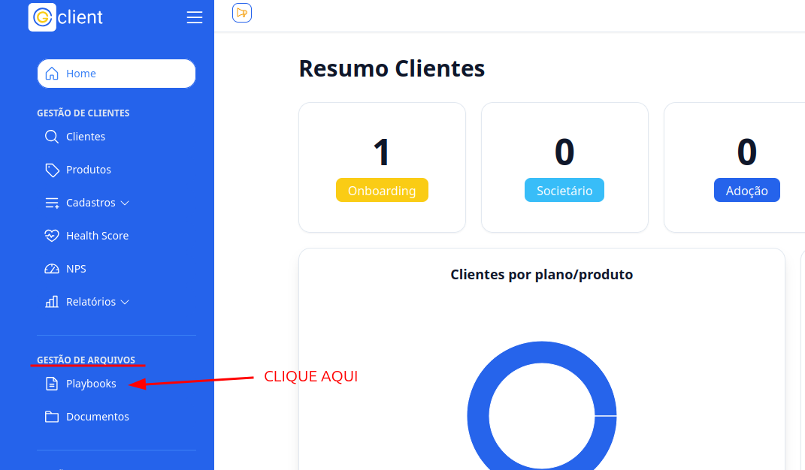
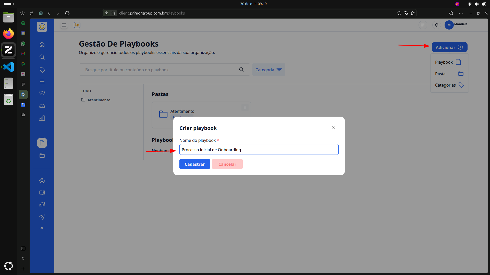
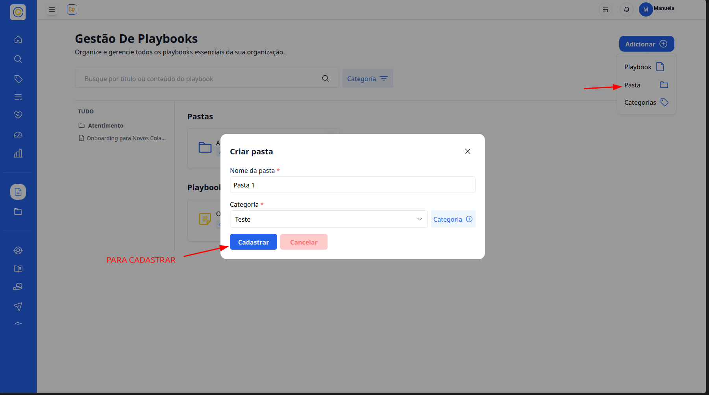
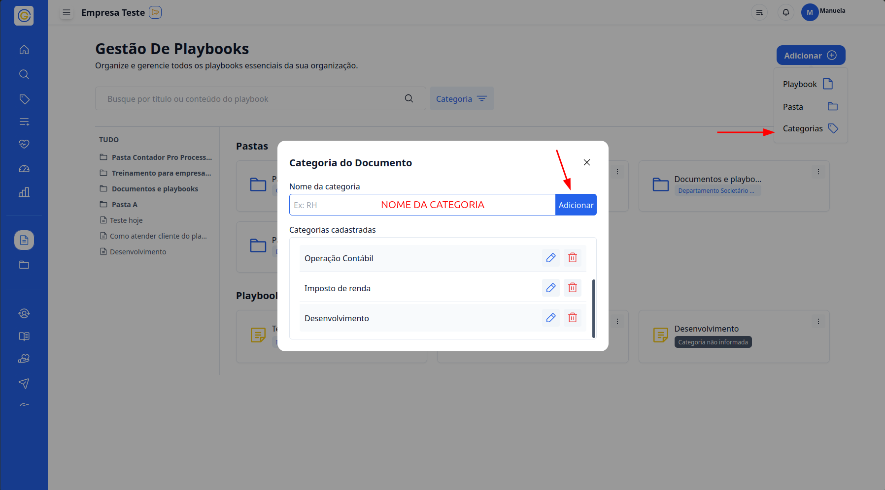
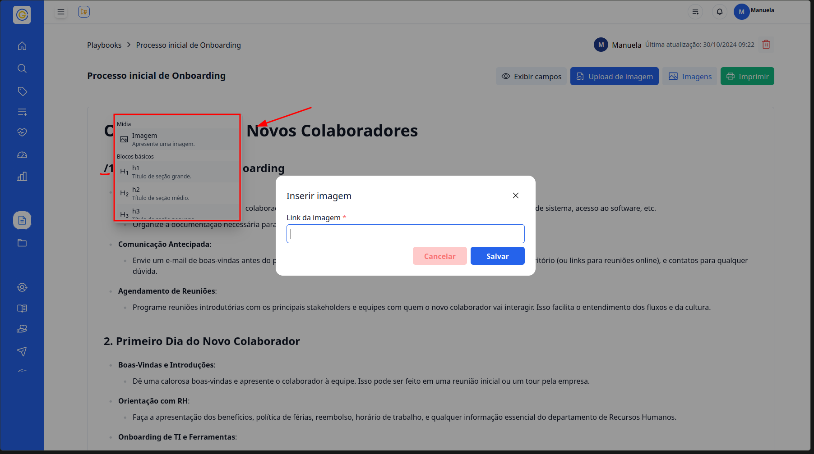
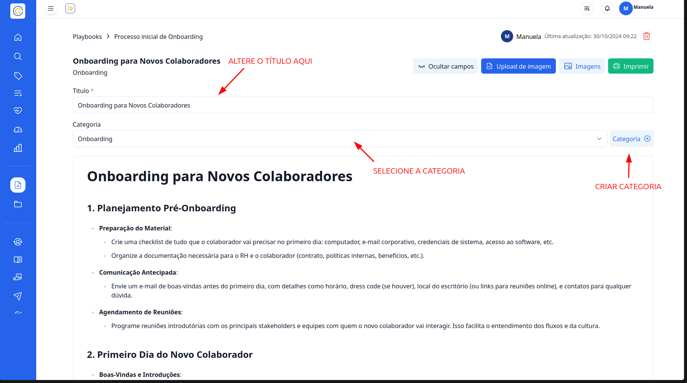
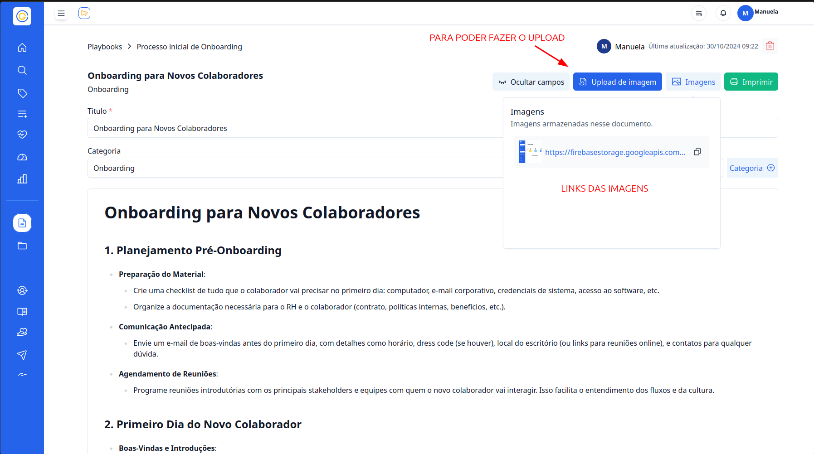

## Passo a passo para criar Playbooks

### 1. Acesse o G Client

Primeiramente, faça login na sua conta do **G Client**.  
Certifique-se de que você possui as permissões necessárias para gerenciar documentos.

---

### 2. Navegue até a seção de **Gestão de Arquivos**

No menu lateral, clique na aba 📄**Playbooks**.  
Você será direcionado para a página onde é possível visualizar os playbooks existentes.

---

### 3. Adicionar novos itens

Clique no botão **Adicionar +** e escolha uma das opções disponíveis: **Nova Pasta**, **Playbook** ou **Categoria**.

#### Criar um Playbook

1. Selecione a opção **Playbook**.
2. Preencha o nome do playbook no modal que será exibido.
3. Clique em **Cadastrar** para finalizar.

---

#### Criar uma Pasta

1. Selecione a opção **Pasta**.
2. Preencha o nome da pasta e associe uma categoria.
3. Clique em **Cadastrar** para finalizar.

---

#### Criar uma Categoria

1. Selecione a opção **Categoria**.
2. Adicione o nome da categoria no modal exibido.
3. Clique em **Cadastrar** para finalizar.

---

### 4. Botões de ação nos documentos

Cada item contém os seguintes botões de ação:

- **...**: Ao clicar, são exibidas três opções:
  - **Editar** (apenas em pastas): Permite alterar o nome do documento e sua categoria.
  - **Mover**: Permite mover o item para outra pasta.
  - **Deletar**: Remove o documento.

---

### 5. Dentro do Playbook

Após cadastrar um novo playbook, você será direcionado para sua página de edição.  
Você também pode clicar em um playbook existente para editá-lo.

#### Recursos disponíveis na edição:

- Utilize `/` para inserir os seguintes elementos:
  - **Image**: Adicione um link de imagem.
  - **h1, h2, h3**: Adicione títulos.
  - **Listas**: Listas com marcadores, numeradas ou de afazeres.

---

#### Ferramentas adicionais:

Na página de edição, você encontrará os seguintes recursos:

- **Exibir campos**: Permite alterar o título e adicionar ou criar uma categoria para o playbook.  
  

- **Upload de imagem**: Faça o upload de imagens que podem ser utilizadas no corpo do playbook.

  - Após o upload, os links das imagens serão exibidos.

  

- **Imprimir**: Gere uma versão impressa do conteúdo do playbook.

---

### 6. Salvar alterações

Ao final da edição, clique no botão **Salvar 💾** para garantir que todas as alterações feitas no playbook sejam salvas.

---

✅ **Pronto!** Agora você sabe como criar playbooks no **G Client**. Se precisar de ajuda, entre em contato clicando [aqui](https://api.whatsapp.com/send?phone=5544997046569&text=Preciso%20de%20ajuda%20sobre%20um%20tutorial)!

🎉 **Obrigado por usar o G Client!**
