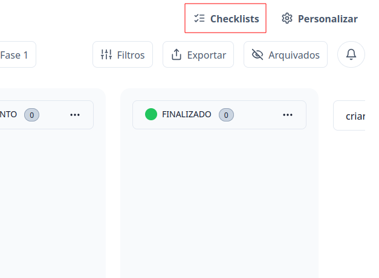
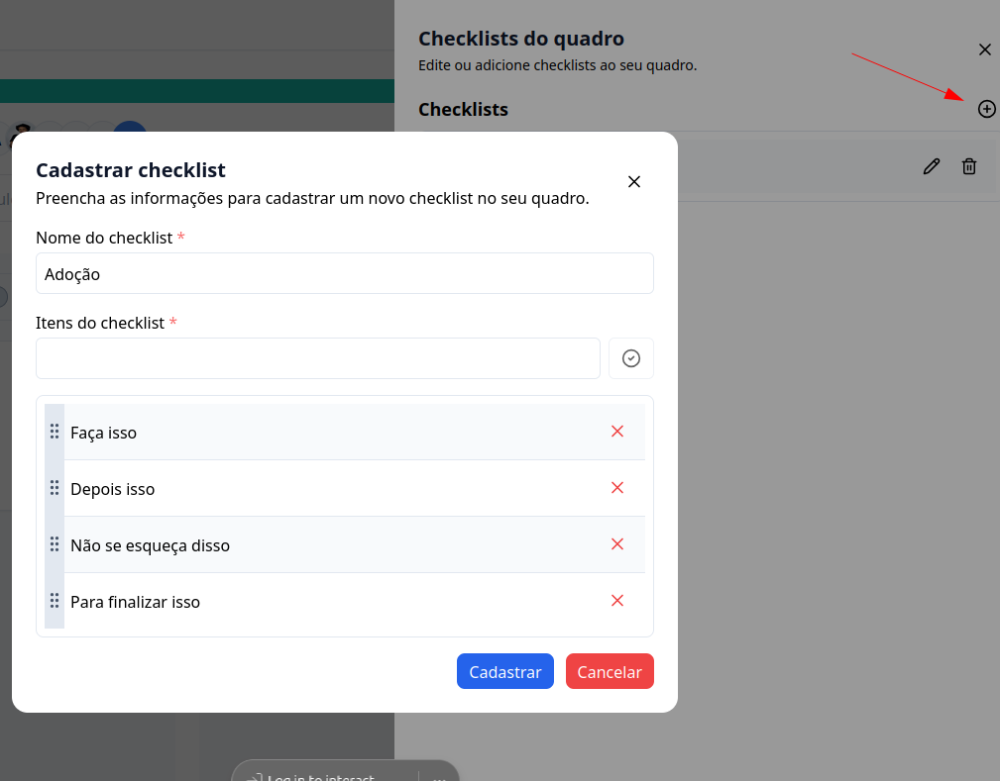
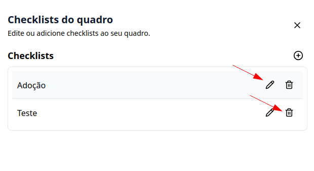
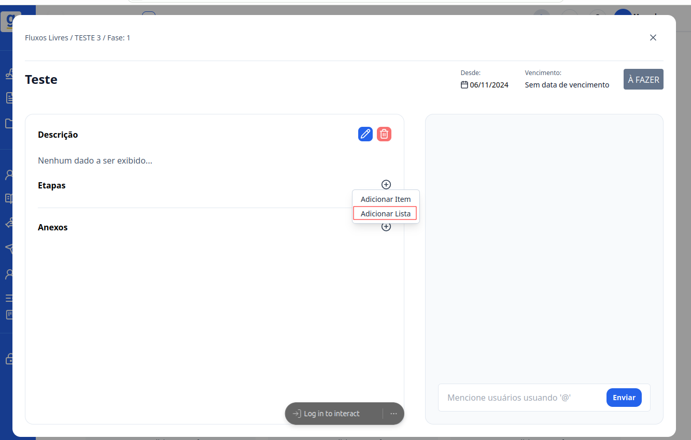
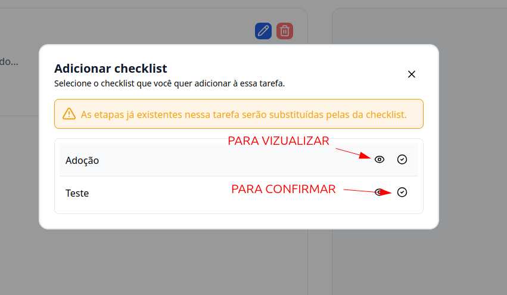

## Introdução

Bem-vindo ao tutorial do G Client! Neste guia, vamos explicar como cadastrar e usar os checklists personalizados nos **FLUXOS DE TRABALHO**.

### Passo a Passo para Cadastrar checklist

### 1. Acesse o G Client

Primeiramente, faça o login na sua conta do G Client

### 2. Navegue até a Seção FLUXOS DE TRABALHO

Na página principal, clique na aba `Quadros` localizada no menu lateral e selecione o quadro desejado.

### 3. Dentro do quadro

Clique no botão **Checklist**, localizado ao lado do botão **Personalizar**

### 4. Preencha os campos

Clique no botão com símbolo de **+**. Com isso aparecerá um modal para preencher com as seguintes informações:

- Nome do checklist: A forma como você deseja nomeá-lo
- Itens do checklist: aqui você colocará os checklist que deseja cadastrar.

Para finalizar clique em cadastrar.

### Botões de ação

Você terá dois botões, um com o ícone de um **lápis** que serve para editar as informações do seu checklist. E o ícone de **lixeira**, que por usual tem a funcionalidade de excluir o itens, mas tenha **cuidado** ao usar, pois o item será excluido **PERMANENTEMENTE**.

## Usando o checklist

### 1. Dentro de um quadro

Selecione uma tarefa a qual você deseja colocar o checklist cadastrado.

Dentro da tarefa nas **Etapas** clique no botão de **+**, ele abrirá um modal, clique em **Adicionar Lista**.

### 2. Selecione o checklist desejado

Você pode visualizar o que está cadastrado o checklist clicando no botão 👁️. Confirmado que é esse o checklist desejado, clique no botão ao lado para confirmar.

---

✅ Com esse tutorial, esperamos que a criação e utilização de checklists nas tarefas dos fluxos livres esteja clara. Se precisar de mais ajuda, é só [avisar](https://api.whatsapp.com/send?phone=5544997046569&text=Preciso%20de%20ajuda%20sobre%20um%20tutorial)!
