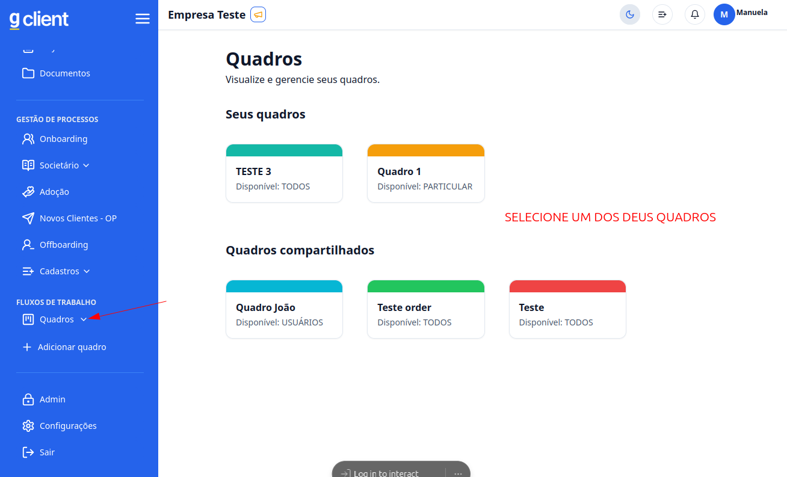
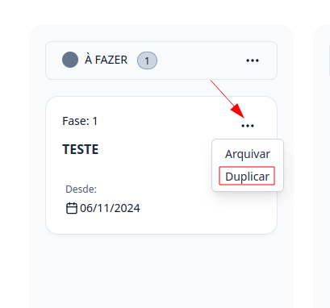
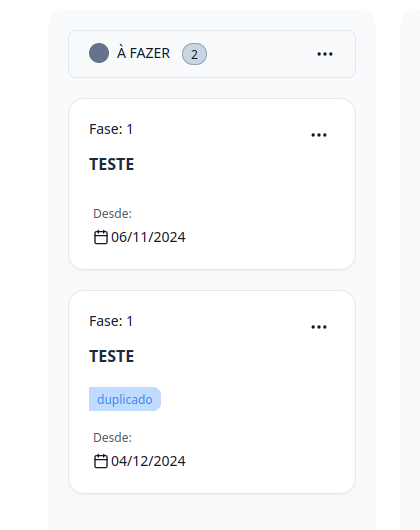

## Introdução

Bem-vindo ao tutorial do **G Client**! Neste guia, vamos explicar como duplicar tarefas nos **FLUXOS DE TRABALHO**.

---

## Passo a passo para Duplicar Tarefas

### 1. Acesse o G Client

Primeiramente, faça o login na sua conta do **G Client**.

---

### 2. Navegue até a Seção **FLUXOS DE TRABALHO**

Na página principal, clique na aba **Quadros** localizada no menu lateral e selecione o quadro desejado.

---

### 3. Dentro do Quadro

1. Localize a tarefa que você deseja duplicar.
2. Clique no botão de três pontos (**...**) na tarefa.
3. Selecione a opção **Duplicar**.

---

### 4. Tarefa Duplicada

A tarefa será criada logo abaixo da original, com um indicador que mostra que ela foi duplicada.

---

✅ **Pronto!** Agora você sabe como duplicar tarefas no fluxo de trabalho do **G Client**.  
Se precisar de ajuda, entre em contato clicando [aqui](https://api.whatsapp.com/send?phone=5544997046569&text=Preciso%20de%20ajuda%20sobre%20um%20tutorial)!

🎉 **Obrigado por usar o G Client!**
