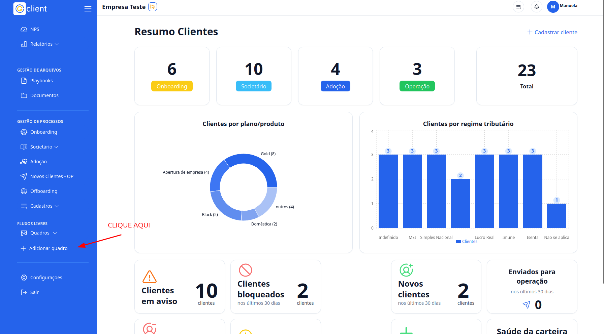
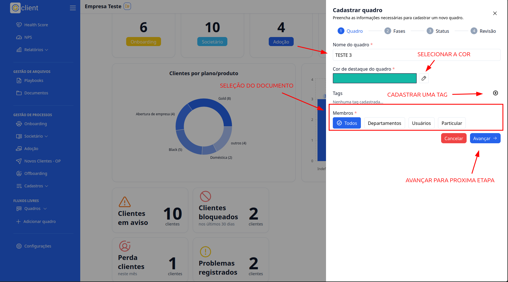
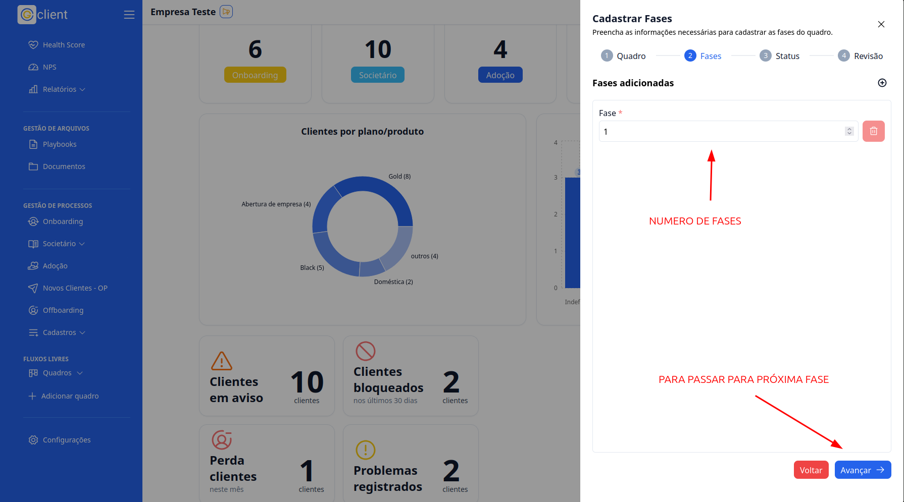
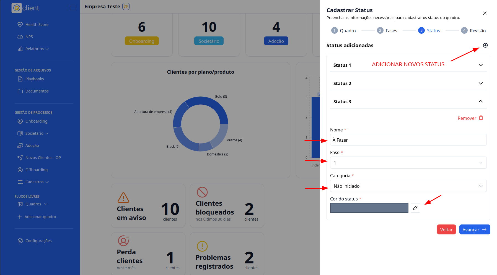
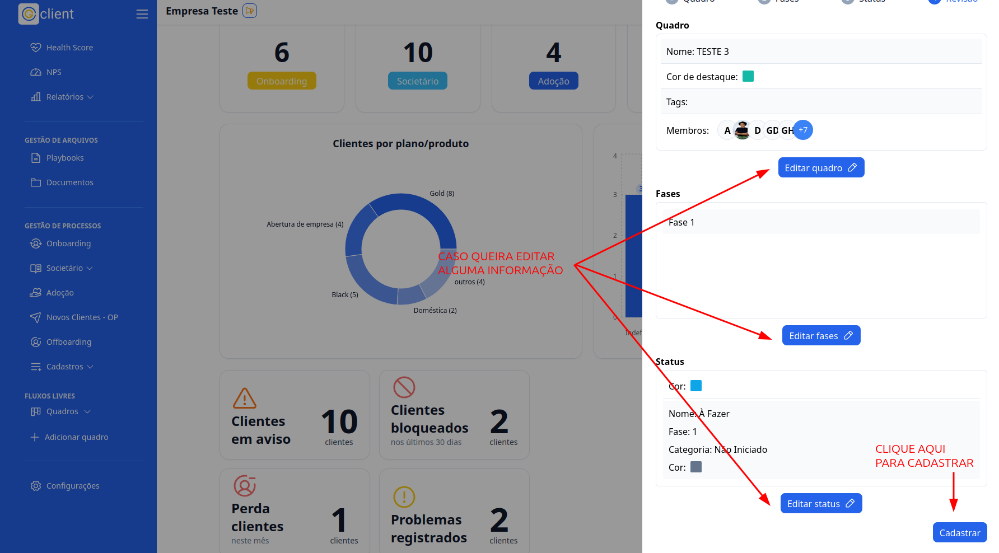

import VideoEmbed from "../../src/components/VideoEmbed";

## Passo a passo de como criar Quadros Personalizados

### 1. Acesse

Primeiramente, faça login na sua conta do **G Client**.

---

### 2. Navegue até a Seção de **FLUXOS DE TRABALHO**

No menu lateral, clique na opção **+ Adicionar Quadro**. Um modal será aberto para você criar um novo quadro.

---

### 3. Configuração do Quadro

Preencha as seguintes informações no modal:

- **Nome do quadro**: Dê um nome ao quadro.
- **Cor de destaque do quadro**: Use o botão `✏️` para selecionar a cor do quadro.
- **Tags (opcional)**: Adicione tags usando o botão `➕`.
- **Membros**: Selecione os membros que terão acesso ao quadro.

Após preencher os campos, clique em **Avançar** para ir para a próxima etapa.

---

### 4. Configuração de Fases

Defina o número de fases do quadro conforme necessário.  
Clique em **Avançar** para continuar.

---

### 5. Configuração de Status

Personalize os status do quadro, preenchendo os seguintes campos:

- **Nome**: Nome do status.
- **Fase**: A fase onde o status se encontra.
- **Categoria**: A categoria do status.
- **Cor**: A cor do status.

Para adicionar múltiplos status, clique no botão **+**.  
Após finalizar, clique em **Avançar** para continuar para a etapa de revisão.

---

### 6. Revisão

Revise todas as informações preenchidas anteriormente. Caso precise editar algo, clique em **Editar**.  
Se tudo estiver correto, clique em **Cadastrar** para finalizar a criação do quadro.

---

## Vídeo Tutorial

Para mais detalhes, assista ao nosso vídeo tutorial sobre como criar quadros personalizados:

<VideoEmbed videoUrl="V0B8jS3CdQk?si=up6rimRAWzP-Ss5p" />

✅ **Pronto!** Agora você sabe como criar quadros personalizados no **G Client**.  
Se precisar de ajuda, entre em contato clicando [aqui](https://api.whatsapp.com/send?phone=5544997046569&text=Preciso%20de%20ajuda%20sobre%20um%20tutorial)!

🎉 **Obrigado por usar o G Client!**
