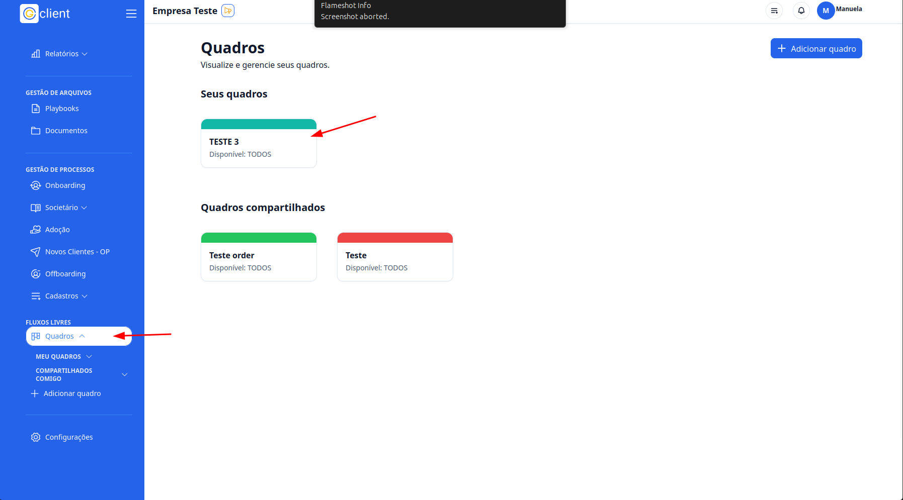
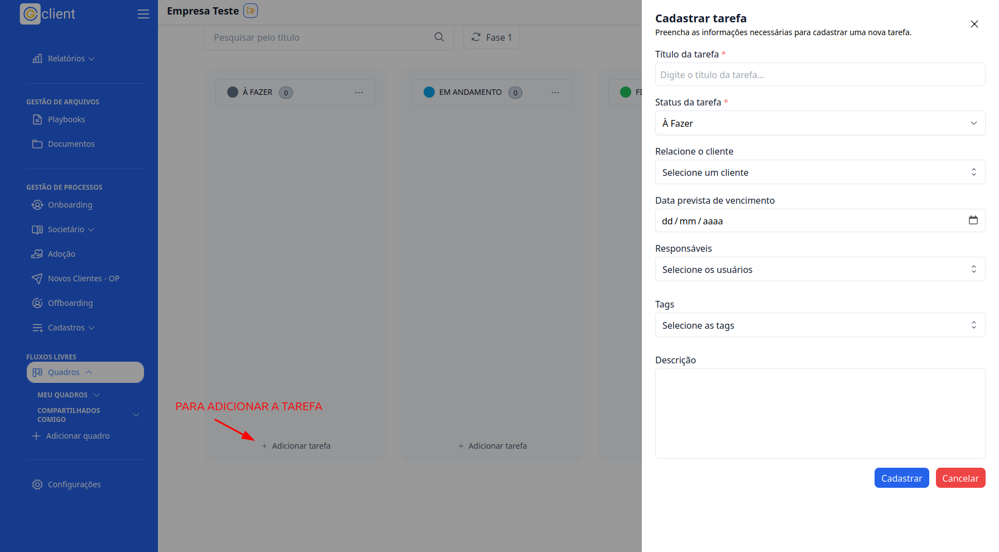
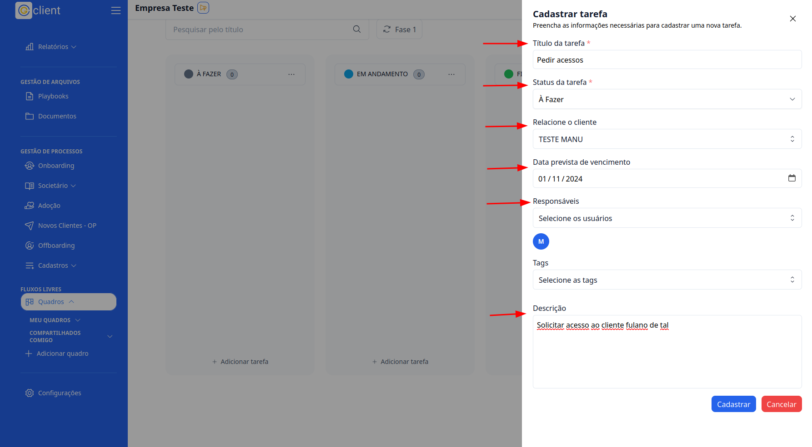

## Passo a passo de como criar tarefas em um quadro personalizado

### 1. Acesso

Primeiramente, faça login na sua conta do G Client. E certifique-se de que você tem permissão para que possa usar os Fluxos de Trabalho.

### 2. Navegue até a Seção de FLUXOS DE TRABALHO

Após a [criação do quadro personalizado](https://ajuda.gclient.com.br/docs/free-flows/personalized-tables.md), clique na aba `Quadros` localizado no menu lateral. Depois selecione o quadro que você deseja criar as tarefas.

### 3. Dentro do quadro

Você terá as colunas com os status criados anteriormente, durante a criação dos quadros. Dentro do status você pode criar uma tarefa clicando no botão **Adicionar tarefa**.

Com isso vai abrir um modal para cadastrar a tarefa.

### 4. Cadastrar a tarefa

Para cadastar uma tarefa você deve preencher os seguintes campos:

- Título da tarefa;
- Status da tarefa;
- Relacione o cliente; (opcional)
- Data prevista de vencimento; (opcional)
- Responsáveis; (opcional)
- Tags; (opcional)
- Descrição; (opcional)

E para finalizar clique no botão **Cadastrar** para poder efetuar o cadastro.

---

✅ Esse tutorial deve ajudar os usuários a criar tarefas dentro de quadros no Fluxo Livres de forma simples e eficiente. Se precisar de mais alguma coisa, é só [avisar](https://api.whatsapp.com/send?phone=5544997046569&text=Preciso%20de%20ajuda%20sobre%20um%20tutorial)!
