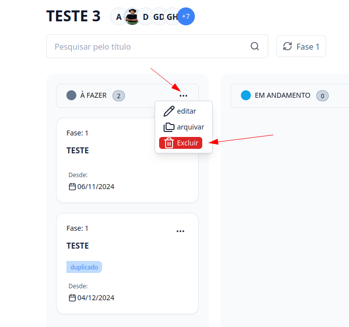
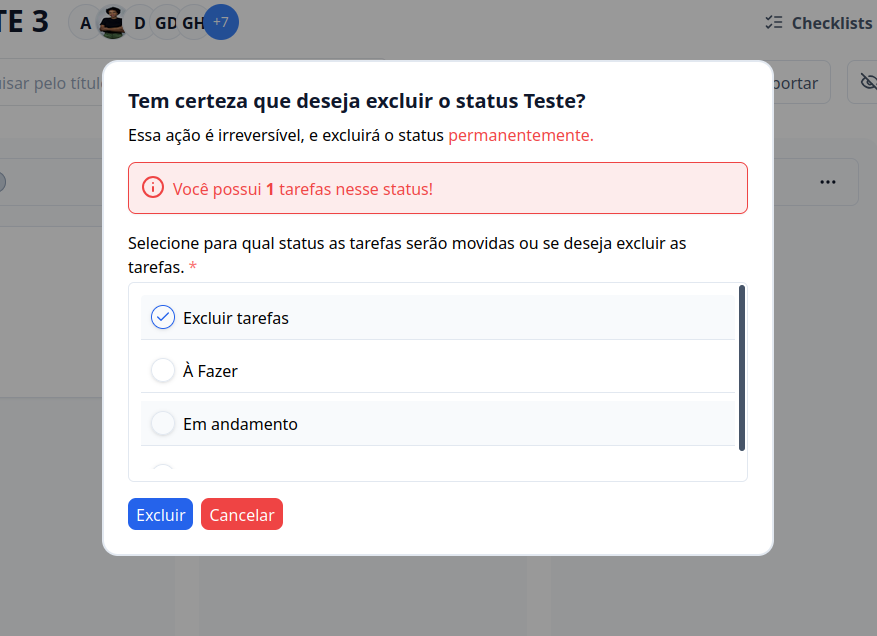

## Introdução

Bem-vindo ao tutorial do G Client! Neste guia, vamos explicar como excluir colunas nos **FLUXOS DE TRABALHO**.

## Passo a Passo para Excluir colunas

### 1. Acesse o G Client

Primeiramente, faça o login na sua conta do G Client

### 2. Navegue até a Seção FLUXOS DE TRABALHO

Na página principal, clique na aba `Quadros` localizada no menu lateral e selecione o quadro desejada.

### 3. Dentro do quadro

Na coluna que você deseja excluir, clique no botão de três pontos `...` e clique na opção **Excluir**.

### 4. Reatribua as tarefas

Caso sua coluna tenha alguma tarefa abrirá um modal para você realocar para outra coluna ou excluí-las.

Assim que selecionar a opção desejada, basta clicar em **Excluir**.

> ⚠️ Cuidado ao excluir, pois as informações são perdidas permanentemente

---

✅ Com esse tutorial, esperamos que ajude você a excluir colunas no fluxo de trabalho. Se precisar de mais ajuda, é só [avisar](https://api.whatsapp.com/send?phone=5544997046569&text=Preciso%20de%20ajuda%20sobre%20um%20tutorial)!
