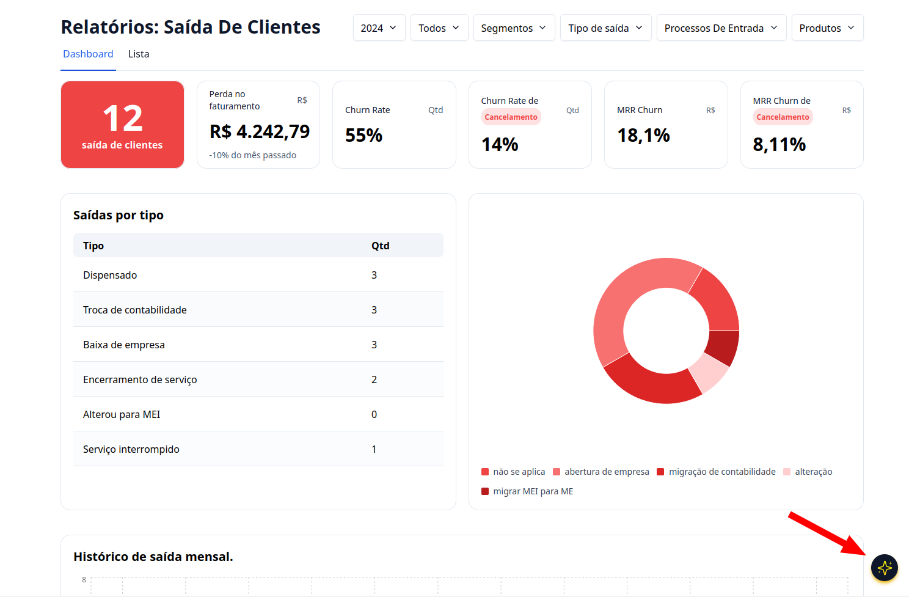
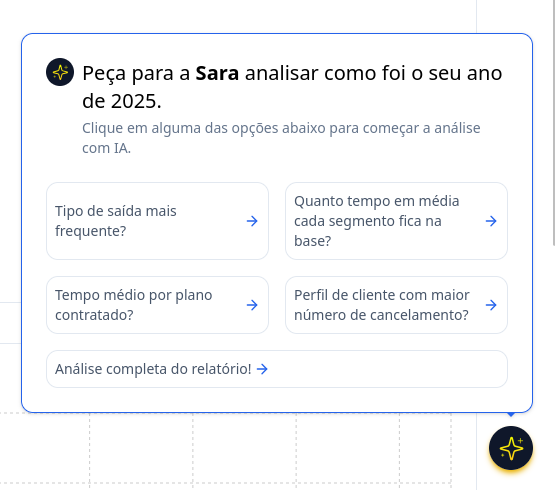
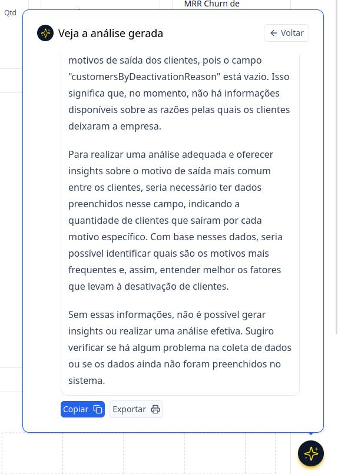

## Introdução

Agora dentro do G Client nós temos IA 🤩, venha que vou ensinar com utilizar a Sara.

## Passo a Passo de como usar Sara

### 1. Acesse o G Client

Primeiramente, faça o login na sua conta do G Client

### 2. Navegue até a Seção Gestão de clientes

Na página principal, clique na aba `Relatórios` localizada no menu lateral. Clique em **Sáida de Clientes**.

### 3. Localize

No canto inferior direito, terá um ícone fixado da SARA, clique nele para abrir as opções.

### 4. Opções

Será aberto as opções que você pode pedir para A Sara analisar. No momento temos as seguintes opções:

- Tipo de saída mais frenquente
- Quanto tempo em média cada segmento fica na base?
- Tempo médio por plano contratado
- Perfil de cliente com maior número de cancelamento
- Análise completa do relatório!

Clique na opção que deseja para poder ser gerado as informações.

### Análise

Com isso será feito uma analise com as informações contidas no G Client. E você terá as opções de copiar as informações ou exportar conforme suas necessidades.

---

✅ Com esse tutorial, esperamos que ajude você na utilização da SARA nossa IA. Se precisar de mais ajuda, é só [avisar](https://api.whatsapp.com/send?phone=5544997046569&text=Preciso%20de%20ajuda%20sobre%20um%20tutorial)!
