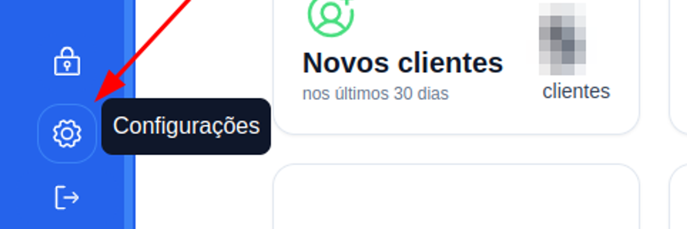
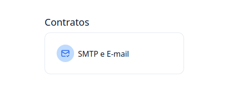
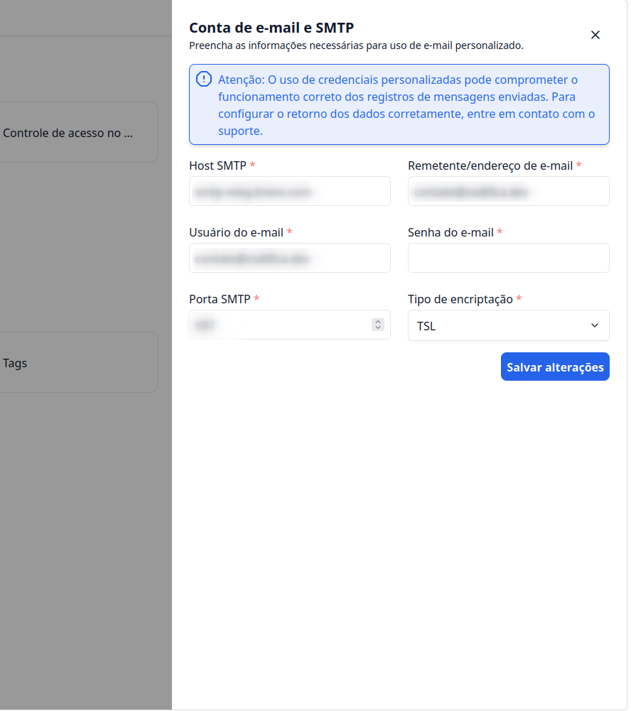

## Introdução

Bem-vindo ao tutorial do G Client! Neste guia, vamos explicar como personalizar o e-mail para o envio de solicitações de contratos.

### Passo a Passo para Personalizar o E-mail de Solicitação de Contratos

### 1. Acesse o G Client

Primeiro, faça login na sua conta do G Client.

### 2. Acesse a Página de Configurações

Navegue até o final da barra lateral e acesse a página de configurações, simbolizada pelo ícone de uma engrenagem.

### 3. Navegue até a Sessão "Contratos"

Na página de configurações, na seção **Contatos**, selecione a opção **SMTP e E-mail**.

### 4. Preencha as Informações

Será aberto um modal com as informações necessárias para o cadastro:

- **Host SMTP**: preencha com o seu provedor de SMTP.
- **Remetente/Endereço de E-mail**.
- **Usuário do E-mail**.
- **Senha do E-mail**.
- **Porta SMTP**: será fornecida pelo seu provedor de SMTP.
- **Tipo de Encriptação**: também será fornecida pelo seu provedor.

> ℹ️ Lembre-se de que será necessário um provedor de SMTP para realizar essa configuração.

Para finalizar, clique em **Salvar Alterações**.

---

✅ Com este tutorial, esperamos ajudar você no envio de e-mails personalizados para contratos. Se precisar de mais ajuda, é só [avisar](https://api.whatsapp.com/send?phone=5544997046569&text=Preciso%20de%20ajuda%20sobre%20um%20tutorial)!
