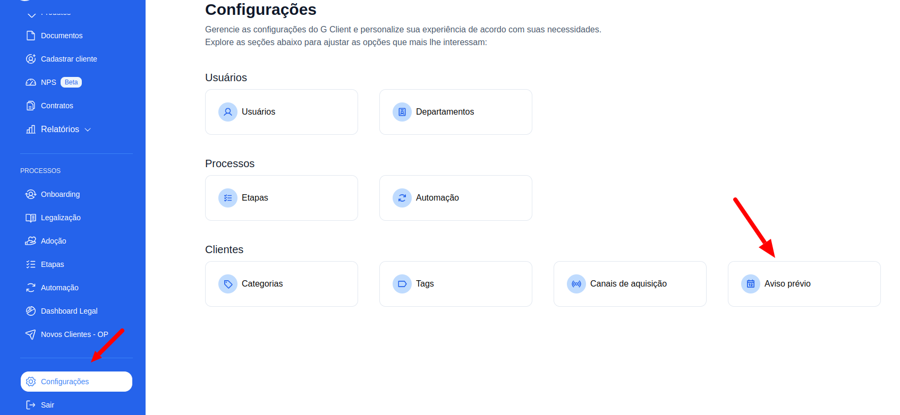
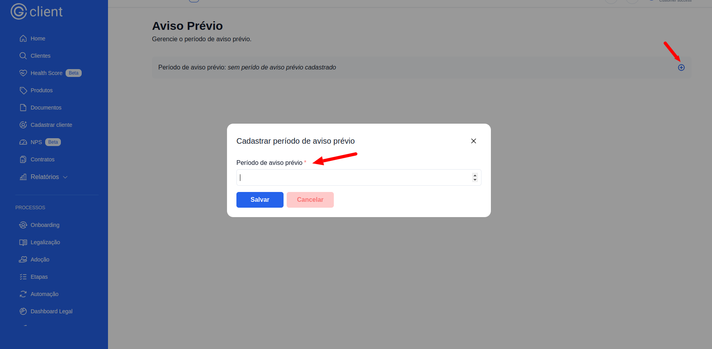
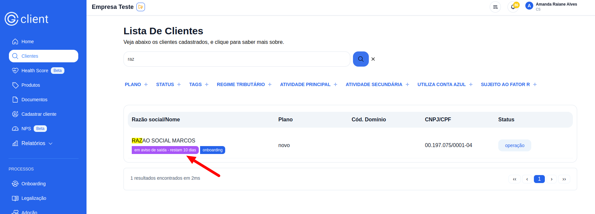
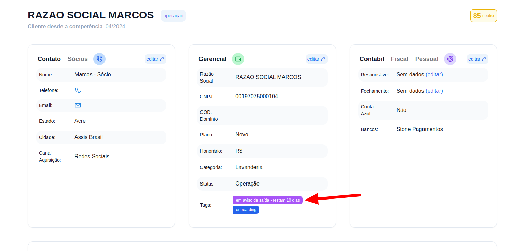

## Passo a Passo para Definir os Dias do Aviso Prévio

### 1. Acesse o G Client

Faça login na sua conta do **G Client**.

---

### 2. Navegue até a Seção de Configurações

Clique na aba [**Configurações**](https://client.primorgroup.com.br/configuracao) localizada no menu lateral. Isso levará você à página com as opções de configuração do sistema.

---

### 3. Clique em **Aviso Prévio**

Na página de configurações, localize e clique na opção **Aviso Prévio**.

---

### 4. Insira a Quantidade de Dias para Aviso Prévio

No painel, clique no botão `+` e insira a quantidade de dias que deseja definir para o aviso prévio. Em seguida, clique em **Salvar**.

---

### 5. Visualize a Contagem dos Dias

Você poderá visualizar a contagem de dias do aviso prévio:

- **Na lista de clientes:**

- **Na tela de informações de um cliente:**

---

✅ **Pronto!** Agora você pode configurar e visualizar os dias de aviso prévio no **G Client**. Se precisar de ajuda, entre em contato clicando [aqui](https://api.whatsapp.com/send?phone=5544997046569&text=Ol%C3%A1,%20estava%20lendo%20um%20tutorial%20do%20Client%20e%20quero%20saber%20mais%20sobre%20seus%20servi%C3%A7os.)!

🎉 **Obrigado por usar o G Client!**
