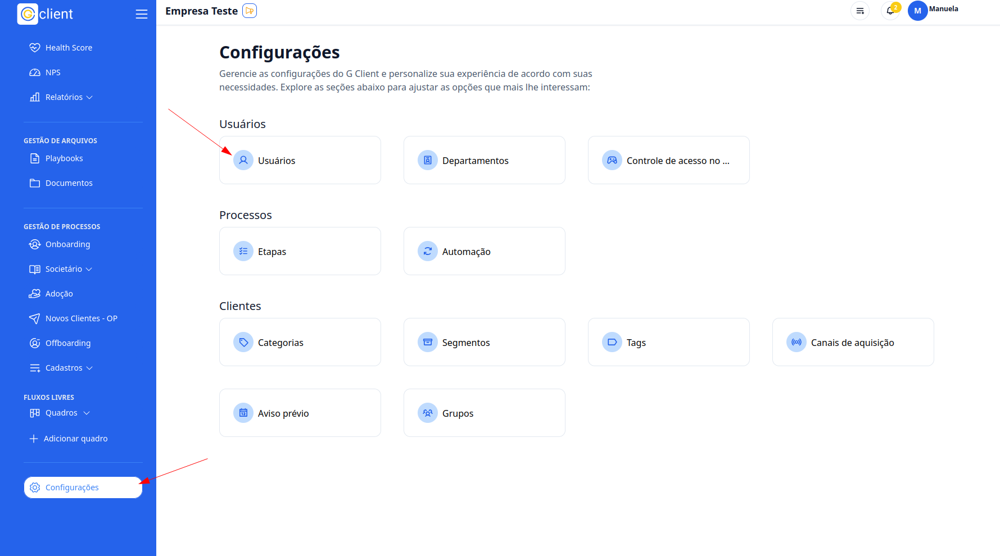
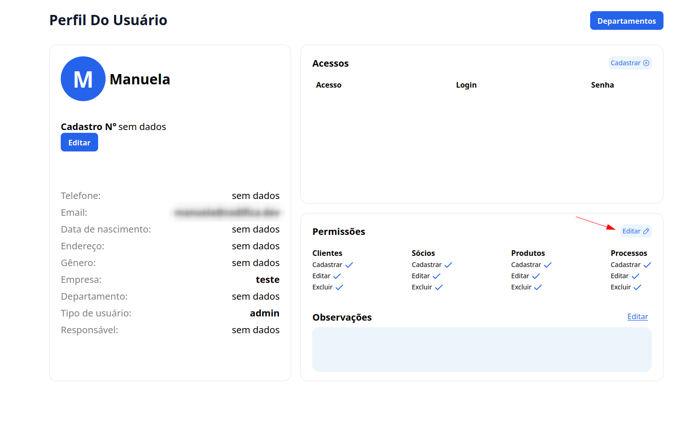
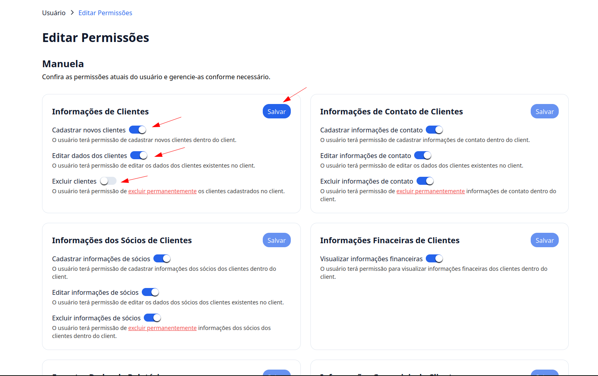

## Passo a passo de como definir permissões para usuários

### 1. Acesse

Primeiro, faça login na sua conta do G Client.

### 2. Acesse a página de configurações

Navegue até o final da barra lateral e acesse a página de configurações, simbolizada pelo ícone de uma engrenagem.

Clique em **Usuários** para poder ver os usuários.

### 3. Permissões

Na seção de permissões clique no **Editar**.

### 4. Editar Permissões

Aqui você poderar editar as permissões do usuário, e ao terminar basta clicar em **Salvar**.

---

✅ Esse tutorial deve ajudar os usuários a editarem as permissões dos usuários de forma simples e eficiente. Se precisar de mais alguma coisa, é só [avisar](https://api.whatsapp.com/send?phone=5544997046569&text=Preciso%20de%20ajuda%20sobre%20um%20tutorial)!
