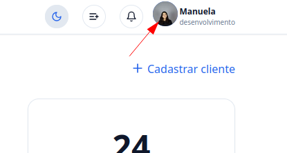
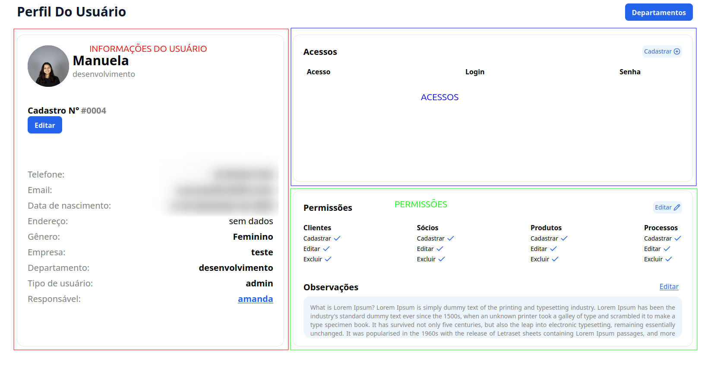
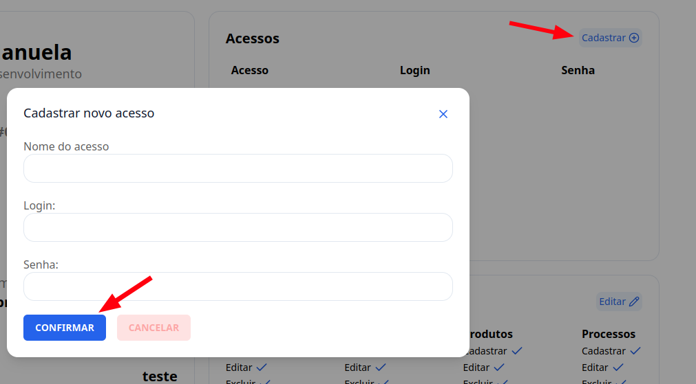
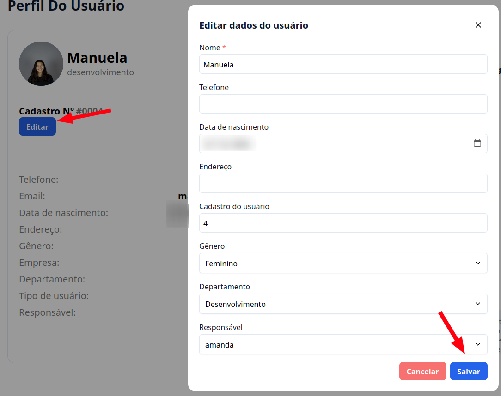

## Introdução

Está com o perfil desatualizado ou sem foto, vem comigo que vou te ajudar a atualizar o seu perfil de usuário.

## Passo a passod e como editar perfil de usuário

### 1. Acesse o G Client

Primeiramente, faça login na sua conta do **G Client**.

---

### 2. Acesse seu perfil

No canto superior direito você vai encotrar o ícone com sua imagem(se você tiver) e seu nome, clique na imagem para poder acessar sua página de perfil.

---

### 3. Dentro do seu perfil

Na sua página de perfil, você poder poderá cadastrar seus acessos(de outros sites, para achar de forma mais rápida), além de, claro, poder editar seu perfil, desde as informações que são exibidas até a sua foto de perfil.

---

### 4. Acessos

Para cadastrar um acesso, basta localizar os acessos e clicar em em **Cadastrar +**, com isso será aberto um modal, basta você preencer os campos e porfim clicar em cadastrar.

---

### 5. Informações de usuário

Para editar as informações de usuário, basta localizar onde está suas informações, e clicar em **Editar**. Com isso será aberto um modal, basta preencer os campos informações. Para concluir basta clicar em **Salvar**.

---

✅ **Pronto!** Agora você pode editar suas informações de perfil no **G Client**. Se precisar de ajuda, entre em contato clicando [aqui](https://api.whatsapp.com/send?phone=5544997046569&text=Preciso%20de%20ajuda%20sobre%20um%20tutorial)!

🎉 **Obrigado por usar o G Client!**
