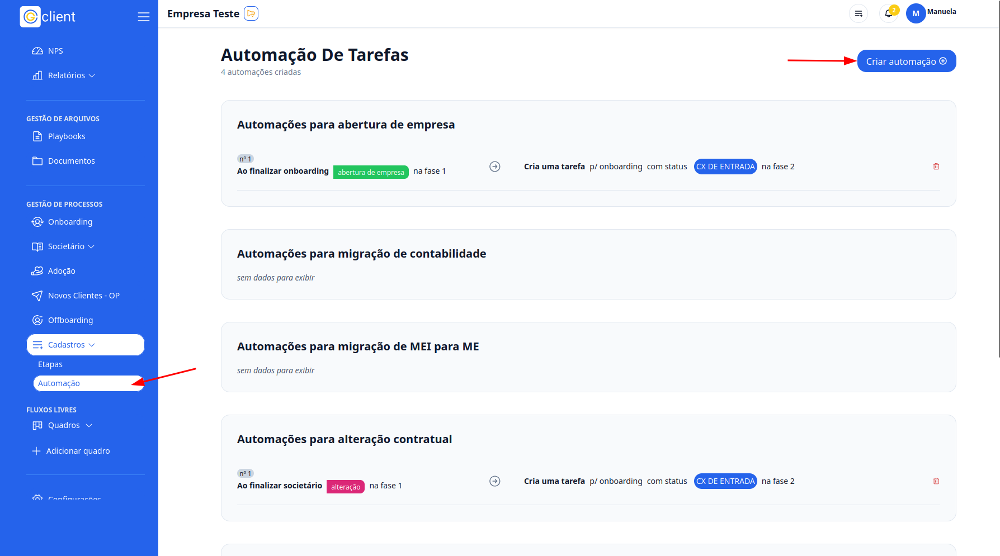
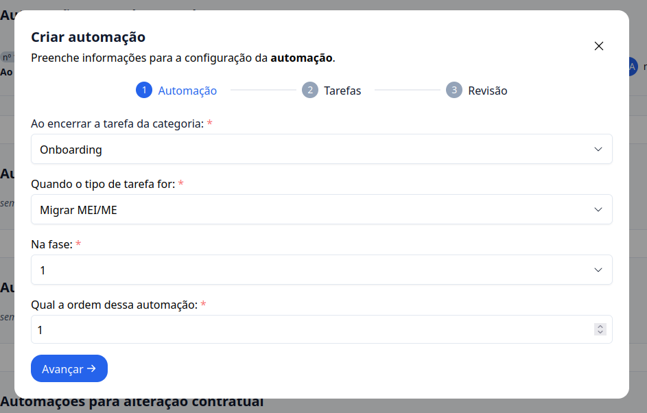
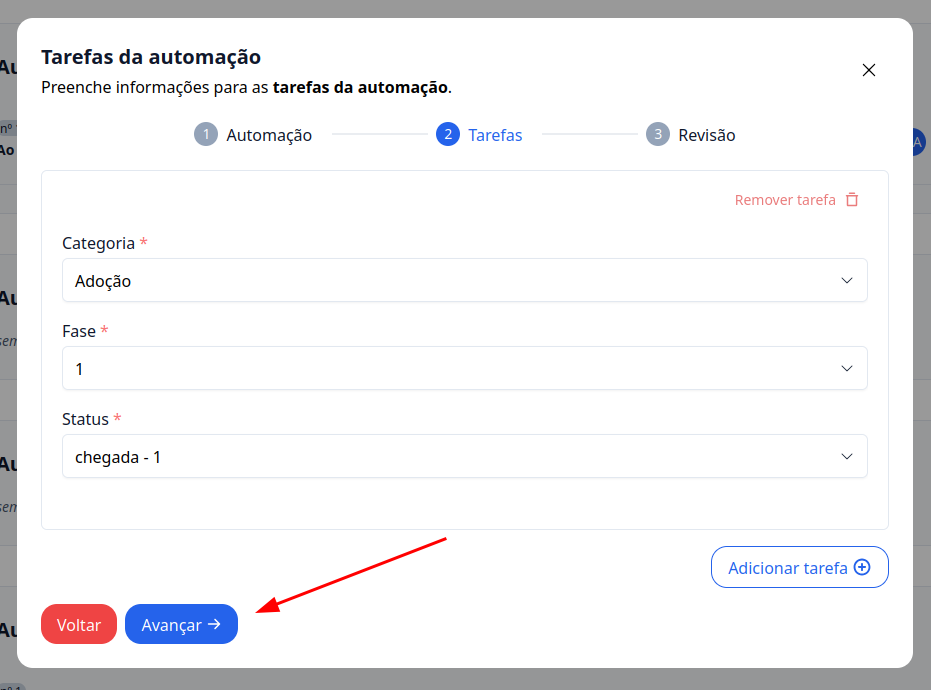
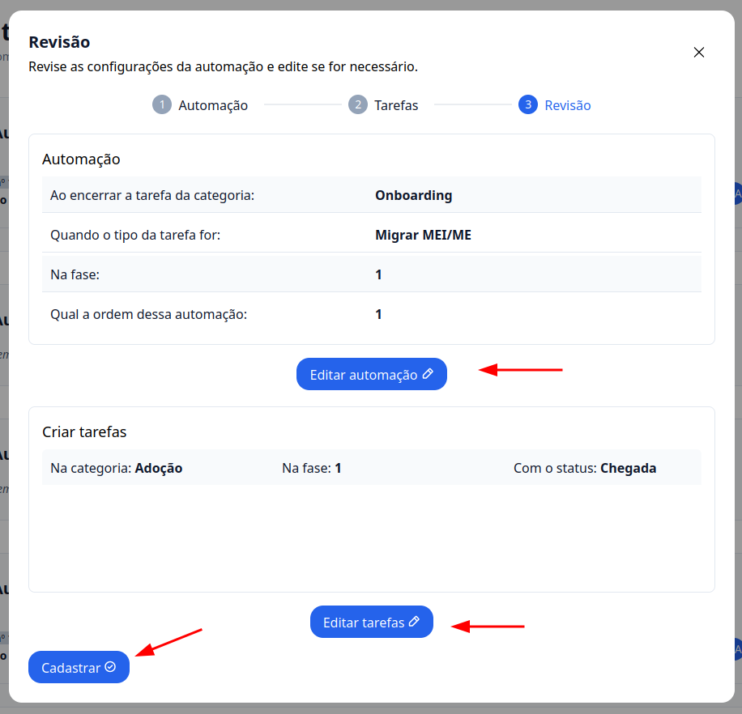

## Passo a Passo de Como Criar Automações nos Processos

### 1. Acesse o G Client

Primeiramente, faça login na sua conta do G Client e certifique-se de que você tem permissão para criar automações.

---

### 2. Navegue até a Seção **Gestão de Processos**

Clique na aba **Cadastros**, localizada ao final do menu lateral. Escolha a opção **Automações**.

Dentro da página de automações, clique no botão **Criar Automação +**.

---

### 3. Configuração da Automação

Preencha os campos necessários para configurar sua automação:

- **Ao encerrar a tarefa da categoria**:
  - Onboarding
  - Adoção
  - Societário
  - Offboarding
- **Quando o tipo de tarefa for**:
  - Baixa de empresa
  - Abertura de empresa
  - Alteração contratual
  - Migrar de contabilidade
  - Migrar de MEI/ME
  - Migrar de ME/MEI
- **Na fase**:
  - Selecione a fase dos processos.
- **Qual a ordem dessa automação**:
  - Escolha a posição em que ela deve iniciar.

Clique no botão **Avançar** para continuar.

---

### 4. Definição de Tarefas

Selecione a **Categoria**, **Fase**, e **Status** desejados para a tarefa.

Clique em **Avançar** para seguir para a próxima etapa.

---

### 5. Revisão e Cadastro

Revise as configurações da automação. Caso algo não esteja correto, clique no botão **Editar** para fazer ajustes.

Após revisar, clique em **Cadastrar +** para finalizar a automação.

---

✅ **Pronto!** Agora você pode criar automações de processos de forma simples e eficiente no **G Client**. Se precisar de ajuda, entre em contato clicando [aqui](https://api.whatsapp.com/send?phone=5544997046569&text=Preciso%20de%20ajuda%20sobre%20um%20tutorial)!

🎉 **Obrigado por usar o G Client!**
