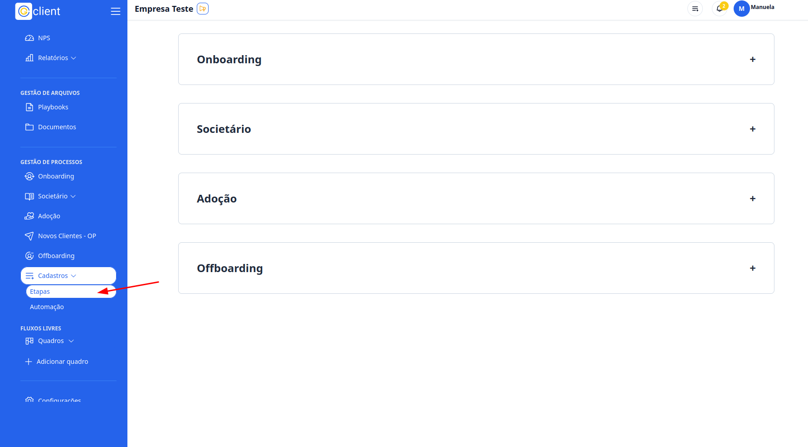
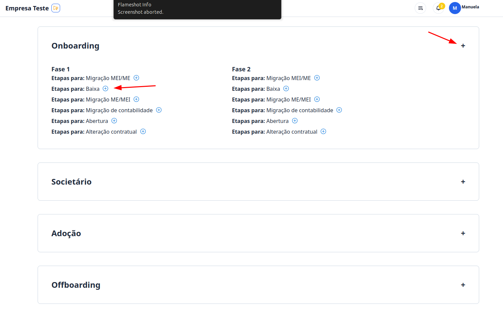
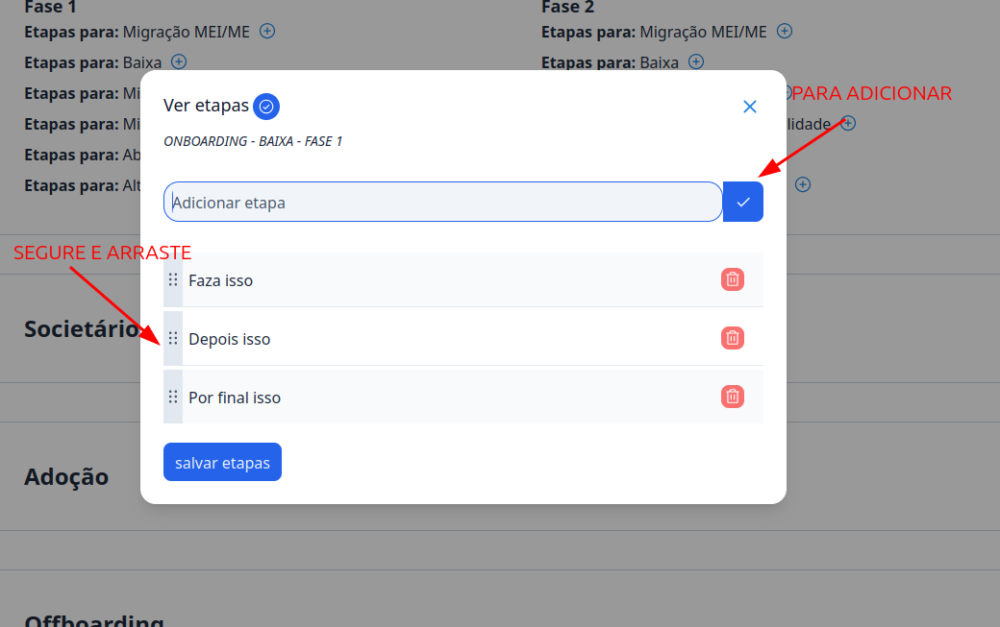

## Passo a passo de como criar checklist padrão

### 1. Acesse

Primeiramente, faça login na sua conta do G Client. E certifique-se de que você tem permissão para criar checklist padrão.

### 2. Navegue até a Seção GESTÃO DE PROCESSOS

Clique na aba **Cadastros**, localizado ao final do menu lateral. Escolha o opção **Etapas**.

### 3. Escolha o processo

Clique no processo que você escolheu para criação dos checklist automatiocs.

E dentro dele terá as etapas, basta clicar no botão `➕` na etapa que deseja efetuar a criação.

### 4. Cadastre os checklist

Assim que realizado a etapa acima, será aberto um modal. Basta escrever as etapas que deseja cadastrar e clicar no botão de ✅.

Lembrando que você alterar a ordem dos items adicionados clicando na barrinha lateral e arrastando.

Por fim clique em **Salvar etapas** para finalizar o processo.

---

✅ Esse tutorial deve ajudar os usuários a criarem checklist padrão para os processos de forma simples e eficiente. Se precisar de mais alguma coisa, é só [avisar](https://api.whatsapp.com/send?phone=5544997046569&text=Preciso%20de%20ajuda%20sobre%20um%20tutorial)!
