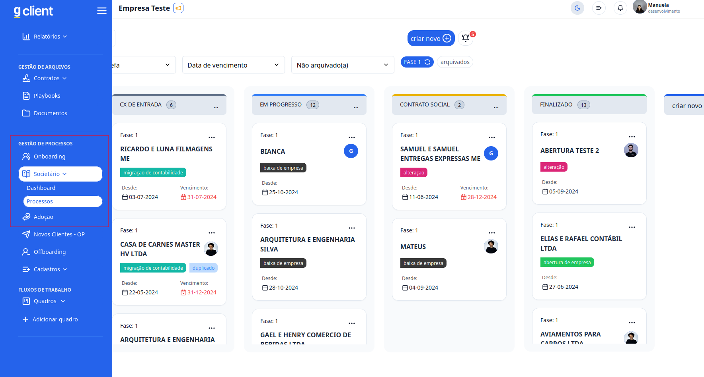
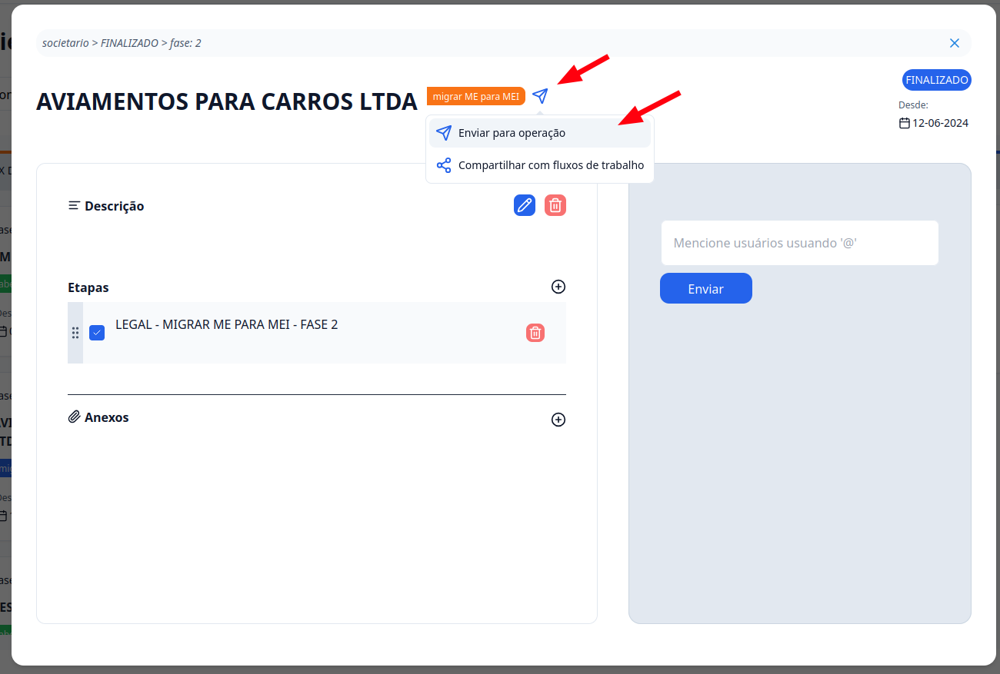

## Introdução

Com o **G Client**, você pode enviar clientes para operação de forma prática. Neste guia, vamos mostrar como realizar este processo.

---

## Passo a passo de como enviar um cliente para operação

### 1. Acesse o G Client

Faça login na sua conta do **G Client**.

---

### 2. Navegue até a sessão **Gestão de Processos**

Clique em uma das opções: **Onboarding**, **Societário** ou **Adoção**. Escolha o processo que contém o card do cliente que você deseja enviar para a operação.

Selecione o card correspondente.

---

### 3. Compartilhe

Dentro do card do cliente que você quer enviar para a operação, ao lado da razão social do cliente, haverá um ícone de enviar. Clique nele e escolha a opção **Enviar para operação**.

---

✅ **Pronto!** Agora você sabe como enviar clientes para operação no **G Client**. Se precisar de ajuda, entre em contato clicando [aqui](https://api.whatsapp.com/send?phone=5544997046569&text=Preciso%20de%20ajuda%20sobre%20um%20tutorial)!

🎉 **Obrigado por usar o G Client!**
