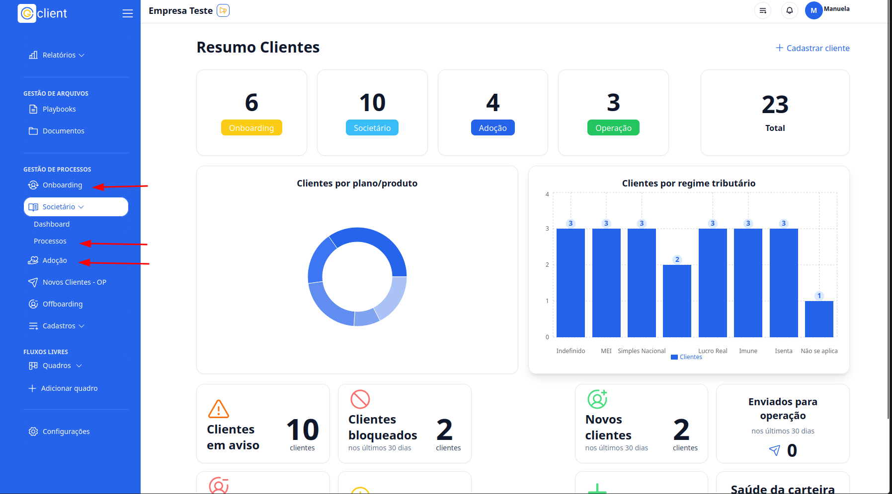
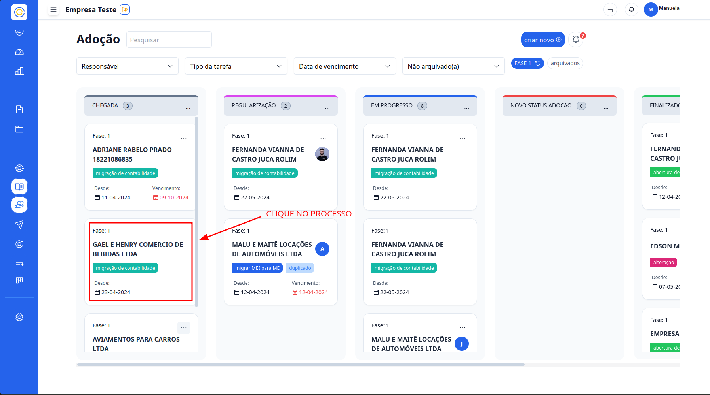
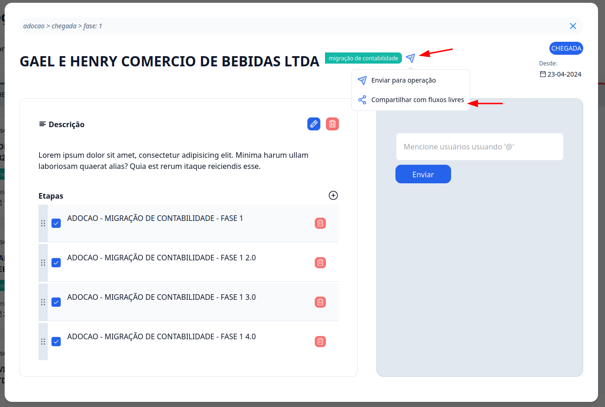
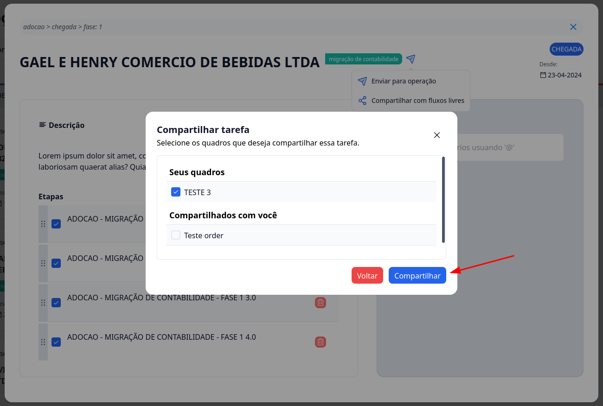

## Passo a passo de como compartilhar tarefa do processo de entrada para um quadro personalizado

### 1. Acesse

Primeiramente, faça login na sua conta do G Client.

### 2. Navegue até a Seção de GESTÃO DE PROCESSOS

Clique em uma das opções: **Onboarding**, **Societário** ou **Adoção**.

### 3. Escolha o processo

Dentro da **Onboarding**, **Societário** ou **Adoção** exolha o processo que voc6e deseja compartilhar e clique nele

### 4. Compartilhe o Processo

Ao lado do título do processo, terá um icone azul clique nele e escolha a opção **Compartilhar com fluxos livres**.

### 5. Escolha o quadro

Assim que clicar em **Compartilhar com fluxos livres**,você vai ter que selecionar o quadro que deseja compartilhar a tarefa.

Assim que selecionado a opção clique em **Compartilhar**, para finalizar a operação.

✅ Esse tutorial deve ajudar os usuários a compartilhar procesos dentro dos quadros no Fluxo Livres de forma simples e eficiente. Se precisar de mais alguma coisa, é só [avisar](https://api.whatsapp.com/send?phone=5544997046569&text=Preciso%20de%20ajuda%20sobre%20um%20tutorial)!