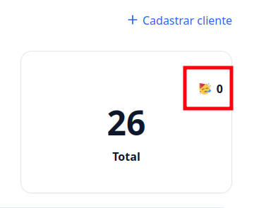
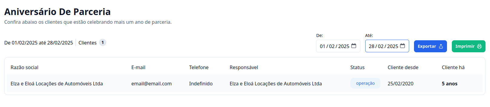

## Introdução

Quer saber há quanto tempo seu cliente está com você? Vem que eu te mostro! 🎉

---

### 1. Acesse o G Client

Primeiramente, faça login na sua conta do **G Client**.

---

### 2. Na Dashboard Inicial

Identifique o card que representa todos os seus clientes. No canto superior direito, você encontrará o seguinte ícone 🥳. Clique nele para ser redirecionado à página de aniversários de parceria.

---

### 3. Dentro da Página de Aniversário de Parceria

- Você poderá visualizar os clientes que estão fazendo aniversário de parceria neste mês.
- Também é possível selecionar um período específico para visualizar aniversariantes de outras datas.
- Se desejar, você pode **exportar os dados** em **planilha** ou **PDF**.

---

✅ **Pronto!** Agora você sabe onde encontrar os aniversariantes dentro do **G Client**. Se precisar de ajuda, entre em contato clicando [aqui](https://api.whatsapp.com/send?phone=5544997046569&text=Preciso%20de%20ajuda%20sobre%20um%20tutorial)!

🎉 **Obrigado por usar o G Client!**
