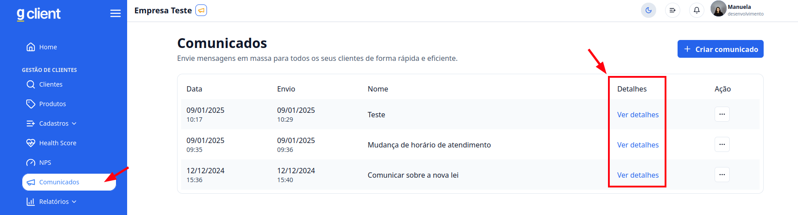
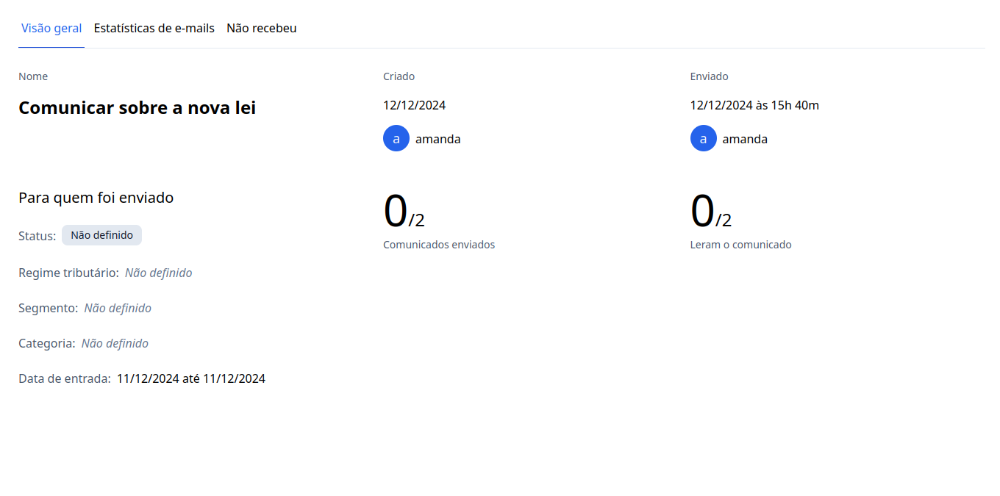
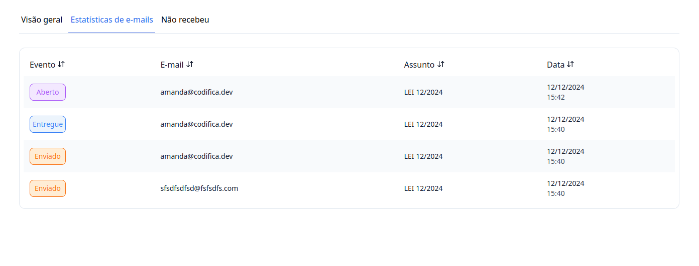
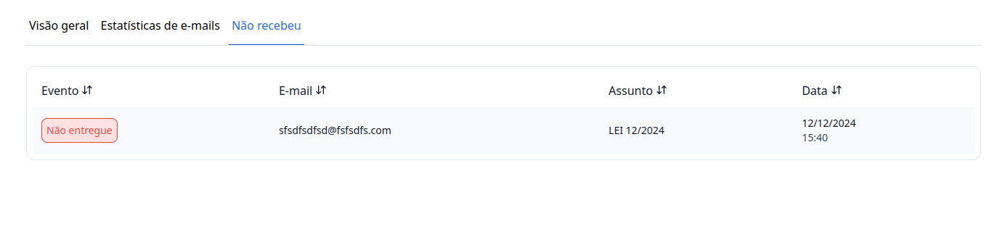

## Introdução

Agora que você já aprendeu a [enviar os comunicados](/docs/customer-management/communication/send-communication) em massa para seus clientes, vamos verificar como identificar quem recebeu ou não os e-mails enviados.

---

## Passo a passo e como funciona os e-mails

### 1. Acesse o G Client

Faça login na sua conta do **G Client**.

---

### 2. Navegue até a seção **Comunicados**

No menu lateral, clique na opção **Comunicados**.

Nesta página, você poderá:

- Visualizar os comunicados já enviados.
- Escolher o comunicado ao qual você deseja saber as informações dos e-mails e clicar em **Ver detalhes**.

Você verá três abas disponíveis:

- **Visão Geral**
- **Estatísticas de E-mail**
- **Não Recebidos**

---

### 3. Visão Geral

Aqui serão exibidas todas as informações gerais do comunicado enviado.

---

### 4. Estatísticas de E-mail

Nesta aba, você poderá visualizar os e-mails que foram enviados, entregues e quais foram abertos. Os status disponíveis são:

- **Enviado**: Indica que o e-mail foi enviado com sucesso.
- **Entregue**: Indica que o e-mail chegou ao destinatário.
- **Aberto**: Indica que o destinatário abriu o e-mail.

---

### 5. Não Recebidos

Nesta aba, você poderá visualizar os clientes que não receberam o e-mail e identificar possíveis problemas.

---

✅ **Pronto!** Agora você pode verificar quem recebeu ou não os comunicados enviados pelo **G Client** de forma simples e eficiente. Se precisar de ajuda, entre em contato clicando [aqui](https://api.whatsapp.com/send?phone=5544997046569&text=Preciso%20de%20ajuda%20sobre%20um%20tutorial)!

🎉 **Obrigado por usar o G Client!**
