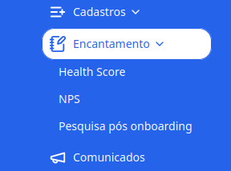
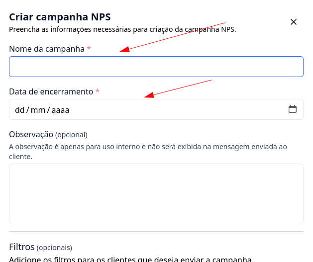
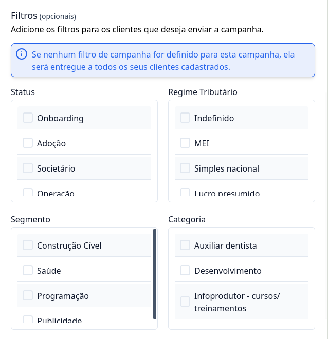
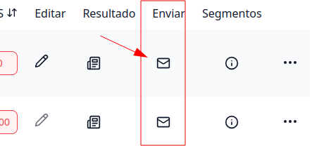

## Como criar pesquisas NPS

### 1. Acesse o G Client

Primeiramente, faça login na sua conta do **G Client**.

### 2. Navegue até a Seção Gestão de Clientes

Acesse a página de **NPS**, localizada no menu lateral, dentro da seção **Encantamento**. Isso o levará para a página de configurações das pesquisas NPS.

### 3. Preencha as informações para criação da pesquisa NPS

Clique no botão Criar NPS e informe os campos obrigatórios:

- Nome da campanha;
- Data de encerramento da pesquisa.

Os demais campos apresentados no formulário são opcionais.

### Filtros de Pesquisa

No formulário de criação de pesquisa NPS, você pode aplicar os seguintes filtros:

- Status;
- Regime Tributário;
- Segmento;
- Categoria.

> ℹ️ **Importante:** Caso deseje que a campanha seja enviada para **todos os seus clientes cadastrados**, não é necessário preencher nenhum filtro.

### Mensagem de Agradecimento

Você pode selecionar uma mensagem personalizada de agradecimento. Clique <a href="/docs/tutoriais-artigo/customer-management/nps/thanks-message" className="text-blue-500 font-bold">aqui</a> para saber mais.

Após preencher os campos, clique no botão Cadastrar para finalizar o cadastro da campanha.

---

## Como enviar pesquisa NPS

### 1. Acesse o formulário de envio da pesquisa

Ainda na página de NPS, localize a pesquisa criada e clique no botão correspondente ao título **Enviar**.

### 2. Visualize o e-mail e os destinatários

Ao acessar o formulário de envio da pesquisa, você poderá:

- Visualizar o **preview do e-mail** que será enviado;
- Ver a **quantidade e a lista de clientes** que receberão a campanha.

### Template de e-mail

Você pode selecionar um template de e-mail personalizado. Clique <a href="/docs/tutoriais-artigo/customer-management/nps/email-templates" className="text-blue-500 font-bold">aqui</a> para saber mais.

### Destinatários da pesquisa

> ℹ️ **Importante:** A pesquisa NPS será enviada automaticamente para:
>
> - O **e-mail de contato principal** do cliente (cadastrado no G Client);
> - Os **e-mails dos sócios**, caso estejam cadastrados.

Garanta que esses campos estejam preenchidos corretamente para que a pesquisa seja entregue aos seus clientes.

Para finalizar, clique no botão `Enviar`.

---

✅ Com esse tutorial, esperamos que você consiga criar e enviar uma campanha NPS. Se precisar de mais ajuda, é só [avisar](https://api.whatsapp.com/send?phone=5544997046569&text=Preciso%20de%20ajuda%20sobre%20um%20tutorial)!
