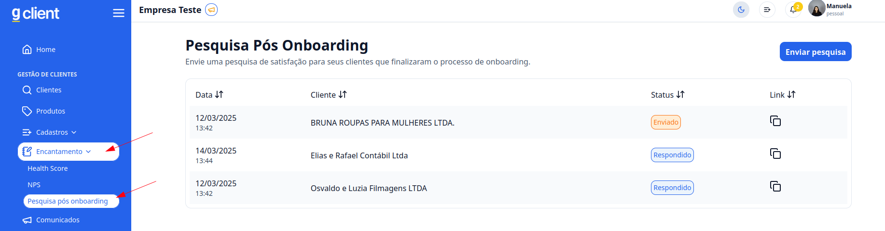
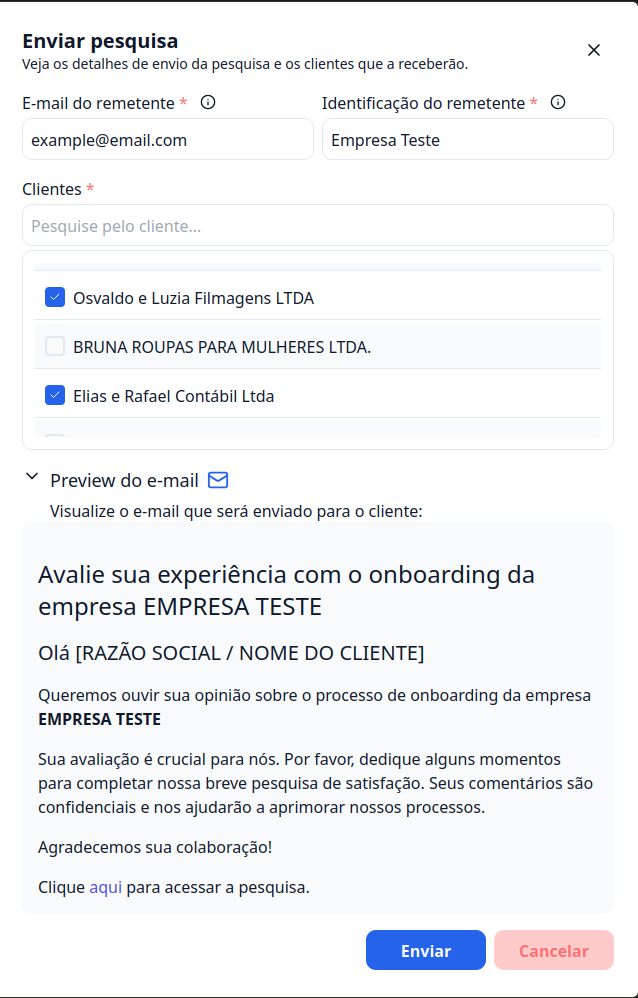
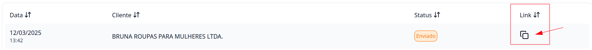

## Introdução

Quer turbinar a experiência com seu cliente no processo de entrada na sua empresa. A **pesquisa pós onboarding** é muito importante para colher feadbeak com seus clientes.

---

## Passo a passo de como enviar uma pesquisa pós onboarding

### 1. Acesse o G Client

Faça login na sua conta do **G Client**.

---

### 2. Navegue até a Sessão **Gestão de Processos**

Clique em **Encantamento** e dentro dele vai ter a **Pesquisa pós onboarding**. Basta clicar que você será redirecionado para a página.

---

### 3. Enviar Pesquisa

Na página clique no botão, **Enviar Pesquisa**, depois disso você deve peencher os campos **E-mail do rementente**, **Identificação do rementente**. Depois disso você vai celecionar os clientes que você deseja enviar essa pesquisa.

Você pode ter uma visualização de como vai ficar o email clicando em **Preview do e-mail**.

Para enviar a pesquisa basta clicar em **Enviar**.

---

### 4. Reforçando para responder a pesquisa

Caso seu cliente não respondeu sua pesquisa, você poder pegar o link da pesquisa e enviar diretamente para seu cliente.

Basta clicar so símbulo de copiar localizado no link, com isso você pode enviar essa informação para o seu cliente.

---

✅ **Pronto!** Agora você sabe como enviar um pesquisa pós onboarding no **G Client**. Se precisar de ajuda, entre em contato clicando [aqui](https://api.whatsapp.com/send?phone=5544997046569&text=Preciso%20de%20ajuda%20sobre%20um%20tutorial)!

🎉 **Obrigado por usar o G Client!**
