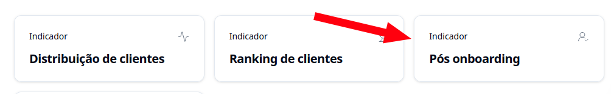
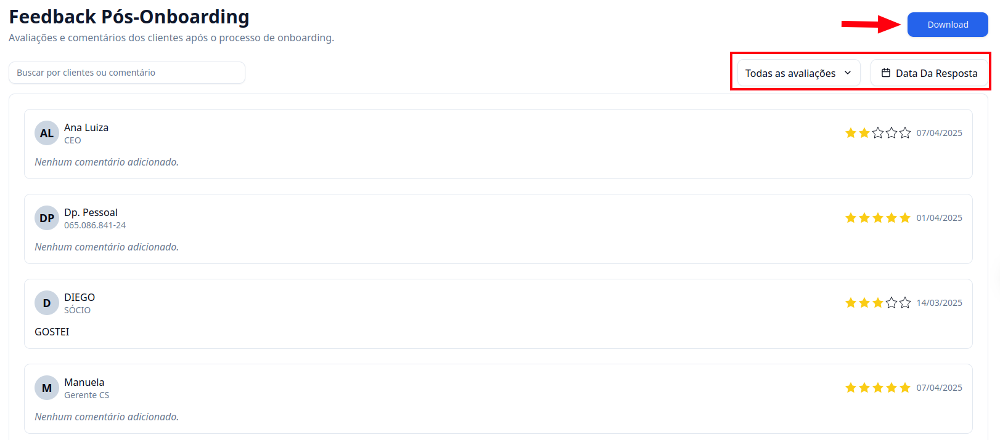

## Introdução

O **Indicador de Pós Onboarding** mostra os resultados de todas as suas pesquisas pós-onboarding de forma organizada e visual.

---

## Como acessar?

### 1. Acesse o G Client

Primeiramente, faça login na sua conta do **G Client**.

---

### 2. Navegue até a seção **Gestão de Clientes**

No menu lateral, clique na opção **Indicadores** e selecione **Pós onboarding**.

---

### 3. Entendendo a página

Você poderá visualizar as pesquisas que foram respondidas e utilizar filtros para refinar os dados por:

- Avaliação
- Data de resposta

Além disso, é possível **exportar os dados em PDF**, clicando no botão correspondente.

---

✅ **Pronto!** Agora você sabe onde encontrar o indicador de pesquisa pós-onboarding dentro do **G Client**. Se precisar de ajuda, entre em contato clicando [aqui](https://api.whatsapp.com/send?phone=5544997046569&text=Preciso%20de%20ajuda%20sobre%20um%20tutorial)!

🎉 **Obrigado por usar o G Client!**
