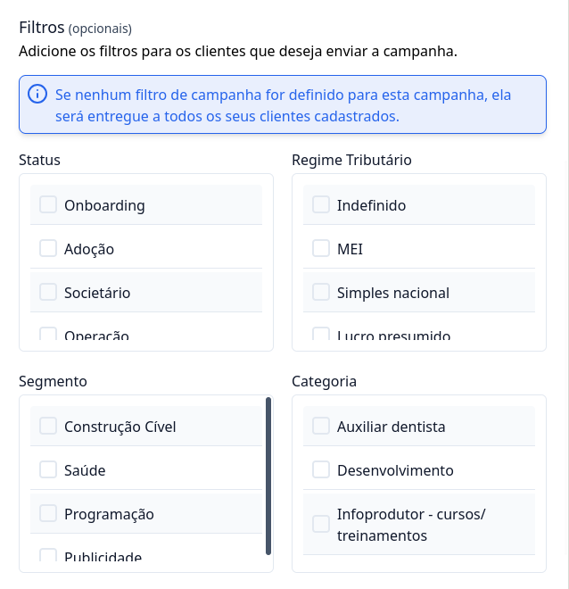
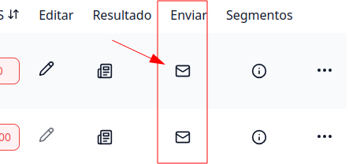

## Como criar pesquisas NPS

### 1. Acesse o G Client

Primeiramente, faça login na sua conta do G Client

### 2. Navegue a Seção Gestão de Clientes

Acesse a página de NPS localizada no menu lateral. Isso o levará para a página de configurações das pesquisas NPS.

### 3. Preecha as informações para criação da pesquisa NPS

Clique no botão Criar NPS e informe os campos obrigatórios que são:

- Nome da campanha
- Data de encerramento da pesquisa

Os demais campos apresentados no formulário são opcionais.

### Filtros de Pesquisa

No formulário de criação de pesquisa NPS, disponibilizamos filtros, esse são:

- Status;
- Regime Tributário;
- Segmento;
- Caregoria.

> ℹ️ **Importante:** Caso queira que a campanha criada seja entregue a todos os seu clientes cadastrados na base, não é necessário preencher nenhum dos filtro de segmentos.

### Mensagem de Obrigado

Você pode selecionar uma mensagem personalizada de agradecimento, clique <a a href="/docs/customer-management/nps/thanks-message" className="text-blue-500 font-bold">aqui</a>. para saber mais sobre.

Ao terminar de preencher os campos e segmentos, basta clicar no botão Cadastrar para finalizar o cadastro da campanha.

## Como enviar pesquisa NPS

### 1. Acesse o formulário de envio de pesquisa

Ainda na página de NPS, é possível visualizar a pesquisas criadas, clique botão correspondente ao título **Enviar**.

### 2. Preview do e-mail e clientes

Ao acessar o formulário de envio de pesquisa, é possível visualizar o preview do e-mail que será entregue aos clientes e também a quantidade e os clientes que receberão a campanha.

### Template de email

Você pode selecionar template de email personalizado, clique <a href="/docs/customer-management/nps/email-templates" className="text-blue-500 font-bold">aqui</a>. para saber mais sobre.

Para efetuar o envio da campanha basta clicar no botão `Enviar`.

> ℹ️ **Importante:** A pesquisa NPS é entregue para o clientes atráves o email de contato do cliente cadastrado dentro do G Client, logo, é importante ter esse campo preenchido para garantir que o email da pesquisa seja entregue para o seus clientes.

---

✅ Com esse tutorial, esperamos que você consiga criar e enviar uma campanha NPS. Se precisar de mais ajuda, é só [avisar](https://api.whatsapp.com/send?phone=5544997046569&text=Preciso%20de%20ajuda%20sobre%20um%20tutorial)!
