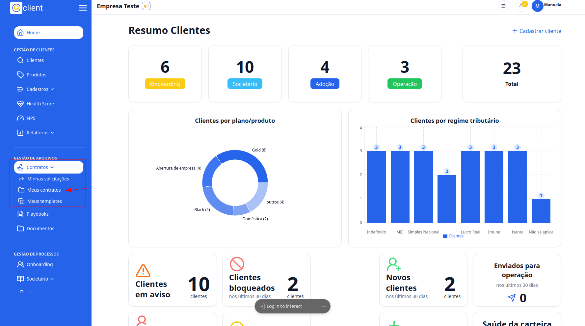
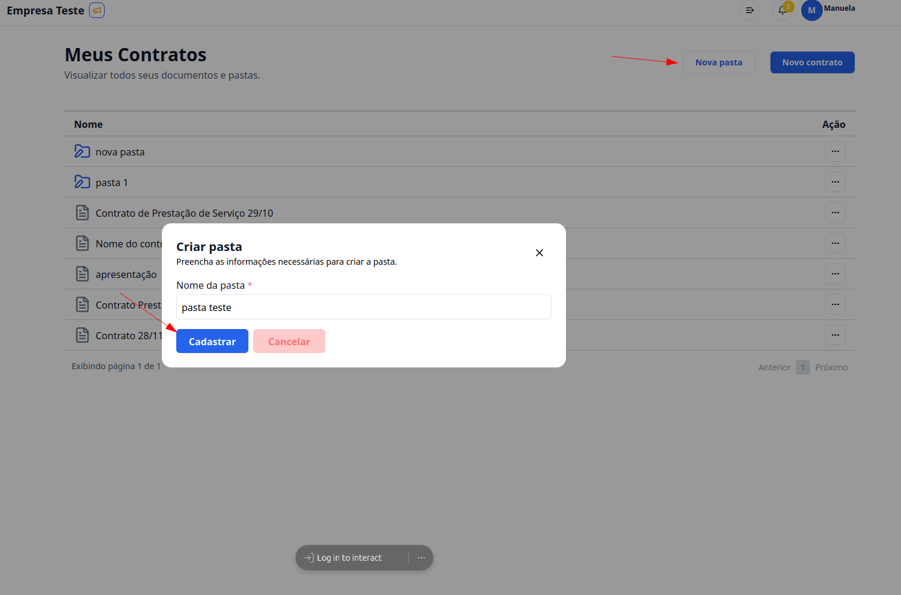
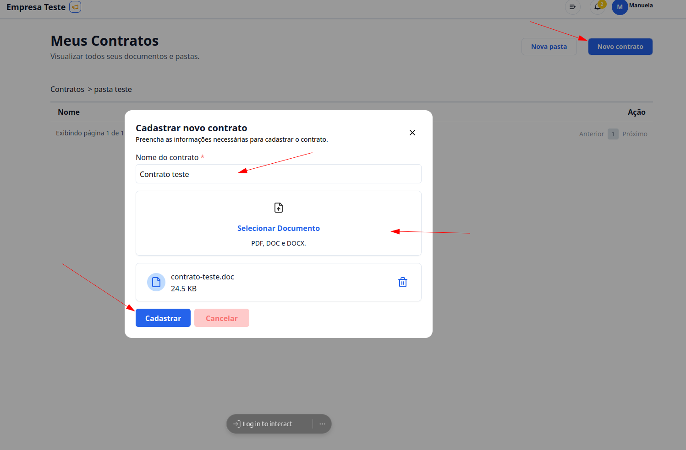
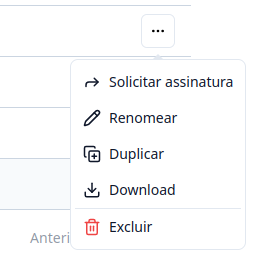

## Passo a passo para criar pastas e adicionar documentos

### 1. Acesse o G Client

Primeiramente, faça login na sua conta do **G Client**.  
Certifique-se de que você possui as permissões necessárias para gerenciar os **Contratos**.

---

### 2. Navegue até a seção de **Gestão de Arquivos**

No menu lateral, clique na aba **Contratos** e, em seguida, selecione **Meus contratos**.

---

### 3. Criar uma pasta

1. Clique no botão **Nova pasta**.
2. Insira o nome desejado para a pasta.
3. Para finalizar, clique em **Cadastrar**.

---

### 4. Criar um contrato

1. Clique no botão **Novo Contrato**.
2. Insira o nome do documento.
3. Importe o arquivo desejado.
   > ⚠️ **Atenção**: Apenas os formatos **PDF**, **DOC**, e **DOCX** são aceitos.
4. Para finalizar, clique em **Cadastrar**.

---

### 5. Botões de ação nos documentos e pastas

#### Ao clicar no botão `...` em uma pasta:

- **Renomear**: permite editar o nome da pasta.
- **Excluir**: permite remover a pasta.

#### Ao clicar no botão `...` em um documento:

- **Solicitar assinatura**: encaminha o documento para assinatura. [(Ver tutorial)](/docs/tutoriais-artigo/file-management/document-signing/signing-solicitation.md)
- **Renomear**: permite editar o nome do documento.
- **Duplicar**: cria uma cópia do arquivo.
- **Download**: baixa o documento para o dispositivo.
- **Excluir**: remove o documento.

---

✅ **Pronto!** Agora você sabe como criar pastas e adicionar documentos no **G Client**. Se precisar de mais ajuda, entre em contato clicando [aqui](https://api.whatsapp.com/send?phone=5544997046569&text=Preciso%20de%20ajuda%20sobre%20um%20tutorial)!

🎉 **Obrigado por usar o G Client!**
