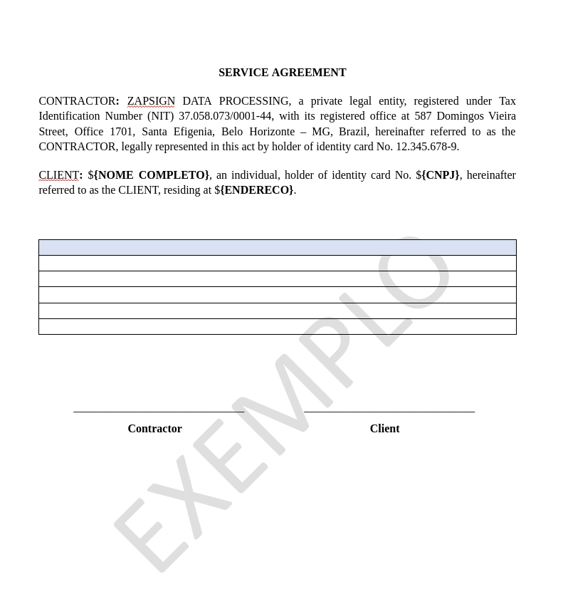
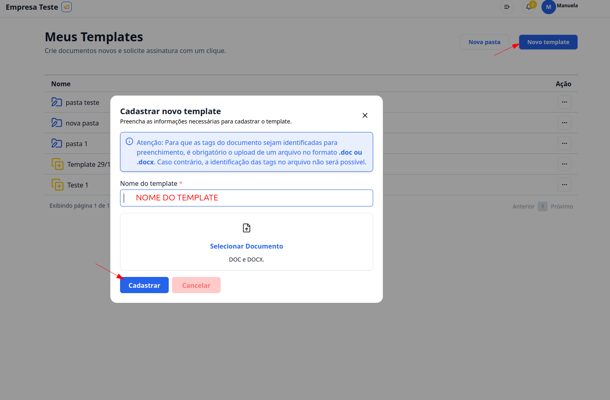

## Passo a passo para criar um documento template

### 1. Acesse o G Client

Primeiramente, faça login na sua conta do **G Client**.  
Certifique-se de que você possui as permissões necessárias para gerenciar os **Contratos**.

---

### 2. Navegue até a seção de **Gestão de Arquivos**

No menu lateral, clique na aba **Contratos** e, em seguida, selecione **Meus templates**.

---

### 3. Criar um template

1. Clique no botão **Novo template**.
2. Insira o nome do template.
3. Selecione o arquivo que será utilizado como template.

#### Como formatar o documento:

- Nos locais onde o conteúdo deverá ser preenchido, utilize a seguinte sintaxe: `${nome}`.
- Exemplo:

No exemplo abaixo, os campos **NOME COMPLETO**, **CNPJ** e **ENDEREÇO** serão preenchidos automaticamente durante o uso do template.

> ⚠️ **Atenção**: Apenas arquivos nos formatos **DOC** e **DOCX** são aceitos.

4. Para finalizar, clique em **Cadastrar**.

---

✅ **Pronto!** Agora você sabe como criar templates para seus contratos no **G Client**. Se precisar de mais ajuda, entre em contato clicando [aqui](https://api.whatsapp.com/send?phone=5544997046569&text=Preciso%20de%20ajuda%20sobre%20um%20tutorial)!

🎉 **Obrigado por usar o G Client!**
