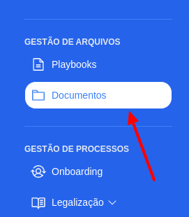
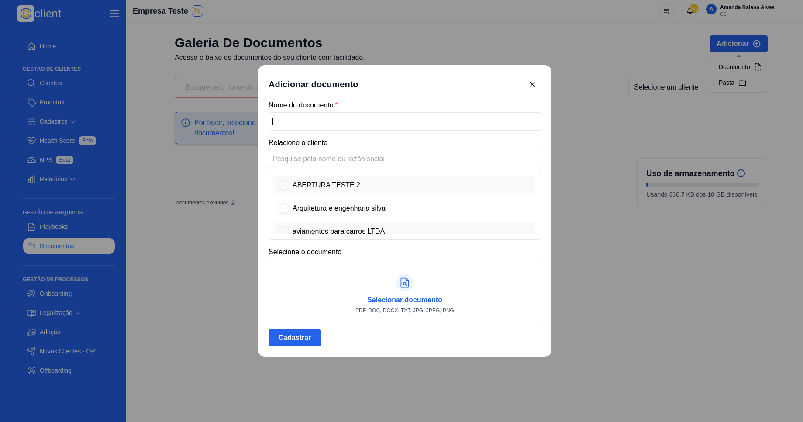
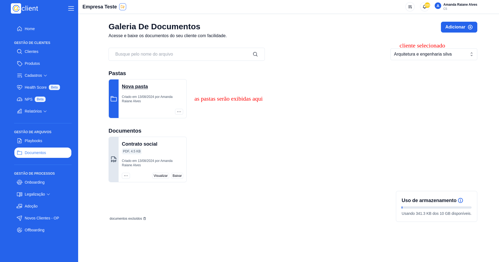
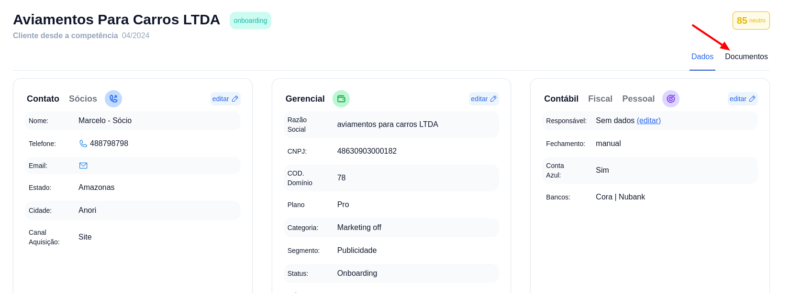
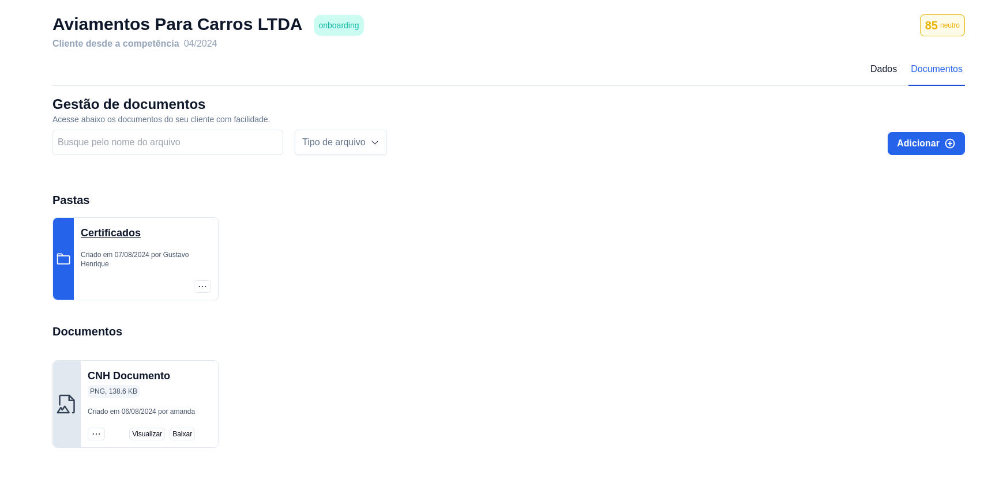

# 🗃️ Como armazenar documentos?

## Passo a passo para armazenar documentos dos seus clientes

### 1. Acesse o G Client

Primeiramente, faça login na sua conta do **G Client**.  
Certifique-se de que você possui as permissões necessárias para gerenciar documentos.

---

### 2. Navegue até a seção de **Gestão de Arquivos**

No menu lateral, clique na aba 📁**Documentos**.  
Você será direcionado para a página onde poderá visualizar a galeria de documentos.

---

### 3. Adicionar novos documentos

Clique no botão **Adicionar +** e escolha a opção **Documento**.  
No modal exibido, preencha as seguintes informações:

- Nome do documento
- Vincular o documento a um cliente
- Escolher o arquivo a ser inserido no sistema

Após preencher os campos, clique em **Cadastrar**.

---

### 4. Selecionar cliente

Para visualizar o documento recém-adicionado, selecione o cliente correspondente na lista.

---

### 5. Botões de ação nos documentos

Cada documento possui as seguintes opções de ação:

- **Visualizar**: Abre uma nova guia do navegador exibindo o conteúdo do documento.
- **Baixar**: Salva o documento no dispositivo.
- **...**: Exibe mais opções:
  - **Mover**: Permite mover o documento para outra pasta.
  - **Editar**: Altere o nome do documento.
  - **Excluir**: Remove permanentemente o documento.

> ⚠️ **Atenção**: A exclusão de documentos é permanente e não pode ser desfeita.

---

### 6. Criar pastas

Na galeria de documentos, clique em **Adicionar +** e selecione a opção **Pasta**.  
No modal exibido, insira as seguintes informações:

- Nome da pasta
- Vincular a pasta a um cliente

Clique em **Cadastrar** para finalizar.

Após o cadastro, ao selecionar o cliente correspondente, a nova pasta será exibida.  
Você também poderá mover, editar ou excluir pastas.

---

### 7. Gerenciar documentos na página do cliente

Você também pode cadastrar e visualizar documentos diretamente na página do cliente.

1. Acesse a página do cliente.
2. Clique na opção **_Documentos_**.

Após acessar **_Documentos_**, você poderá gerenciar os arquivos e pastas vinculados ao cliente.

---

✅ **Pronto!** Agora você pode cadastrar e gerenciar os documentos dos seus clientes no **G Client** de forma simples e eficiente. Se precisar de ajuda, entre em contato clicando [aqui](https://api.whatsapp.com/send?phone=5544997046569&text=Preciso%20de%20ajuda%20sobre%20um%20tutorial)!

🎉 **Obrigado por usar o G Client!**
