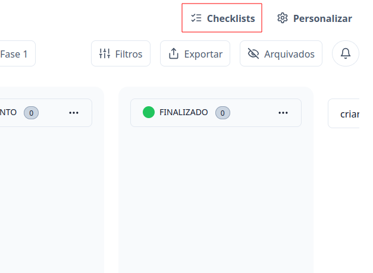
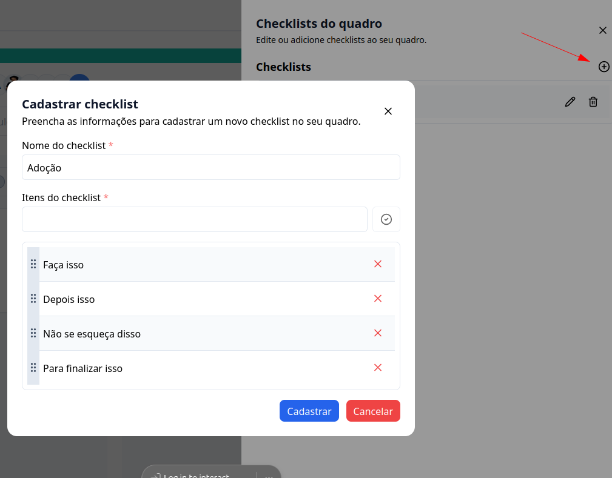
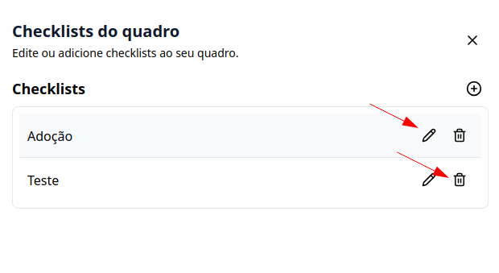
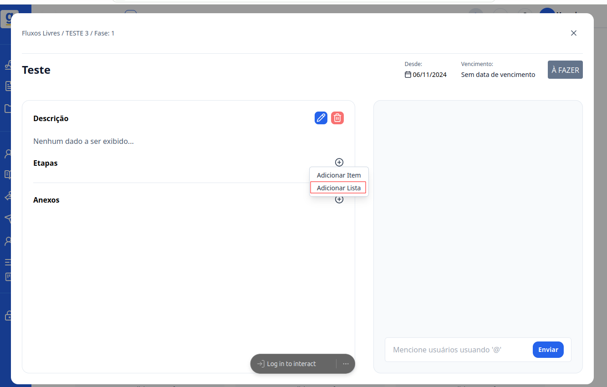
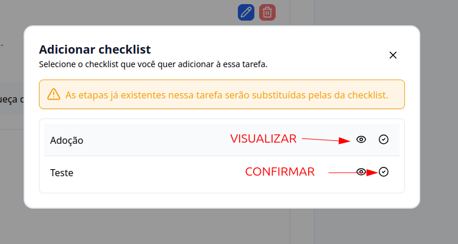

## Introdução

Bem-vindo ao tutorial do **G Client**! Neste guia, você aprenderá a cadastrar e usar checklists personalizados nos **FLUXOS DE TRABALHO**.

---

## Passo a passo para cadastrar checklists

### 1. Acesse o G Client

Faça login na sua conta do **G Client**.

---

### 2. Navegue até a seção **Fluxos de Trabalho**

No menu lateral, clique na aba **Quadros** e selecione o quadro em que deseja criar o checklist.

---

### 3. Dentro do quadro

Clique no botão **Checklist**, localizado ao lado do botão **Personalizar**.

---

### 4. Preencha os campos

1. Clique no botão com o símbolo **+**.
2. No modal que será exibido, preencha as seguintes informações:

   - **Nome do checklist**: Como você deseja chamá-lo.
   - **Itens do checklist**: Liste os itens que deseja adicionar.

3. Para finalizar, clique em **Cadastrar**.

---

### Botões de ação nos checklists

- **Editar (ícone de lápis)**: Permite alterar as informações do checklist.
- **Excluir (ícone de lixeira)**: Remove permanentemente o checklist.
  > ⚠️ **Atenção**: A exclusão é definitiva, use com cuidado!

---

## Como usar o checklist

### 1. Dentro de um quadro

Selecione a tarefa onde deseja adicionar o checklist.

1. Dentro da tarefa, vá até a seção **Etapas**.
2. Clique no botão **+**, que abrirá um modal.
3. Escolha a opção **Adicionar Lista**.

---

### 2. Selecione o checklist desejado

1. Clique no ícone 👁️ para visualizar os itens cadastrados no checklist.
2. Se o checklist for o correto, clique no botão ao lado para confirmá-lo.

---

✅ **Pronto!** Agora você pode criar e utilizar checklists nos fluxos de trabalho dentro do **G Client** de forma simples e eficiente. Se precisar de ajuda, entre em contato clicando [aqui](https://api.whatsapp.com/send?phone=5544997046569&text=Preciso%20de%20ajuda%20sobre%20um%20tutorial)!

🎉 **Obrigado por usar o G Client!**
