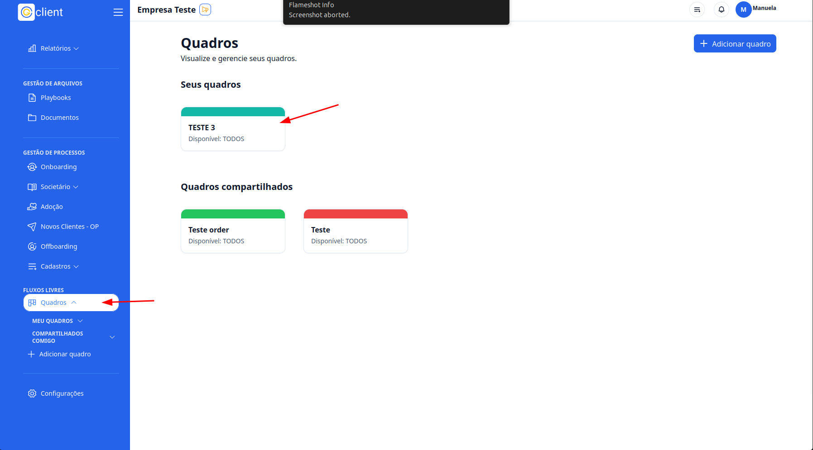
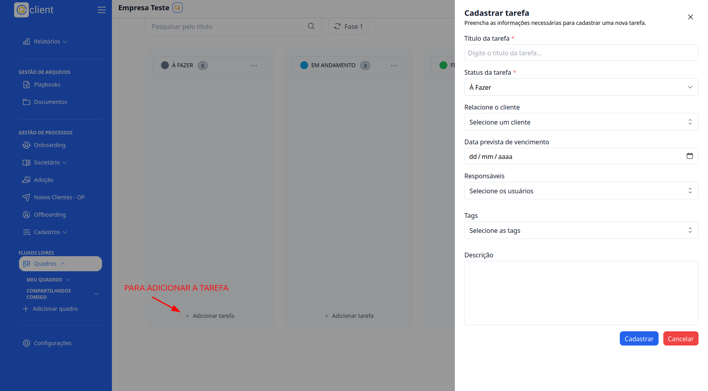

## Passo a passo de como criar tarefas em um quadro personalizado

### 1. Acesso

Primeiramente, faça login na sua conta do **G Client** e certifique-se de que possui permissão para usar os **Fluxos de Trabalho**.

---

### 2. Navegue até a Seção de **FLUXOS DE TRABALHO**

Após a [criação do quadro personalizado](https://ajuda.gclient.com.br/docs/tutoriais-artigo/free-flows/personalized-tables.md), clique na aba **Quadros** localizada no menu lateral. Em seguida, selecione o quadro onde deseja criar as tarefas.

---

### 3. Dentro do Quadro

Você verá as colunas com os **status** criados anteriormente durante a configuração do quadro. Para criar uma nova tarefa, localize o botão **Adicionar Tarefa** dentro do status desejado.

Ao clicar no botão, um modal será aberto para o cadastro da tarefa.

---

### 4. Cadastro da Tarefa

No modal de cadastro, preencha os seguintes campos:

- **Título da tarefa** (obrigatório);
- **Status da tarefa** (obrigatório);
- **Cliente relacionado** (opcional);
- **Data prevista de vencimento** (opcional);
- **Responsáveis** (opcional);
- **Tags** (opcional);
- **Descrição** (opcional).

Após preencher os campos, clique no botão **Cadastrar** para concluir o processo.

---

✅ **Pronto!** Agora você pode criar tarefas dentro dos quadros no **Fluxo Livres** de forma simples e eficiente.  
Se precisar de ajuda, entre em contato clicando [aqui](https://api.whatsapp.com/send?phone=5544997046569&text=Preciso%20de%20ajuda%20sobre%20um%20tutorial)!

🎉 **Obrigado por usar o G Client!**
