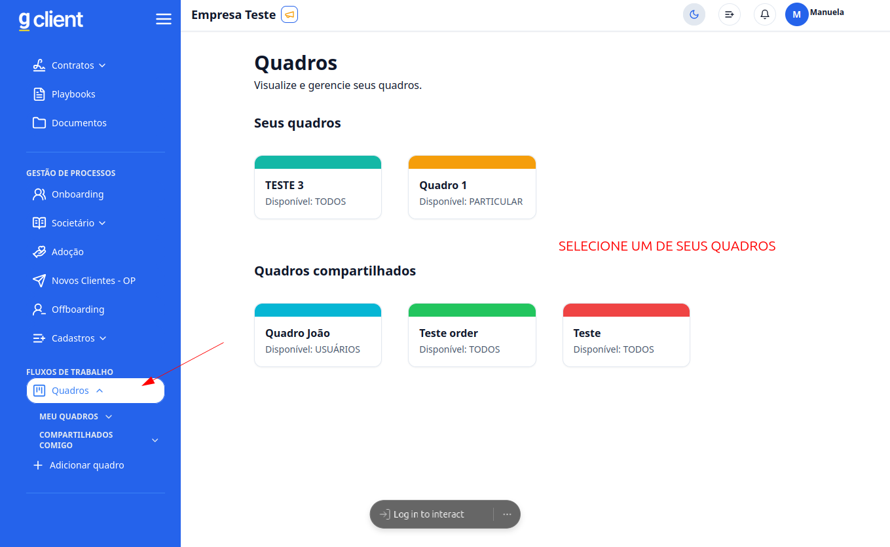
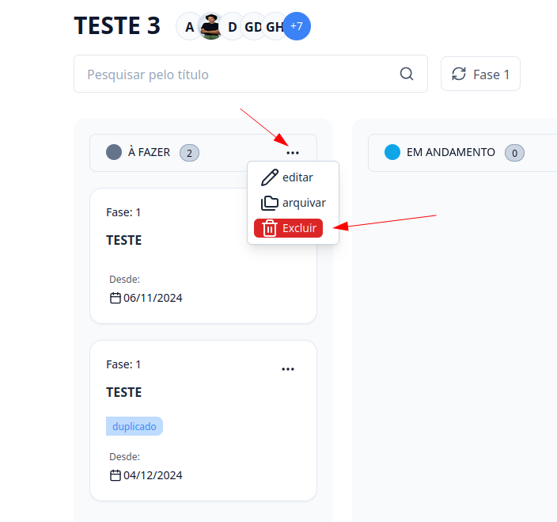
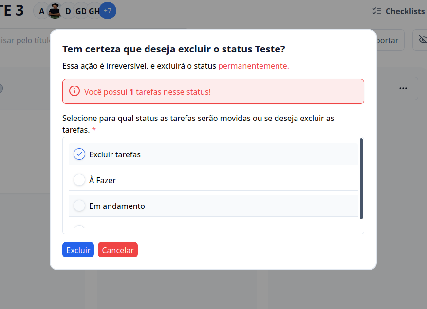

## Introdução

Bem-vindo ao tutorial do **G Client**! Neste guia, explicaremos como excluir colunas nos **FLUXOS DE TRABALHO** de maneira simples e segura.

---

## Passo a Passo para Excluir Colunas

### 1. Acesse o G Client

Primeiramente, faça login na sua conta do **G Client**.

---

### 2. Navegue até a Seção **FLUXOS DE TRABALHO**

Na página principal, clique na aba **Quadros** localizada no menu lateral e selecione o quadro que contém a coluna que deseja excluir.

---

### 3. Dentro do Quadro

Na coluna que deseja excluir, clique no botão de três pontos `...` e selecione a opção **Excluir**.

---

### 4. Reatribua as Tarefas

Se a coluna contiver tarefas, será exibido um modal permitindo que você escolha entre:

- **Realocar tarefas para outra coluna**
- **Excluir as tarefas junto com a coluna**

Após selecionar a opção desejada, clique em **Excluir**.

> ⚠️ **Atenção!** A exclusão de colunas e suas tarefas é permanente e não pode ser desfeita. Certifique-se de revisar suas escolhas.

---

✅ **Pronto!** Agora você sabe como excluir colunas no **Fluxo de Trabalho**. Se precisar de ajuda, entre em contato clicando [aqui](https://api.whatsapp.com/send?phone=5544997046569&text=Preciso%20de%20ajuda%20sobre%20um%20tutorial)!

🎉 **Obrigado por usar o G Client!**
